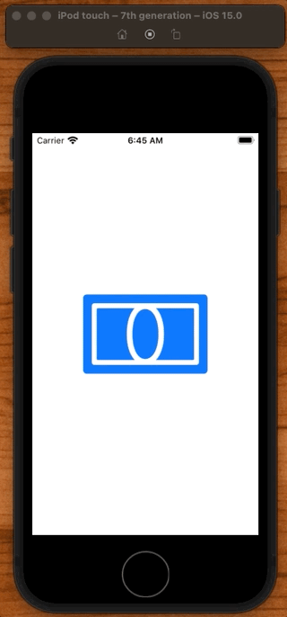

# Constraint Based Animation



In constraint based animations we setup the controls into the positions we want to animation `from` using Auto Layout, and then we animate to the positions we want to animate `to` by changing the constraints to the new positions we want.

## Step 1: Setup the pre-animated state

```swift
// animation
var leadingEdgeOnScreen: CGFloat = 16
var leadingEdgeOffScreen: CGFloat = -1000
    
var titleLeadingAnchor: NSLayoutConstraint?
var subtitleLeadingAnchor: NSLayoutConstraint?
    
titleLeadingAnchor = titleLabel.leadingAnchor.constraint(equalTo: view.leadingAnchor, constant: leadingEdgeOffScreen)
titleLeadingAnchor?.isActive = true
    
subtitleLeadingAnchor = subtitleLabel.leadingAnchor.constraint(equalTo: view.leadingAnchor, constant: leadingEdgeOffScreen)
subtitleLeadingAnchor?.isActive = true
```

## Step 2: Setup the post-animated state

Animate to the state you want in `viewDidLoad` once auto layout has completed.

```swift
override func viewDidAppear(_ animated: Bool) {
    super.viewDidAppear(animated)
    animate()
}
```

And then chain antimations together with `UIViewPropertyAnimator`.

```swift
// MARK: - Animations
extension LoginViewController {
    private func animate() {
        let duration = 0.8

        let animator1 = UIViewPropertyAnimator(duration: duration, curve: .easeInOut) {
            self.titleLeadingAnchor?.constant = self.leadingEdgeOnScreen
            self.view.layoutIfNeeded()
        }
        animator1.startAnimation()

        let animator2 = UIViewPropertyAnimator(duration: duration, curve: .easeInOut) {
            self.subtitleLeadingAnchor?.constant = self.leadingEdgeOnScreen
            self.view.layoutIfNeeded()
        }
        animator2.startAnimation(afterDelay: 0.2)

        let animator3 = UIViewPropertyAnimator(duration: duration*2, curve: .easeInOut) {
            self.titleLabel.alpha = 1
            self.subtitleLabel.alpha = 1
            self.view.layoutIfNeeded()
        }
        animator3.startAnimation(afterDelay: 0.2)
    }
}
```

## Full Source

```swift
//
//  ViewController.swift
//  Bankey
//
//  Created by jrasmusson on 2021-09-23.
//

import UIKit

protocol LogoutDelegate: AnyObject {
    func didLogout()
}

protocol LoginViewControllerDelegate: AnyObject {
    func didLogin()
}

class LoginViewController: UIViewController {

    let titleLabel = UILabel()
    let subtitleLabel = UILabel()
    
    let loginView = LoginView()
    let signInButton = UIButton(type: .system)
    let errorMessageLabel = UILabel()
    
    weak var delegate: LoginViewControllerDelegate?
    
    var username: String? {
        return loginView.usernameTextField.text
    }

    var password: String? {
        return loginView.passwordTextField.text
    }

    // animation
    var leadingEdgeOnScreen: CGFloat = 16
    var leadingEdgeOffScreen: CGFloat = -1000
    
    var titleLeadingAnchor: NSLayoutConstraint?
    var subtitleLeadingAnchor: NSLayoutConstraint?
    
    override func viewDidLoad() {
        super.viewDidLoad()
        style()
        layout()
    }
    
    override func viewDidDisappear(_ animated: Bool) {
        super.viewDidDisappear(animated)
        signInButton.configuration?.showsActivityIndicator = false
    }
    
    override func viewDidAppear(_ animated: Bool) {
        super.viewDidAppear(animated)
        animate()
    }
}

extension LoginViewController {
    
    private func style() {
        view.backgroundColor = .systemBackground
        
        titleLabel.translatesAutoresizingMaskIntoConstraints = false
        titleLabel.textAlignment = .center
        titleLabel.font = UIFont.preferredFont(forTextStyle: .largeTitle)
        titleLabel.adjustsFontForContentSizeCategory = true
        titleLabel.text = "Bankey"
        titleLabel.alpha = 0

        subtitleLabel.translatesAutoresizingMaskIntoConstraints = false
        subtitleLabel.textAlignment = .center
        subtitleLabel.font = UIFont.preferredFont(forTextStyle: .title3)
        subtitleLabel.adjustsFontForContentSizeCategory = true
        subtitleLabel.numberOfLines = 0
        subtitleLabel.text = "Your premium source for all things banking!"
        subtitleLabel.alpha = 0
        
        loginView.translatesAutoresizingMaskIntoConstraints = false

        signInButton.translatesAutoresizingMaskIntoConstraints = false
        signInButton.configuration = .filled()
        signInButton.configuration?.imagePadding = 8 // for indicator spacing
        signInButton.setTitle("Sign In", for: [])
        signInButton.addTarget(self, action: #selector(signInTapped), for: .primaryActionTriggered)
        
        errorMessageLabel.translatesAutoresizingMaskIntoConstraints = false
        errorMessageLabel.textAlignment = .center
        errorMessageLabel.textColor = .systemRed
        errorMessageLabel.numberOfLines = 0
        errorMessageLabel.isHidden = true
    }
    
    private func layout() {
        view.addSubview(titleLabel)
        view.addSubview(subtitleLabel)
        view.addSubview(loginView)
        view.addSubview(signInButton)
        view.addSubview(errorMessageLabel)

        // Title
        NSLayoutConstraint.activate([
            subtitleLabel.topAnchor.constraint(equalToSystemSpacingBelow: titleLabel.bottomAnchor, multiplier: 3),
            titleLabel.trailingAnchor.constraint(equalTo: loginView.trailingAnchor)
        ])
        
        titleLeadingAnchor = titleLabel.leadingAnchor.constraint(equalTo: view.leadingAnchor, constant: leadingEdgeOffScreen)
        titleLeadingAnchor?.isActive = true
        
        // Subtitle
        NSLayoutConstraint.activate([
            loginView.topAnchor.constraint(equalToSystemSpacingBelow: subtitleLabel.bottomAnchor, multiplier: 3),
            subtitleLabel.trailingAnchor.constraint(equalTo: loginView.trailingAnchor)
        ])
        
        subtitleLeadingAnchor = subtitleLabel.leadingAnchor.constraint(equalTo: view.leadingAnchor, constant: leadingEdgeOffScreen)
        subtitleLeadingAnchor?.isActive = true

        // LoginView
        NSLayoutConstraint.activate([
            loginView.leadingAnchor.constraint(equalToSystemSpacingAfter: view.leadingAnchor, multiplier: 2),
            view.trailingAnchor.constraint(equalToSystemSpacingAfter: loginView.trailingAnchor, multiplier: 2),
            view.centerYAnchor.constraint(equalTo: loginView.centerYAnchor),
        ])
        
        // Button
        NSLayoutConstraint.activate([
            signInButton.topAnchor.constraint(equalToSystemSpacingBelow: loginView.bottomAnchor, multiplier: 2),
            signInButton.leadingAnchor.constraint(equalTo: loginView.leadingAnchor),
            signInButton.trailingAnchor.constraint(equalTo: loginView.trailingAnchor),
        ])
        
        // Error message
        NSLayoutConstraint.activate([
            errorMessageLabel.topAnchor.constraint(equalToSystemSpacingBelow: signInButton.bottomAnchor, multiplier: 2),
            errorMessageLabel.leadingAnchor.constraint(equalTo: loginView.leadingAnchor),
            errorMessageLabel.trailingAnchor.constraint(equalTo: loginView.trailingAnchor)
        ])
    }
}

// MARK: Actions
extension LoginViewController {
    @objc func signInTapped(sender: UIButton) {
        errorMessageLabel.isHidden = true
        login()
    }
    
    private func login() {
        guard let username = username, let password = password else {
            assertionFailure("Username / password should never be nil")
            return
        }

        // Temporarily turn off this check
//        if username.isEmpty || password.isEmpty {
//            configureView(withMessage: "Username / password cannot be blank")
//            return
//        }
        
        if username == "" && password == "" {
            signInButton.configuration?.showsActivityIndicator = true
            delegate?.didLogin()
        } else {
            configureView(withMessage: "Incorrect username / password")
        }
    }
    
    private func configureView(withMessage message: String) {
        errorMessageLabel.isHidden = false
        errorMessageLabel.text = message
    }
}

// MARK: - Animations
//extension LoginViewController {
//    private func animate() {
//        let duration = 0.8
//
//        let animator1 = UIViewPropertyAnimator(duration: duration, curve: .easeInOut) {
//            self.titleLeadingAnchor?.constant = self.leadingEdgeOnScreen
//            self.subtitleLeadingAnchor?.constant = self.leadingEdgeOnScreen
//            self.view.layoutIfNeeded()
//        }
//        animator1.startAnimation()
//    }
//}


//// MARK: - Animations
//extension LoginViewController {
//    private func animate() {
//        let duration = 0.8
//
//        let animator1 = UIViewPropertyAnimator(duration: duration, curve: .easeInOut) {
//            self.titleLeadingAnchor?.constant = self.leadingEdgeOnScreen
//            self.view.layoutIfNeeded()
//        }
//        animator1.startAnimation()
//
//        let animator2 = UIViewPropertyAnimator(duration: duration, curve: .easeInOut) {
//            self.subtitleLeadingAnchor?.constant = self.leadingEdgeOnScreen
//            self.view.layoutIfNeeded()
//        }
//        animator2.startAnimation(afterDelay: 0.2)
//    }
//}


// MARK: - Animations
extension LoginViewController {
    private func animate() {
        let duration = 0.8

        let animator1 = UIViewPropertyAnimator(duration: duration, curve: .easeInOut) {
            self.titleLeadingAnchor?.constant = self.leadingEdgeOnScreen
            self.view.layoutIfNeeded()
        }
        animator1.startAnimation()

        let animator2 = UIViewPropertyAnimator(duration: duration, curve: .easeInOut) {
            self.subtitleLeadingAnchor?.constant = self.leadingEdgeOnScreen
            self.view.layoutIfNeeded()
        }
        animator2.startAnimation(afterDelay: 0.2)

        let animator3 = UIViewPropertyAnimator(duration: duration*2, curve: .easeInOut) {
            self.titleLabel.alpha = 1
            self.subtitleLabel.alpha = 1
            self.view.layoutIfNeeded()
        }
        animator3.startAnimation(afterDelay: 0.2)
    }
}
```

### Links that help


