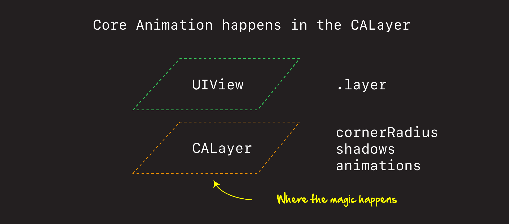
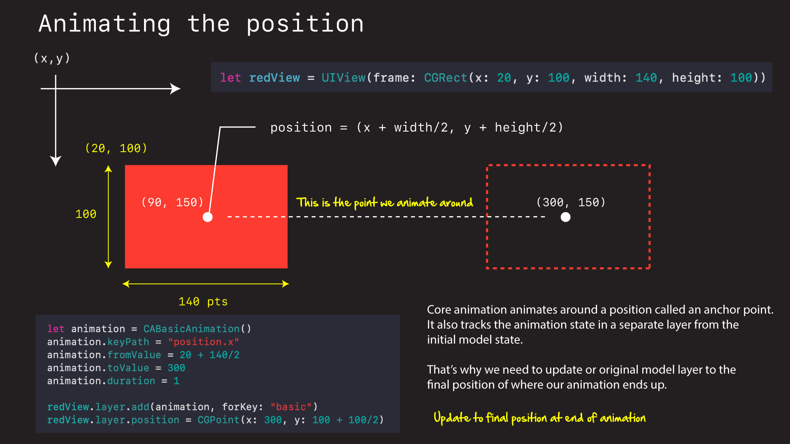
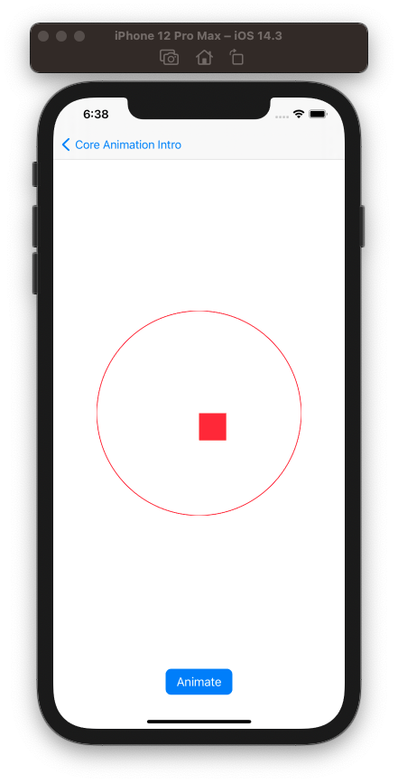
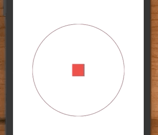

# What is Core Animation?


Core Animation (CA) is the underlying library UIKit and SwiftUI use to animate and manipulate content in their UIViews. While higher level APIs are often easier to use and recommended for doing iOS animations, understanding how Core Animation works not only gives you insight, it is sometimes necessary to get the desired effects you want.

The power of Core Animation is it’s speed. It works off the main run loop. It leverages the GPU hardware to animate things very quickly. Which is why it is able to animate and update your screen roughly 60 times per second.


# How does it work?



Core Animation works off of layers. Every `UIView` has an underlying `CALayer` that you use to animate and change properties of your view.

You basically specify a start and stop position. Add the animation to the layer, and Core Animation takes care of the rest interpolating the images between the two states and animating them on screen.

Using Core Animation we can move shapes.


```swift
let animation = CABasicAnimation()
animation.keyPath = "position.x"
animation.fromValue = 20 + 140/2
animation.toValue = 300
animation.duration = 1
    
redView.layer.add(animation, forKey: "basic")
redView.layer.position = CGPoint(x: 300, y: 100 + 100/2) // update to final position
```

Scale things up.


```swift
let animation = CABasicAnimation()
animation.keyPath = "transform.scale"
animation.fromValue = 1
animation.toValue = 2
animation.duration = 0.4
    
redView.layer.add(animation, forKey: "basic")
redView.layer.transform = CATransform3DMakeScale(2, 2, 1) // update
```

Rotate them.


```swift
let animation = CABasicAnimation()
animation.keyPath = "transform.rotation.z" // Note: z-axis
animation.fromValue = 0
animation.toValue = CGFloat.pi / 4
animation.duration = 1
    
redView.layer.add(animation, forKey: "basic")
redView.layer.transform = CATransform3DMakeRotation(CGFloat.pi / 4, 0, 0, 1)
```

Even shake things up.


```swift
let animation = CAKeyframeAnimation()
animation.keyPath = "position.x"
animation.values = [0, 10, -10, 10, 0]
animation.keyTimes = [0, 0.16, 0.5, 0.83, 1]
animation.duration = 0.4

animation.isAdditive = true
textField.layer.add(animation, forKey: "shake")
```

# Examples

## Moving




In Core Animation everything animates around the views `position` or `anchor point`. To animate a rectangle from left-to-right along it's x-axis we first need to create a `CABasicAnimation`.

```swift
let animation = CABasicAnimation()
```

We then need to tell this animation what exactly we would like to animate. We do this by setting its `keyPath`.

```swift
animation.keyPath = "position.x"
```

Keypaths are how we tell Core Animation what we would like to animate. You can find a list of different [here](https://developer.apple.com/library/archive/documentation/Cocoa/Conceptual/CoreAnimation_guide/Key-ValueCodingExtensions/Key-ValueCodingExtensions.html#//apple_ref/doc/uid/TP40004514-CH12-SW2).

Just note you need to add the extension to the `keyPath` when reading the documention. For example `transform.rotation.z` instead of just `rotation.z`.

Then we need to define the start and end states of our animation like this.

```swift
animation.fromValue = 20 + 140/2
animation.toValue = 300
animation.duration = 1
```

The tricky thing to understand is Core Animation (CA) works of a shapes `position` or `anchor point`. The position is the shapes middle. So to move the rectangle left-to-right we first need to calculate the `x` point value of the rectangle middle, and then final `x` position of the rectangle middle and make those our `fromValue` and `toValue`.

Then we add the animation to our view's layer.

```swift
redView.layer.add(animation, forKey: "basic")
```

And then update the final animated position.

```swift
redView.layer.position = CGPoint(x: 300, y: 100 + 100/2) // update to final position
```

This last step is critical. As mentioned earlier, CA keeps two layers - the *model layer* (current state) and the *presentation layer* (animation state). And the end of our animation we need to update our *model* state to reflect the final *presentation* state. That is what this line does here. 

Full source.

**MoveViewController.swift**

```swift
import UIKit

class MoveViewController: UIViewController {

    let redView = UIView(frame: CGRect(x: 20, y: 100, width: 140, height: 100))
    let button = makeButton(withText: "Animate")

    override func viewDidLoad() {
        super.viewDidLoad()
        
        redView.backgroundColor = .systemRed
        
        button.translatesAutoresizingMaskIntoConstraints = false
        button.addTarget(self, action: #selector(buttonTapped(_:)), for: .primaryActionTriggered)
        
        view.addSubview(redView)
        view.addSubview(button)
        
        NSLayoutConstraint.activate([
            view.safeAreaLayoutGuide.bottomAnchor.constraint(equalToSystemSpacingBelow: button.bottomAnchor, multiplier: 2),
            button.centerXAnchor.constraint(equalTo: view.centerXAnchor),
        ])
    }
    
    func animate() {
        let animation = CABasicAnimation()
        animation.keyPath = "position.x"
        animation.fromValue = 20 + 140/2
        animation.toValue = 300
        animation.duration = 1
        
        redView.layer.add(animation, forKey: "basic")
        redView.layer.position = CGPoint(x: 300, y: 100 + 100/2) // update to final position
    }

    @objc func buttonTapped(_ sender: UIButton) {
        animate()
    }
}

// MARK: - Factories

func makeButton(withText text: String) -> UIButton {
    let button = UIButton()
    button.translatesAutoresizingMaskIntoConstraints = false
    button.setTitle(text, for: .normal)
    button.titleLabel?.adjustsFontSizeToFitWidth = true
    button.contentEdgeInsets = UIEdgeInsets(top: 8, left: 16, bottom: 8, right: 16)
    button.backgroundColor = .systemBlue
    button.layer.cornerRadius = 8
    return button
}
```

## Scaling 


Using these same principles we can scale shapes too.

```swift
let animation = CABasicAnimation()
animation.keyPath = "transform.scale"
animation.fromValue = 1
animation.toValue = 2
animation.duration = 0.4
    
redView.layer.add(animation, forKey: "basic")
redView.layer.transform = CATransform3DMakeScale(2, 2, 1) // update
```

Here we set the `keyPath` to `transform.scale`. Specify how big we would like our shape to scale (x2). And then update our final scaled size using `CATransform3DMakeScale`.

The one difference with this example is note how we didn't set the rectangle's size until the `viewDidAppear`.

I did this to avoid hard coding the size, so you could see how to dynamically set a views size based on the size of the phone screen.

```swift
override func viewDidAppear(_ animated: Bool) {
    super.viewDidAppear(animated)
    
    redView.frame = CGRect(x: view.bounds.midX - _width/2,
                           y: view.bounds.midY - _height/2,
                           width: _width, height: _height)
}
```

Full source.

**ScaleViewController.swift**

```swift
import UIKit

class ScaleViewController: UIViewController {

    let redView = UIView()
    let _width: CGFloat = 140
    let _height: CGFloat = 100
    
    let button = makeButton(withText: "Animate")

    override func viewDidLoad() {
        super.viewDidLoad()
        
        redView.backgroundColor = .systemRed
        
        button.translatesAutoresizingMaskIntoConstraints = false
        button.addTarget(self, action: #selector(buttonTapped(_:)), for: .primaryActionTriggered)
        
        view.addSubview(redView)
        view.addSubview(button)
        
        NSLayoutConstraint.activate([
            view.safeAreaLayoutGuide.bottomAnchor.constraint(equalToSystemSpacingBelow: button.bottomAnchor, multiplier: 2),
            button.centerXAnchor.constraint(equalTo: view.centerXAnchor),
        ])
    }
    
    override func viewDidAppear(_ animated: Bool) {
        super.viewDidAppear(animated)
        
        redView.frame = CGRect(x: view.bounds.midX - _width/2,
                               y: view.bounds.midY - _height/2,
                               width: _width, height: _height)
    }
    
    func animate() {
        let animation = CABasicAnimation()
        animation.keyPath = "transform.scale"
        animation.fromValue = 1
        animation.toValue = 2
        animation.duration = 0.4
        
        redView.layer.add(animation, forKey: "basic")
        redView.layer.transform = CATransform3DMakeScale(2, 2, 1) // update
    }

    @objc func buttonTapped(_ sender: UIButton) {
        animate()
    }
}
```

## Rotating


Rotating is the same as the others. Only here note that we rotate around the z-axis and that angles are in `radians`.

```swift
let animation = CABasicAnimation()
animation.keyPath = "transform.rotation.z" // Note: z-axis
animation.fromValue = 0
animation.toValue = CGFloat.pi / 4
animation.duration = 1
    
redView.layer.add(animation, forKey: "basic")
redView.layer.transform = CATransform3DMakeRotation(CGFloat.pi / 4, 0, 0, 1)
```

This example rotates the rectangle 45 degrees (pi/4) and the z-axis is the one coming out of the page.

Full source.

**RotateViewController.swift**

```swift
import UIKit

class RotateViewController: UIViewController {

    let redView = UIView()
    let _width: CGFloat = 140
    let _height: CGFloat = 100
    
    let button = makeButton(withText: "Animate")

    override func viewDidLoad() {
        super.viewDidLoad()
        
        redView.backgroundColor = .systemRed
        
        button.translatesAutoresizingMaskIntoConstraints = false
        button.addTarget(self, action: #selector(buttonTapped(_:)), for: .primaryActionTriggered)
        
        view.addSubview(redView)
        view.addSubview(button)
        
        NSLayoutConstraint.activate([
            view.safeAreaLayoutGuide.bottomAnchor.constraint(equalToSystemSpacingBelow: button.bottomAnchor, multiplier: 2),
            button.centerXAnchor.constraint(equalTo: view.centerXAnchor),
        ])
    }
    
    override func viewDidAppear(_ animated: Bool) {
        super.viewDidAppear(animated)
        
        redView.frame = CGRect(x: view.bounds.midX - _width/2,
                               y: view.bounds.midY - _height/2,
                               width: _width, height: _height)
    }
    
    func animate() {
        let animation = CABasicAnimation()
        animation.keyPath = "transform.rotation.z" // Note: z-axis
        animation.fromValue = 0
        animation.toValue = CGFloat.pi / 4
        animation.duration = 1
        
        redView.layer.add(animation, forKey: "basic")
        redView.layer.transform = CATransform3DMakeRotation(CGFloat.pi / 4, 0, 0, 1)
    }

    @objc func buttonTapped(_ sender: UIButton) {
        animate()
    }
}
```

## Shaking


CA enables you to very specifically control how your animations works via `keyframes`.

```swift
let animation = CAKeyframeAnimation()
animation.keyPath = "position.x"
animation.values = [0, 10, -10, 10, 0]
animation.keyTimes = [0, 0.16, 0.5, 0.83, 1]
animation.duration = 0.4

animation.isAdditive = true
textField.layer.add(animation, forKey: "shake")
```

Keyframes are specific frames in your animation that CA will animate between. For exanple to get this shake effect, we specifiy which `position.x` positions we would like our `textField` to oscilate between for specifiy seconds.

```swift
animation.values = [0, 10, -10, 10, 0]
animation.keyTimes = [0, 0.16, 0.5, 0.83, 1]
```

When this animation is applied and added, that's what gives the textField that shake.

Full source.

**ShakeViewController.swift**

```swift
import UIKit

class ShakeViewController: UIViewController {
    
    let textField = UITextField()
    let shakeButton = makeButton(withText: "Shake")
    
    override func viewDidLoad() {
        super.viewDidLoad()
        setup()
        layout()
        animate()
    }
}

// MARK: - Setup

extension ShakeViewController {
    
    func setup() {
        textField.setIcon(UIImage(systemName: "lock")!)

        textField.translatesAutoresizingMaskIntoConstraints = false
        textField.backgroundColor = .systemGray5
        textField.font = UIFont.preferredFont(forTextStyle: .title1)
        textField.layer.cornerRadius = 6
        textField.placeholder = "  •••••  "
        
        shakeButton.addTarget(self, action: #selector(shakeTapped(_:)), for: .primaryActionTriggered)
        
        view.addSubview(textField)
        view.addSubview(shakeButton)
    }
    
    func layout() {
        NSLayoutConstraint.activate([
            textField.topAnchor.constraint(equalTo: view.safeAreaLayoutGuide.topAnchor, constant: 60),
            textField.centerXAnchor.constraint(equalTo: view.centerXAnchor),
            
            shakeButton.topAnchor.constraint(equalToSystemSpacingBelow: textField.bottomAnchor, multiplier: 2),
            shakeButton.centerXAnchor.constraint(equalTo: view.centerXAnchor),
        ])
    }
    
    @objc func shakeTapped(_ sender: UIButton) {
        animate()
    }
}

// MARK: - Animations

extension ShakeViewController {

    func animate() {
        let animation = CAKeyframeAnimation()
        animation.keyPath = "position.x"
        animation.values = [0, 10, -10, 10, 0]
        animation.keyTimes = [0, 0.16, 0.5, 0.83, 1]
        animation.duration = 0.4

        animation.isAdditive = true
        textField.layer.add(animation, forKey: "shake")
    }
}

extension UITextField {
    
    func setIcon(_ image: UIImage) {
        let iconView = UIImageView(frame: CGRect(x: 10, y: 5, width: 20, height: 20))
        iconView.image = image
        
        let iconContainerView: UIView = UIView(frame: CGRect(x: 20, y: 0, width: 30, height: 30))
        iconContainerView.addSubview(iconView)
        
        leftView = iconContainerView
        leftViewMode = .always
    }
}
```

## It's all relative

To get good at Core Animation it's important to understand the relative natural of the coordinate system and how things connect together.

Take this red square for example. Say we would like to make it circle the middle of the screen following that red path.



If we naively added the rectangle not centered perfectly to the circle, we would get an animation that looks like this.

```swift
redView.frame = CGRect(x: view.bounds.midX,
                       y: view.bounds.midY,
                       width: _width, height: _height)
```


This happens a lot when working in CA. You often don't get things lined quite up right.

If we center our square relative to the circle however (by adjusting its position by half its width and height).

```swift
redView.frame = CGRect(x: view.bounds.midX - _width/2,
                       y: view.bounds.midY - _height/2,
                       width: _width, height: _height)
```



Everything is centered and it all works out. This was the most confusing thing for me when first starting out. But once you understand the coordinate system, and how shapes relate to one another, it start making sense.

### Links that help

- [Apple Core Animation Docs](https://developer.apple.com/library/archive/documentation/Cocoa/Conceptual/CoreAnimation_guide/CoreAnimationBasics/CoreAnimationBasics.html#//apple_ref/doc/uid/TP40004514-CH2-SW3)
- [Apple Core Animation Key Path list](https://developer.apple.com/library/archive/documentation/Cocoa/Conceptual/CoreAnimation_guide/Key-ValueCodingExtensions/Key-ValueCodingExtensions.html#//apple_ref/doc/uid/TP40004514-CH12-SW2) 
- [Apple Core Animation Animatable Properties](https://developer.apple.com/library/archive/documentation/Cocoa/Conceptual/CoreAnimation_guide/AnimatableProperties/AnimatableProperties.html)
- [Good overview and intro to CA upon which these notes were based](https://www.objc.io/issues/12-animations/animations-explained/)
- [Mawr Detailed notes](https://gist.github.com/JeOam/94e833bcefd738d805cc)

