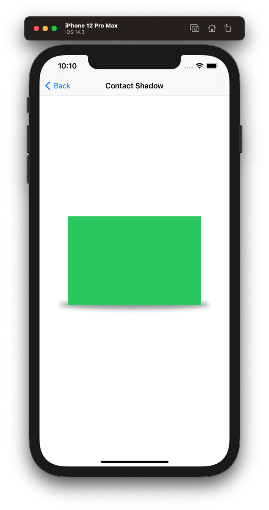
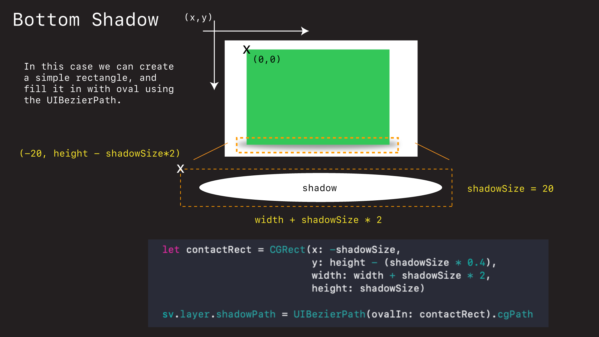
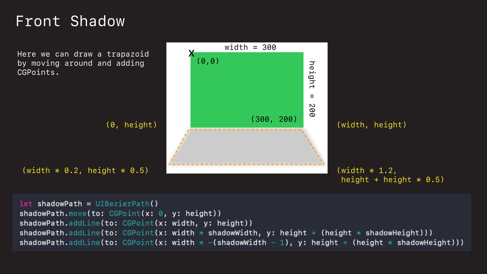
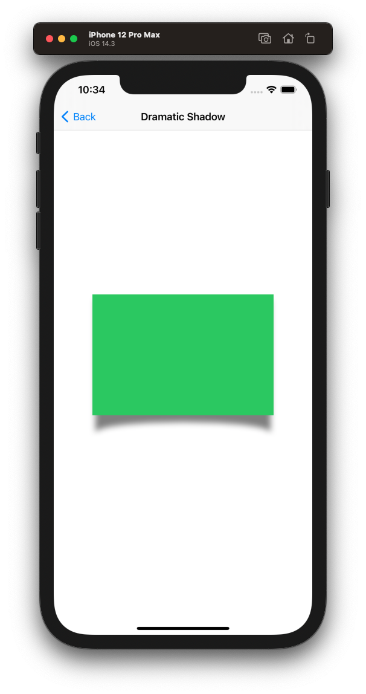
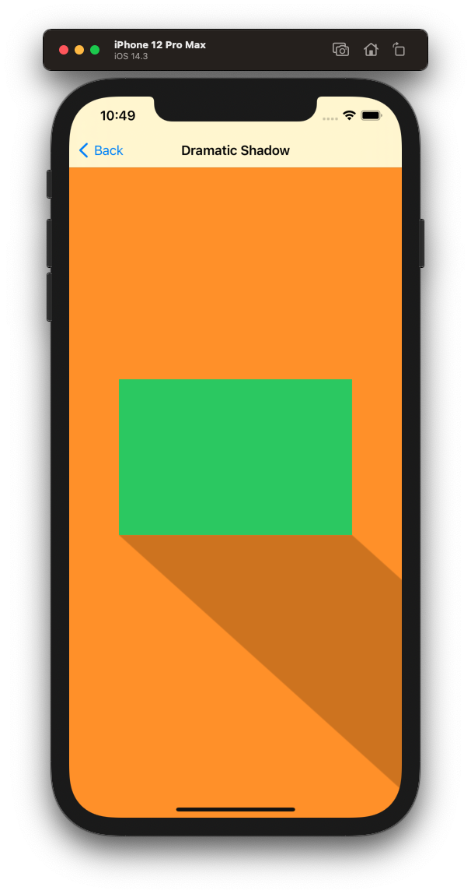
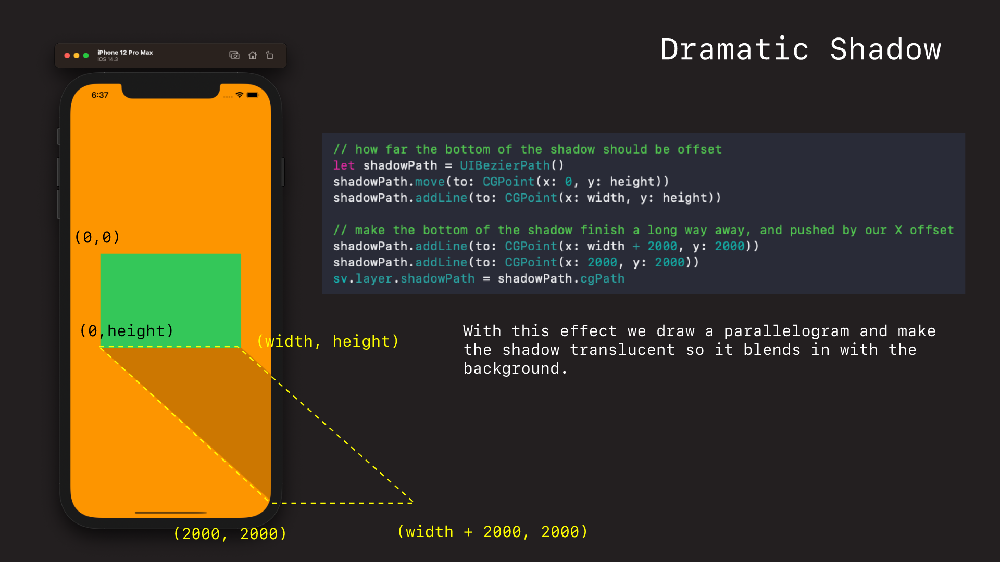
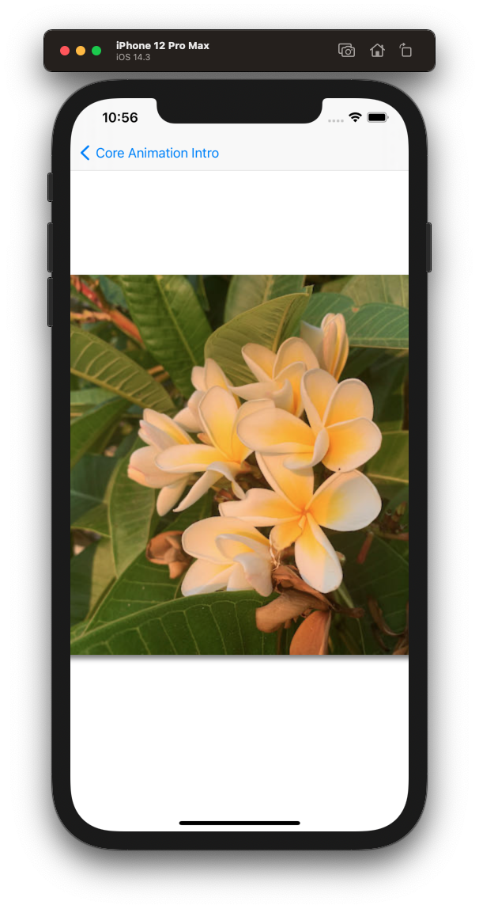

# Shadows

Here are some ways you can add shadows to your views in iOS.

## How do shadows work?

Shadows are added to views by setting properties in the view's `CALayer`.

```swift
shadowView.layer.shadowOpacity = 0.5
shadowView.layer.shadowOffset = CGSize(width: 5, height: 5)
```

You simply set the shadows opacity, specify an offset, and voila - shadows!


**SimpleViewController.swift**

```swift
import UIKit

class SimpleViewController: UIViewController {
    
    let shadowView = UIView()
    
    override func viewDidLoad() {
        super.viewDidLoad()
        title = "Simple Shadow"
        shadowView.backgroundColor = .systemBlue
        
        shadowView.translatesAutoresizingMaskIntoConstraints = false

        view.addSubview(shadowView)
        
        NSLayoutConstraint.activate([
            shadowView.centerXAnchor.constraint(equalTo: view.centerXAnchor),
            shadowView.centerYAnchor.constraint(equalTo: view.centerYAnchor),
            shadowView.widthAnchor.constraint(equalToConstant: 300),
            shadowView.heightAnchor.constraint(equalToConstant: 200),
        ])

        shadowView.layer.shadowOpacity = 0.5
        shadowView.layer.shadowOffset = CGSize(width: 5, height: 5)
    }
}
```

## Performant Shadows

Drawing shadows can be an expensive operation. To make the rendering of them more performant we can:

   1. Rasterizing them (create a bitmap cache).
   2. Assigning them an explicit path.

```swift
shadowView.layer.shadowOpacity = 0.5
shadowView.layer.shouldRasterize = true
shadowView.layer.shadowOffset = CGSize(width: 5, height: 5)
    
// for performance...
shadowView.layer.rasterizationScale = UIScreen.main.scale
shadowView.layer.shadowPath = UIBezierPath(rect: shadowView.bounds).cgPath
```

>Note: Paths often need view bounds, which can only be determined once a view has been rendered. For that reason you often need to to add the shadows to a view in `viewDidAppear` or in `layoutSubviews` of a custom view.


**PerformantViewController.swift**

```swift
import UIKit

class PerformantViewController: UIViewController {
    
    let shadowView = UIView()
    let myView = MyView()
    
    override func viewDidLoad() {
        super.viewDidLoad()
        title = "Performant Shadow"
        
        shadowView.backgroundColor = .systemRed
        shadowView.translatesAutoresizingMaskIntoConstraints = false

        myView.backgroundColor = .systemBlue
        myView.translatesAutoresizingMaskIntoConstraints = false

        view.addSubview(shadowView)
        view.addSubview(myView)
        
        NSLayoutConstraint.activate([
            shadowView.centerXAnchor.constraint(equalTo: view.centerXAnchor),
            shadowView.centerYAnchor.constraint(equalTo: view.centerYAnchor),
            shadowView.widthAnchor.constraint(equalToConstant: 300),
            shadowView.heightAnchor.constraint(equalToConstant: 200),
            
            myView.centerXAnchor.constraint(equalTo: view.centerXAnchor),
            myView.topAnchor.constraint(equalToSystemSpacingBelow: shadowView.bottomAnchor, multiplier: 3),
            myView.widthAnchor.constraint(equalToConstant: 300),
            myView.heightAnchor.constraint(equalToConstant: 200),
        ])
    }
    
    override func viewDidAppear(_ animated: Bool) {
        super.viewDidAppear(animated)
        
        shadowView.layer.shadowOpacity = 0.5
        shadowView.layer.shouldRasterize = true
        shadowView.layer.shadowOffset = CGSize(width: 5, height: 5)
        
        // for performance...
        shadowView.layer.rasterizationScale = UIScreen.main.scale
        shadowView.layer.shadowPath = UIBezierPath(rect: shadowView.bounds).cgPath
    }
    
    class MyView: UIView {
        
        override init(frame: CGRect) {
            super.init(frame: frame)
        }
        
        required init?(coder: NSCoder) {
            fatalError("init(coder:) has not been implemented")
        }
        
        override var intrinsicContentSize: CGSize {
            return CGSize(width: 200, height: 200)
        }
        
        override func layoutSubviews() {
            super.layoutSubviews()
            
            // do shadow work here once size is known
            addShadow()
        }
        
        func addShadow() {
            layer.shadowOpacity = 0.5
            layer.shouldRasterize = true
            layer.shadowOffset = CGSize(width: 5, height: 5)
            layer.rasterizationScale = UIScreen.main.scale
            layer.shadowPath = UIBezierPath(rect: bounds).cgPath
        }
    }
}
```

## Custom Shadows

Drawing custom shadows comes down to drawing `UIBezier` curves and specifying their dimensions in Core Graphics. Here are some examples I have taken from Paul Hudsons excellent write up [here](https://www.hackingwithswift.com/articles/155/advanced-uiview-shadow-effects-using-shadowpath).

### Bottom shadow



We can add a shadow to the bottom of a view by defining a Bezier curve in the form of an oval and adding it to the views `layer` like this.

**BaseViewController.swift** (for code reuse)

```swift

class BaseViewController: UIViewController {
    
    let sv = UIView() // shadowView
    
    override func viewDidLoad() {
        super.viewDidLoad()
        title = "Base Shadow"
        
        sv.backgroundColor = .systemGreen
        sv.translatesAutoresizingMaskIntoConstraints = false

        view.addSubview(sv)
        
        NSLayoutConstraint.activate([
            sv.centerXAnchor.constraint(equalTo: view.centerXAnchor),
            sv.centerYAnchor.constraint(equalTo: view.centerYAnchor),
            sv.widthAnchor.constraint(equalToConstant: 300),
            sv.heightAnchor.constraint(equalToConstant: 200),
        ])
    }
}
```

**BottomViewController.swift**

```swift
import UIKit

class BottomViewController: BaseViewController {

    override func viewDidAppear(_ animated: Bool) {
        super.viewDidAppear(animated)
        title = "Contact Shadow"

        let shadowSize: CGFloat = 20
        let height = sv.bounds.height
        let width = sv.bounds.width
        
        let contactRect = CGRect(x: -shadowSize,
                                 y: height - (shadowSize * 0.4),
                                 width: width + shadowSize * 2,
                                 height: shadowSize)

        sv.layer.shadowPath = UIBezierPath(ovalIn: contactRect).cgPath
        sv.layer.shadowRadius = 5
        sv.layer.shadowOpacity = 0.4
    }
}
```

The trick to understanding these custom shadows is understanding Core Graphics and its coordinate system.



Here we are defining a `CGRect`, which is going to define the dimensions of our shadow, and then drawing inside it an oval.

>Note: The origin is in the upper-left hand corner of our original view, and the `CGRect` is defined relative to that.

### Front shadow

Once you understand how `CGRect` works, you can define any type of shadow you like. Here is one that faces forward.


**FrontViewController.swift**

```swift
import UIKit

class FrontViewController: BaseViewController {

    override func viewDidAppear(_ animated: Bool) {
        super.viewDidAppear(animated)
        title = "Front Shadow"

        let height = sv.bounds.height
        let width = sv.bounds.width
        
        // how wide and high the shadow should be, where 1.0 is identical to the view
        let shadowWidth: CGFloat = 1.20
        let shadowHeight: CGFloat = 0.5

        let shadowPath = UIBezierPath()
        shadowPath.move(to: CGPoint(x: 0, y: height))
        shadowPath.addLine(to: CGPoint(x: width, y: height))
        shadowPath.addLine(to: CGPoint(x: width * shadowWidth, y: height + (height * shadowHeight)))
        shadowPath.addLine(to: CGPoint(x: width * -(shadowWidth - 1), y: height + (height * shadowHeight)))
        
        sv.layer.shadowPath = shadowPath.cgPath
        sv.layer.shadowRadius = 5
        sv.layer.shadowOffset = .zero
        sv.layer.shadowOpacity = 0.2
    }
}
```

Here is a picture visualizing how the geometry of this shadow was calculated.



### Curved Shadow

You can curve shadows using the `addCurve` method.



```swift
import UIKit

class CurvedViewController: BaseViewController {

    override func viewDidAppear(_ animated: Bool) {
        super.viewDidAppear(animated)
        title = "Dramatic Shadow"

        let height = sv.bounds.height
        let width = sv.bounds.width
        
        let shadowRadius: CGFloat = 5
        sv.layer.shadowRadius = shadowRadius
        sv.layer.shadowOffset = CGSize(width: 0, height: 10)
        sv.layer.shadowOpacity = 0.5

        // how strong to make the curling effect
        let curveAmount: CGFloat = 20
        let shadowPath = UIBezierPath()

        // the top left and right edges match our view, indented by the shadow radius
        shadowPath.move(to: CGPoint(x: shadowRadius, y: 0))
        shadowPath.addLine(to: CGPoint(x: width - shadowRadius, y: 0))

        // the bottom-right edge of our shadow should overshoot by the size of our curve
        shadowPath.addLine(to: CGPoint(x: width - shadowRadius, y: height + curveAmount))

        // the bottom-left edge also overshoots by the size of our curve, but is added with a curve back up towards the view
        shadowPath.addCurve(to: CGPoint(x: shadowRadius, y: height + curveAmount),
                            controlPoint1: CGPoint(x: width, y: height - shadowRadius),
                            controlPoint2: CGPoint(x: 0, y: height - shadowRadius))
        sv.layer.shadowPath = shadowPath.cgPath
    }
}
```

Like all shadow examples, the trick with understanding this one is the geometry.


Here our shadow actually mimics the original view, and then extends down below it adding a curve.

The curve at the bottom is a bit confusing.


What's going on here is we are adding a curve to that point in the lower left hand corder. We do this by specifiying the point we want to start at, and then add x2 control points which define the arc.

### Dramatic Curve

You can give shadows a dramatic effect like this by drawing a shadow that goes off screen and then setting its opacity to something less than 1 so it blends with the background.



```swift
import UIKit

class DramaticViewController: BaseViewController {

    override func viewDidAppear(_ animated: Bool) {
        super.viewDidAppear(animated)
        title = "Dramatic Shadow"

        let height = sv.bounds.height
        let width = sv.bounds.width
        
        sv.layer.shadowRadius = 0
        sv.layer.shadowOffset = .zero
        sv.layer.shadowOpacity = 0.2

        // how far the bottom of the shadow should be offset
        let shadowPath = UIBezierPath()
        shadowPath.move(to: CGPoint(x: 0, y: height))
        shadowPath.addLine(to: CGPoint(x: width, y: height))

        // make the bottom of the shadow finish a long way away, and pushed by our X offset
        shadowPath.addLine(to: CGPoint(x: width + 2000, y: 2000))
        shadowPath.addLine(to: CGPoint(x: 2000, y: 2000))
        sv.layer.shadowPath = shadowPath.cgPath

        view.backgroundColor = .systemOrange
    }
}
```



## Dealing with clipped views

Sometimes our views need to be clipped.

```swift
imageView.clipsToBounds = true
```

When we do this it also clips our subview layers - thus hiding any shadow effects.

To fix this, set `masksToBounds = false` on your `layer`.

```swift
imageView.layer.masksToBounds = false
```

Doing this will let you subviews shine that and not include them in the clipping from the parent.



You can see the shadow coming through at the bottom.

```swift
import UIKit

class ClippedViewController: UIViewController {
    
    let imageView = UIImageView()
    
    override func viewDidLoad() {
        super.viewDidLoad()
        
        imageView.translatesAutoresizingMaskIntoConstraints = false
        imageView.image = UIImage(named: "flowers")
        
        
        view.addSubview(imageView)
        
        NSLayoutConstraint.activate([
            imageView.centerXAnchor.constraint(equalTo: view.centerXAnchor),
            imageView.centerYAnchor.constraint(equalTo: view.centerYAnchor),
        ])
        
        // Normally we could ...
        // imageView.layer.shadowOpacity = 0.5
        // imageView.layer.shadowOffset = CGSize(width: 5, height: 5)

        // But when clipped..
        imageView.clipsToBounds = true
    }
    
    // We can fix by...
    override func viewDidAppear(_ animated: Bool) {
        super.viewDidAppear(animated)
        
        let shadowPath = UIBezierPath(rect: imageView.bounds)
        imageView.layer.masksToBounds = false // adding this line here
        imageView.layer.shadowColor = UIColor.black.cgColor
        imageView.layer.shadowOffset = CGSize(width: 5, height: 5)
        imageView.layer.shadowOpacity = 0.5
        imageView.layer.shadowPath = shadowPath.cgPath
    }
}
```

### Why can't I see my shadows?

When you add shadows to a view and you can't seem them it generally means one of two things.

1. Your view hasn't been sized (so the UIBezier curve you are drawing has no `CGRect` and your shadow has a size of zero.
2. Your view is clipped.

For the first, don't add your shadow until your view is sized (see examples above on how to add shadow in `viewDidAppear` or `layoutSubviews`.

For the second see the clipped view example above and set

```swift
imageView.layer.masksToBounds = false
```


### Download source

Check the [subdirectory](Demo) of this repo for all the source.

### Links that help

- [Paul Hudson Examples](https://www.hackingwithswift.com/articles/155/advanced-uiview-shadow-effects-using-shadowpath)