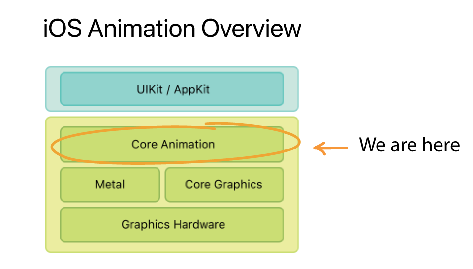
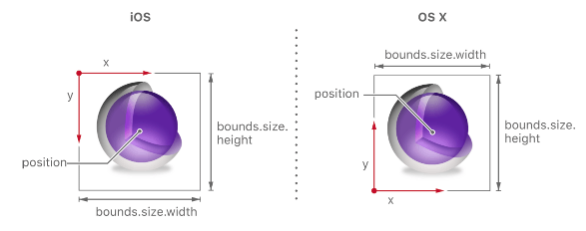
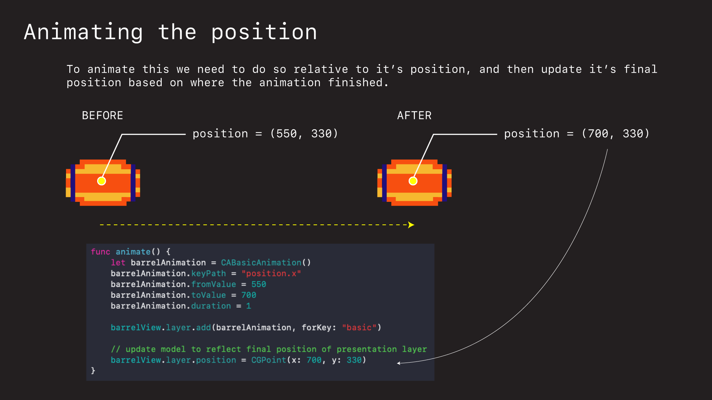

# Core Animation Intro

Core animation can be confusing at first, but if we learn it from first principles it will make understanding the rest of Animation in iOS a lot easier so let's start here.

## What is Core Animation


Core Animation provides a general purpose system for animating views and other visual elements of your app. It does this by caching the contents of views into bitmaps that can be manipulated directly by the graphics hardware.

It sits below UIKit. Whenever you animate anything with UIKit it's Core Animation (or CA) that is doing the work behind the scenes. And by learning more about how it works, you are going to gain deeper insight into how to use it effectively.

## What's important to understand?

The key thing to understand about CA is that when you add an animation layer to your view, your aren't actually changing the underlying view - just it's animation.

CA maintains two parallet layer hierarchies: the *model layer tree* and the *presentation layer tree*. Layers in the former represent the current state, while layers in the latter represent the in-flight values of animations.

You can switch between these layers easily (`CALayer presentationLayer` and `CALayer modelLayer`). But if you ever inspect a layer during an animation and notice that it's values aren't different, this is why. It's the presentation layer that's being anination, not the model layer.

## The Coordinate System

One of the most confusing things about getting started with CA is it's coordinate system. But once you understand how it's layed out, and which operations are done to which properties it's not that bad.

The basic coordinate system starts with the origin in the upper-right-hand corner for iOS (Mac is lower left). And the key thing to note is the center of the `layer` or it's `position`.


When we create a `UIImageView` we can specify the `CGRect` (whose lays the image out relative to the x and y values in the upper righ-hand-corner), but as we will see shortly, when we go to animate it, it is the position or `anchor point` that we will change.

## A Basic Animation

To animate something in CA we often do so relative to it's anchor point or position.



Note how the `position` is in the middle of the image. This position is half the width and half the height away from the images initial "position" of it's `CGRect` in the upper-right-hand corner.

That's why when animating we often need to take this into account.

For example, say we define an image with a `CGRect` defined at (500, 300).


```swift
lazy var barrelView: UIImageView = {
    let view = UIImageView(frame: CGRect(x: 500, y: 300, width: 100, height: 60))
    view.image = UIImage(named: "barrel")
    
    return view
}()
```

To animate and move it 150 pts to the right, we need to do so relative to its position - which is 500 plus half the width of the image itself 100/2. Or 550.

```swift
let barrelAnimation = CABasicAnimation()
barrelAnimation.keyPath = "position.x"
barrelAnimation.fromValue = 550
barrelAnimation.toValue = 700
barrelAnimation.duration = 1
    
barrelView.layer.add(barrelAnimation, forKey: "basic")
```


Notice when we do the image flips back to it's original position? That's the *model presentation* thing I was talking about. By default the animation will not modify the presentation layer beyond its duration. It will be removed when it is done and the presentation layer will fall back to the values of the model layer.

We can fix this by updating the *model layer* to equal the final position of the animation from the *presentation layer*.

```swift
let barrelAnimation = CABasicAnimation()
barrelAnimation.keyPath = "position.x"
barrelAnimation.fromValue = 550
barrelAnimation.toValue = 700
barrelAnimation.duration = 1
    
barrelView.layer.add(barrelAnimation, forKey: "basic")
    
// update model to reflect final position of presentation layer
barrelView.layer.position = CGPoint(x: 700, y: 330)
```



Note also how when updating the model we can't just use the initial y-value of the `CGRect`. We have to use the y-position which is 300 + height/2 = 300 pts.

Now the barrel stays where is should, our *model* and *presentation* layers are in sync, and all is good.


## Keyframe animations

To get full control over what happens in an animation and when use `CAKeyframeAnimation`.

Here is an example of how we can make a login form shake by moving the `position.x` of a textfield back and forth at specific times over a 0.4 sec duration.


```swift
let animation = CAKeyframeAnimation()
animation.keyPath = "position.x"
animation.values = [0, 10, -10, 10, 0]
animation.keyTimes = [0, 0.16, 0.5, 0.83, 1]
animation.duration = 0.4

animation.isAdditive = true
loginView.layer.add(animation, forKey: "shake")
```

`isAdditive` determines if the value specified by the animation is added to the current render tree value to produce the new render tree value.

## Animating along paths

### Links that help

- [Core Animation Apple Docs](https://developer.apple.com/library/archive/documentation/Cocoa/Conceptual/CoreAnimation_guide/CoreAnimationBasics/CoreAnimationBasics.html#//apple_ref/doc/uid/TP40004514-CH2-SW3)
- [Good overview and intro to CA upon which these notes were based](https://www.objc.io/issues/12-animations/animations-explained/)

