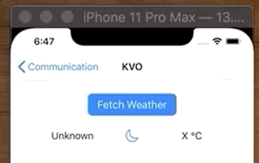

# Key-Value Observing



Make your property observable.

```swift
@objc
class KVOWeatherService: NSObject {

    // 1 Make weather observable
    //   - `dynamic` bridges objc and Swift. Use to enable Key-Value observing.
    @objc dynamic var weather = KVOWeather(city: "Unknown", temperature: "X °C", imageName: "moon")

    func fetchWeather(for city: String) {
        weather = KVOWeather(city: city, temperature: "21 °C", imageName: "sunset.fill")
    }

}

@objc
class KVOWeather: NSObject {
    var city: String
    var temperature: String!
    var imageName: String!
    
    init(city: String, temperature: String, imageName: String) {
        self.city = city
        self.temperature = temperature
        self.imageName = imageName
    }
}
```

Observe it.

```swift
    @objc func weatherPressed() {
        weatherService.fetchWeather(for: "San Francisco")
    }
    
    /// KVO
    var observableWeather: Any?
    @objc let weatherService = KVOWeatherService()

    override func viewDidLoad() {
        super.viewDidLoad()
        setupViews()

        // 2 Observe it
        observableWeather = weatherService.observe(\.weather, options: [.initial, .new]) {
            // 5 Get updated
            [unowned self] object, change in
            let weatherValue = change.newValue
            self.updateView(with: weatherValue!)
        }
    }
```

### Video

- [What are Key-Value Observers and How Do They Work?](https://www.youtube.com/watch?v=eOLb_Z1F4hk)

