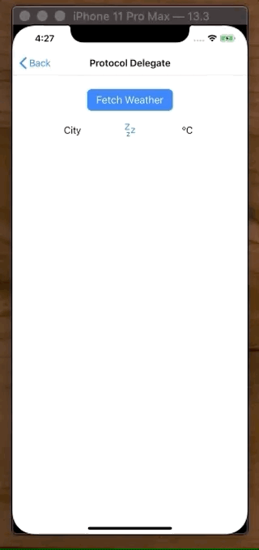

# Responder Chain



```swift
import UIKit

/*
 The ResponderChain fires UIEvents up the Responder chain stack giving each UIResponder
 a chance to handle.

 The subtile difference in target is whether you set yourself, or `nil`.

 If you set `self` as the target, you will get a chance to intercept the responder chain call, and either
 handle it or refire it up the chain again with `UIApplication.shared.sendAction`.

    > button.addTarget(self, action: #selector(responderPressed(sender:)), for: .primaryActionTriggered)

 If you set the target as `nil` initially, the event will continue to walk up the chain, calling `next`, one
 every responder it meets, until it finds one that satisfier the action.

    > button.addTarget(nil, action: .performFetchWeatherAction, for: .primaryActionTriggered)

 */
class ResponderChainViewController: UIViewController {

    override func viewDidLoad() {
        super.viewDidLoad()
        setupViews()
    }

    let sharedActionButton: UIButton = {
        let button = makeButton(withText: "UIApplication.shared")
        button.addTarget(self, action: #selector(responderPressed(sender:)), for: .primaryActionTriggered)
        return button
    }()

    let planActionButton: UIButton = {
        let button = makeButton(withText: "button.addTarget(nil)")
        button.addTarget(nil, action: .performFetchWeatherAction, for: .primaryActionTriggered)
        return button
    }()

    func setupViews() {
        navigationItem.title = "Responder Chain"

        let stackView = makeVerticalStackView()
        stackView.addArrangedSubview(sharedActionButton)
        stackView.addArrangedSubview(planActionButton)

        view.addSubview(stackView)

        stackView.centerXAnchor.constraint(equalTo: view.centerXAnchor).isActive = true
        stackView.topAnchor.constraint(equalToSystemSpacingBelow: view.safeAreaLayoutGuide.topAnchor, multiplier: 3).isActive = true
    }

    @objc func responderPressed(sender: Any?) {
        UIApplication.shared.sendAction(
            #selector(ResponderAction.fetchWeather), to: nil, // target = nil
            from: self, for: nil)
    }
}

@objc protocol ResponderAction: AnyObject {
    func fetchWeather(sender: Any?)
}

private extension Selector {
    static let performFetchWeatherAction = #selector(ResponderAction.fetchWeather(sender:))
}
```

## Discussion

You can't just send any _func_ up the responder chain. It must be of a certain form. 

```swift
- (void)action

- (void)action:(id)sender

- (void)action:(id)sender forEvent:(UIEvent *)event
```

Only these method signatures are supported. With the last two parameters being optional. If you look at the documentation via Xcode it will show. This is why you can't send func's like this.

```
func didSelectRowAt(_ indexPath: IndexPath) // 💥
```

When you do that you get a «Unrecognized Selector Sent to Instance» Error In Xcode.


### Video

- [What is Responder Chain and How Does it Work?](https://www.youtube.com/watch?v=le7tzeqN908)
- [Using the Responder Chain](https://useyourloaf.com/blog/using-the-responder-chain/)

