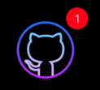
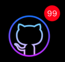
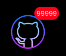

# Custom Badge

This tutorial will show you how to create your own custom badge and display on any `UIView`. Example based on source code of [BadgeHub](https://github.com/jogendra/BadgeHub).


## Usage

**ViewController.swift**

```swift
import UIKit

class ViewController: UIViewController {
    
    private var hub: BadgeHub?
    
    private lazy var imageView: UIImageView = {
        let iv = UIImageView()
        iv.frame = CGRect(x: view.frame.size.width / 2 - 48,
                          y: 80, width: 96, height: 96)
        iv.image = UIImage(named: "github_color")
        return iv
    }()
        
    override func viewDidLoad() {
        super.viewDidLoad()
        setupImageView()
    }
    
    private func setupImageView() {
        hub = BadgeHub(view: imageView)
        hub?.setCount(200)
        view.addSubview(imageView)
    }
}
```

You basically create the view you want to add the badge to (in this case a `UIImage`). And then you add the badge to the view by passing it into this object called `BadgeHub` and it takes care of the rest.

It will look at the frame of the view you pass it, create a red circle and label offset up and to the right, and that's basically it.

## How it works

### Placing the circle


The circle is placed in the upper-righthand-corner by taking the frame of the passed in view, and creating a new view for the circle

```swift
        redCircle = BadgeView()
        redCircle.backgroundColor = UIColor.red
```

And then setting that view's frame up and to the right by calculating a new x y coordinate.

```swift
let atFrame = CGRect(x: (frame?.size.width ?? 0.0) - ((Constants.notificHubDefaultDiameter) * 2 / 3),
                     y: (-Constants.notificHubDefaultDiameter) / 3,
                     width: CGFloat(Constants.notificHubDefaultDiameter),
                     height: CGFloat(Constants.notificHubDefaultDiameter))
setCircleAtFrame(atFrame)
```

The key to understanding this is that if we set the new circular frame to the origin

```swift
let atFrame = CGRect(x: 0,
                     y: 0,
                     width: ...,
                     height: ...)
```

Our badge would appear here.


So in order to move it up and to the right we need take the original frame size, and subtract from it 2/3 of the circles diameter, nudging it just in from the far right.


Here is the full source for just placing the circle.

```swift
import UIKit
import QuartzCore

fileprivate class BadgeView: UIView {
    
    func setBackgroundColor(_ backgroundColor: UIColor?) {
        super.backgroundColor = backgroundColor
    }
}

public class BadgeHub: NSObject {
    
    private var redCircle: BadgeView!
    var hubView: UIView?
    
    private struct Constants {
        static let notificHubDefaultDiameter: CGFloat = 30
    }
            
    public init(view: UIView) {
        super.init()
        
        setView(view)
    }
        
    public func setView(_ view: UIView?) {
        let frame: CGRect? = view?.frame
        
        redCircle = BadgeView()
        redCircle.backgroundColor = UIColor.red
        
        let atFrame = CGRect(x: (frame?.size.width ?? 0.0) - ((Constants.notificHubDefaultDiameter) * 2 / 3),
                             y: (-Constants.notificHubDefaultDiameter) / 3,
                             width: CGFloat(Constants.notificHubDefaultDiameter),
                             height: CGFloat(Constants.notificHubDefaultDiameter))
        setCircleAtFrame(atFrame)
        
        view?.addSubview(redCircle)
        view?.bringSubviewToFront(redCircle)
        hubView = view
    }
    
    /// Set the frame of the notification circle relative to the view.
    public func setCircleAtFrame(_ frame: CGRect) {
        redCircle.frame = frame
        redCircle.layer.cornerRadius = frame.size.height / 2
    }
}
```

### Adding the label

We can add a number to the badge by creating a `UILabel` 

```swift
private var countLabel: UILabel? {
    didSet {
        countLabel?.text = "\(count)"
        checkZero()
    }
}
```

and then setting the label's frame to be the same as the badge.

```swift
public func setView(_ view: UIView?, andCount startCount: Int) {
	// ...    
    let frame: CGRect? = view?.frame
    
    redCircle = BadgeView()
    
    countLabel = UILabel(frame: redCircle.frame)
    countLabel?.textAlignment = .center
    countLabel?.textColor = UIColor.white
    countLabel?.backgroundColor = UIColor.clear
    // ...
}
```

and then setting its frame to that of the badge.

### Dealing with order of magnitude numbers

So long as the label contains one or two digits, the circle around the label looks OK.





It's when we get to the third order of magnitude number or more that we need to adjust the width and x coordinate of our circle frame.



We can do that, by recalculating the width of the badge based on the number of digit's, as well as adjust its x-coordinate.

```swift
/// Resize the badge to fit the current digits.
/// This method is called everytime count value is changed.
func resizeToFitDigits() {
    guard count > 0 else { return }
    var orderOfMagnitude: Int = Int(log10(Double(count)))
    orderOfMagnitude = (orderOfMagnitude >= 2) ? orderOfMagnitude : 1
    
    var frame = initialFrame
    let newFrameWidth = CGFloat(initialFrame.size.width * (1 + 0.3 * CGFloat(orderOfMagnitude - 1)))
    
    frame.size.width = newFrameWidth
    frame.origin.x = initialFrame.origin.x - (newFrameWidth - initialFrame.size.width) / 2
    
    redCircle.frame = frame
    countLabel?.frame = redCircle.frame
    
    baseFrame = frame
    curOrderMagnitude = orderOfMagnitude
}
```


## Full source

**ViewController.swift**

```swift
import UIKit

class ViewController: UIViewController {
    
    private var hub: BadgeHub?
    
    private lazy var imageView: UIImageView = {
        let iv = UIImageView()
        iv.frame = CGRect(x: view.frame.size.width / 2 - 48,
                          y: 80, width: 96, height: 96)
        iv.image = UIImage(named: "github_color")
        return iv
    }()
        
    override func viewDidLoad() {
        super.viewDidLoad()
        setupImageView()
    }
    
    private func setupImageView() {
        hub = BadgeHub(view: imageView)
        hub?.setCount(99999)
        view.addSubview(imageView)
    }
}
```

**BadgeHub.swift**

```swift
import UIKit
import QuartzCore

fileprivate class BadgeView: UIView {
    
    func setBackgroundColor(_ backgroundColor: UIColor?) {
        super.backgroundColor = backgroundColor
    }
}

public class BadgeHub: NSObject {
    
    private var curOrderMagnitude: Int = 0
    private var redCircle: BadgeView!
    private var baseFrame = CGRect.zero
    private var initialFrame = CGRect.zero
    
    var hubView: UIView?
    
    private struct Constants {
        static let notificHubDefaultDiameter: CGFloat = 30
        static let countMagnitudeAdaptationRatio: CGFloat = 0.3
    }

    var count: Int = 0 {
        didSet {
            countLabel?.text = "\(count)"
            checkZero()
            resizeToFitDigits()
        }
    }
        
    private var countLabel: UILabel? {
        didSet {
            countLabel?.text = "\(count)"
            checkZero()
        }
    }
    
    public init(view: UIView) {
        super.init()
        
        setView(view, andCount: 0)
    }
        
    public func setView(_ view: UIView?, andCount startCount: Int) {
        curOrderMagnitude = 0
        
        let frame: CGRect? = view?.frame
        
        redCircle = BadgeView()
        redCircle?.isUserInteractionEnabled = false
        redCircle.backgroundColor = UIColor.red
        
        countLabel = UILabel(frame: redCircle.frame)
        countLabel?.isUserInteractionEnabled = false
        count = startCount
        countLabel?.textAlignment = .center
        countLabel?.textColor = UIColor.white
        countLabel?.backgroundColor = UIColor.clear
        
        let atFrame = CGRect(x: (frame?.size.width ?? 0.0) - ((Constants.notificHubDefaultDiameter) * 2 / 3),
                             y: (-Constants.notificHubDefaultDiameter) / 3,
                             width: CGFloat(Constants.notificHubDefaultDiameter),
                             height: CGFloat(Constants.notificHubDefaultDiameter))
        setCircleAtFrame(atFrame)
        
        view?.addSubview(redCircle)
        view?.addSubview(countLabel!)
        view?.bringSubviewToFront(redCircle)
        view?.bringSubviewToFront(countLabel!)
        hubView = view
        checkZero()
    }
    
    /// Set the frame of the notification circle relative to the view.
    public func setCircleAtFrame(_ frame: CGRect) {
        redCircle.frame = frame
        baseFrame = frame
        initialFrame = frame
        
        countLabel?.frame = redCircle.frame
        redCircle.layer.cornerRadius = frame.size.height / 2
        countLabel?.font = UIFont.systemFont(ofSize: frame.size.width / 2)
    }
            
    public func moveCircleBy(x: CGFloat, y: CGFloat) {
        var frame: CGRect = redCircle.frame
        frame.origin.x += x
        frame.origin.y += y
        self.setCircleAtFrame(frame)
    }
                            
    public func setCount(_ newCount: Int) {
        self.count = newCount
        countLabel?.text = "\(count)"
        checkZero()
    }
            
    public func checkZero() {
        if count <= 0 {
            redCircle.isHidden = true
            countLabel?.isHidden = true
        } else {
            redCircle.isHidden = false
            countLabel?.isHidden = false
        }
    }
    
    /// Resize the badge to fit the current digits.
    /// This method is called everytime count value is changed.
    func resizeToFitDigits() {
        guard count > 0 else { return }
        var orderOfMagnitude: Int = Int(log10(Double(count)))
        orderOfMagnitude = (orderOfMagnitude >= 2) ? orderOfMagnitude : 1
        
        var frame = initialFrame
        let newFrameWidth = CGFloat(initialFrame.size.width * (1 + 0.3 * CGFloat(orderOfMagnitude - 1)))
        
        frame.size.width = newFrameWidth
        frame.origin.x = initialFrame.origin.x - (newFrameWidth - initialFrame.size.width) / 2
        
        redCircle.frame = frame
        countLabel?.frame = redCircle.frame
        
        baseFrame = frame
        curOrderMagnitude = orderOfMagnitude
    }
}
```

Note: This code from from the open source project [BadgeHub](https://github.com/jogendra/BadgeHub). 


### Links the help

- [BadgeHub - source code for example](https://github.com/jogendra/BadgeHub)