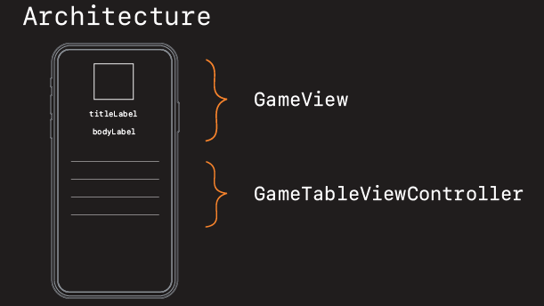
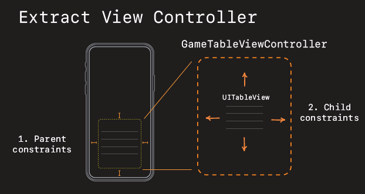
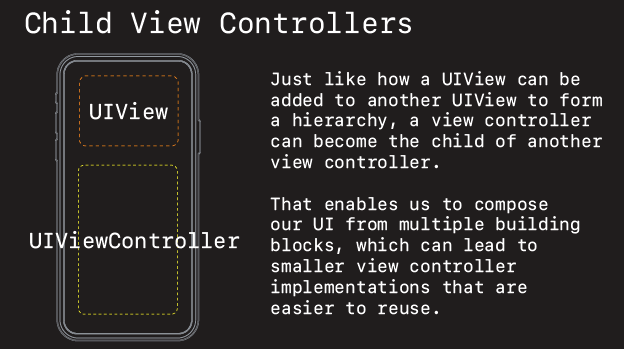
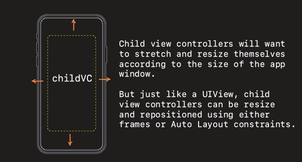
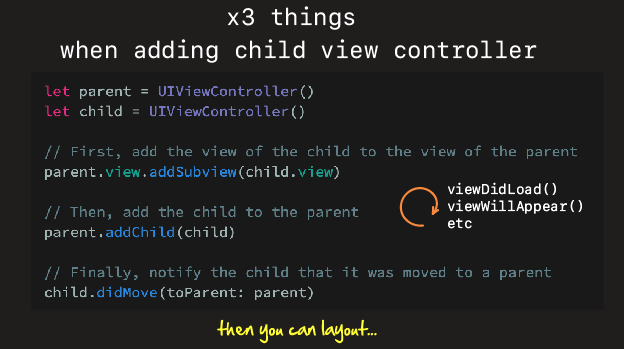
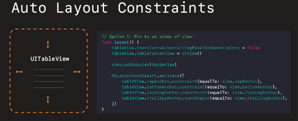
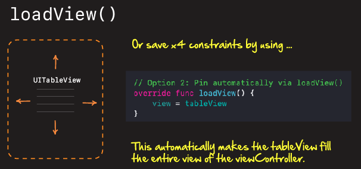
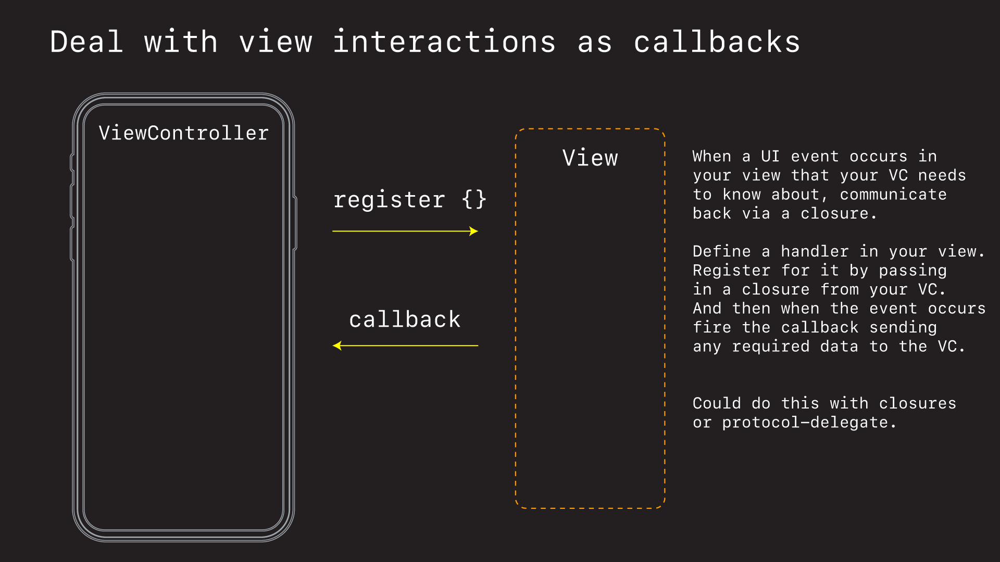

# Extracting Views & View Controllers



## Extracting Views


When you extract a view from a view controller, there are two sets of constraints you need to think about:

- Parent constraints
- Child constraints

Parent constraints are pretty easy because these are the ones you already laid out when you built the original view controller.

With child contraints on the other hand, you need to think about how the view will be laid on in the container view, and where to include the padding and spacing (in the child or the parent).

I prefer making the child flush with it's container view, and leave the padding and spacing to the parent.

```swift
import UIKit

class GameView: UIView {

    var game: Game? {
        didSet {
            guard let game = game else { return }
            profileImage.image = UIImage(named: game.imageName)
            titleLabel.text = game.name
            bodyLabel.text = game.description
        }
    }

    lazy var profileImage: UIImageView = {
        return makeProfileImageView(withName: "space-invaders")
    }()

    lazy var titleLabel: UILabel = {
        return makeTitleLabel(withTitle: "Space Invaders")
    }()

    lazy var bodyLabel: UILabel = {
        return makeLabel(withTitle: "Space Invaders is a Japanese shooting video game released in 1978 by Taito. It was developed by Tomohiro Nishikado, who was inspired by other media: Breakout, The War of the Worlds, and Star Wars.")
    }()

    required init?(coder: NSCoder) {
        fatalError("init(coder:) has not been implemented")
    }

    override init(frame: CGRect) {
        super.init(frame: .zero)

        let stackView = makeVerticalStackView()

        addSubview(stackView)

        stackView.addArrangedSubview(profileImage)
        stackView.addArrangedSubview(titleLabel)
        stackView.addArrangedSubview(bodyLabel)

        profileImage.heightAnchor.constraint(equalToConstant: 100).isActive = true

        stackView.topAnchor.constraint(equalToSystemSpacingBelow: topAnchor, multiplier: 0).isActive = true
        stackView.leadingAnchor.constraint(equalToSystemSpacingAfter: leadingAnchor, multiplier: 0).isActive = true
        trailingAnchor.constraint(equalToSystemSpacingAfter: stackView.trailingAnchor, multiplier: 0).isActive = true
        bottomAnchor.constraint(equalToSystemSpacingBelow: stackView.bottomAnchor, multiplier: 0).isActive = true
    }

}
```

## Extracting View Controllers

### Child View Controllers







### Three Things



When you extract child view controller from a parent, there are three things you need to do in order to include that child view controller in the parent's view controller life cycle.

```swift
// x3 things with nested childViewControllers
view.addSubview(gameTableViewController.view)
addChild(gameTableViewController)
gameTableViewController.didMove(toParent: self)
```

Once that is down, you can then layout the child view in the parent using frames or Auto Layout.

**Child View Controller**

```swift
import UIKit

struct Game {
    let name: String
    let description: String
    let imageName: String
}

protocol GameTableViewControllerDelegate: AnyObject {
    func didSelectRowAt(indexPath: IndexPath)
}

class GameService {

    func fetchGames(completion: @escaping ((Result<[Game], Error>) -> Void)) {
        let games = [Game(name: "Space Invaders", description: "Space Invaders is a Japanese shooting video game released in 1978 by Taito. It was developed by Tomohiro Nishikado, who was inspired by other media: Breakout, The War of the Worlds, and Star Wars.", imageName: "space-invaders"),
                     Game(name: "Discs of Tron", description: "Discs of Tron, is the second arcade game based on the Disney film Tron. While the first Tron arcade game had several mini-games based on scenes in the movie, Discs of Tron is a single game inspired by Tron's disc-battle sequences and set in an arena similar to the one in the Jai Alai–style sequence. ", imageName: "tron"),
                     Game(name: "Frogger", description: "Frogger is a 1981 arcade game developed by Konami and originally published by Sega. In North America, it was published jointly by Sega and Gremlin Industries. The object of the game is to direct frogs to their homes one by one by crossing a busy road and navigating a river full of hazards.", imageName: "frogger"),
                     Game(name: "Joust", description: "Joust is an arcade game developed by Williams Electronics and released in 1982. It popularized the concept of two-player cooperative gameplay by being more successful at it than its predecessors. The player uses a button and joystick to control a knight riding a flying ostrich.", imageName: "joust")
                    ]

        DispatchQueue.main.asyncAfter(deadline: .now() + 0.5) {
            completion(Result.success(games))
        }
    }
}

class GameTableViewController: UIViewController {

    let cellId = "cellId"
    var tableView = UITableView()
    var games = [Game]()

    weak var delegate: GameTableViewControllerDelegate?

    override func viewDidLoad() {
        super.viewDidLoad()
        setup()
//        layout()
        loadData()
    }

    func setup() {
        tableView.delegate = self
        tableView.dataSource = self
        tableView.tableFooterView = UIView()
        tableView.register(UITableViewCell.self, forCellReuseIdentifier: cellId)
    }

    func loadData() {
        GameService().fetchGames { [weak self] result in
            switch result {
            case .success(let games):
                self?.games = games
                self?.tableView.reloadData()
            case .failure(let error):
                print(error.localizedDescription)
            }
        }
    }

    // Option 1: Pin to x4 sides of view.
    func layout() {
        tableView.translatesAutoresizingMaskIntoConstraints = false

        view.addSubview(tableView)

        NSLayoutConstraint.activate([
            tableView.topAnchor.constraint(equalTo: view.topAnchor),
            tableView.bottomAnchor.constraint(equalTo: view.bottomAnchor),
            tableView.leadingAnchor.constraint(equalTo: view.leadingAnchor),
            tableView.trailingAnchor.constraint(equalTo: view.trailingAnchor),
        ])
    }

    // Option 2: Pin automatically via loadView()
    override func loadView() {
        view = tableView
    }
}

extension GameTableViewController: UITableViewDelegate {
    func tableView(_ tableView: UITableView, didSelectRowAt indexPath: IndexPath) {
        delegate?.didSelectRowAt(indexPath: indexPath)
    }
}

extension GameTableViewController: UITableViewDataSource {
    func tableView(_ tableView: UITableView, cellForRowAt indexPath: IndexPath) -> UITableViewCell {
        let cell = tableView.dequeueReusableCell(withIdentifier: cellId, for: indexPath)

        cell.textLabel?.text = games[indexPath.row].name

        return cell
    }

    func tableView(_ tableView: UITableView, numberOfRowsInSection section: Int) -> Int {
        return games.count
    }
}
```

**Parent View Controller**

```swift
import UIKit
import Foundation

class ViewController: UIViewController {

    let cellId = "cellId"
    var tableView = UITableView()

    var gameView = GameView()
    var gameTableViewController = GameTableViewController()

    override func viewDidLoad() {
        super.viewDidLoad()
        setup()
        layout()
    }

    func setup() {
        gameTableViewController.delegate = self
    }
    
    func layout() {
        gameView.translatesAutoresizingMaskIntoConstraints = false
        view.addSubview(gameView)

        // x3 things with nested childViewControllers
        view.addSubview(gameTableViewController.view)
        addChild(gameTableViewController)
        gameTableViewController.didMove(toParent: self)

        guard let gameTableView = gameTableViewController.view else { return }
        gameTableView.translatesAutoresizingMaskIntoConstraints = false

        gameView.topAnchor.constraint(equalToSystemSpacingBelow: view.safeAreaLayoutGuide.topAnchor, multiplier: 3).isActive = true
        gameView.leadingAnchor.constraint(equalToSystemSpacingAfter: view.leadingAnchor, multiplier: 3).isActive = true
        view.trailingAnchor.constraint(equalToSystemSpacingAfter: gameView.trailingAnchor, multiplier: 3).isActive = true

        gameTableView.heightAnchor.constraint(equalTo: view.heightAnchor, multiplier: 0.5).isActive = true
        gameTableView.leadingAnchor.constraint(equalToSystemSpacingAfter: view.leadingAnchor, multiplier: 1).isActive = true
        view.trailingAnchor.constraint(equalToSystemSpacingAfter: gameTableView.trailingAnchor, multiplier: 1).isActive = true
        view.bottomAnchor.constraint(equalToSystemSpacingBelow: gameTableView.bottomAnchor, multiplier: 1).isActive = true
    }
}

extension ViewController: GameTableViewControllerDelegate {
    func didSelectRowAt(indexPath: IndexPath) {
        let game = gameTableViewController.games[indexPath.row]

        gameView.alpha = 0

        UIViewPropertyAnimator.runningPropertyAnimator(withDuration: 2, delay: 0, options: [], animations: {
            self.gameView.game = game
            self.gameView.alpha = 1
        })
    }
}
```

### loadView()

If you want the child view to fill the entire child view controller you can either pin it with x4 constraints like this.



Or you can call `loadView` in the view controller.



Calling `loadView` takes whatever view you pass it and sets it to fill the entire view controller. You save x4 layout constraints doing this, its pretty simple, and quite elegant.

## Dealing with interactions

Sometimes views need to communicate back to their VCs when certain UI events occur. You can do this via closures.



Simply define a handler in your view, register for if from the VC, and then fire the closure when the UI event occurs.

**View**

```swift
class WeatherView: UIView {
    
    // callback
    var searchTextFieldHandler: ((UITextField) -> Void)?    
}

extension WeatherView {
        
    func textFieldDidEndEditing(_ textField: UITextField) {
        guard let handler = searchTextFieldHandler else { return }
        
        handler(textField)
        searchTextField.text = ""
    }
}

```

**ViewController**

```swift
extension WeatherViewController {
    
    func setup() {
        weatherView.searchTextFieldHandler = fetchWeather(_:)
    }
    
    func fetchWeather(_ textField: UITextField) {
        if let city = textField.text {
            weatherService.fetchWeather(cityName: city)
        }
    }
```


### Links that help

- [Sundell on Child View Controllers](https://www.swiftbysundell.com/basics/child-view-controllers/)
- [Apple Docs on UIViewControllers](https://developer.apple.com/library/archive/featuredarticles/ViewControllerPGforiPhoneOS/index.html)
- [Writing cleaner view code by overriding loadview - Rambo]()https://swiftrocks.com/writing-cleaner-view-code-by-overriding-loadview)

### Video

- [Extract views](https://www.youtube.com/watch?v=PyUyWtpKhFM)

