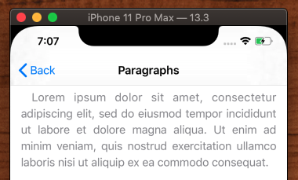
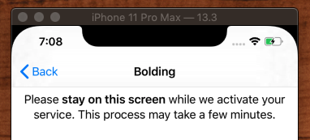
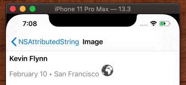
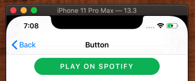

# NSAttributedStrings

## Paragraph



```swift
lazy var label: UILabel = {
    let label = makeLabel()
    label.attributedText = makeText()
    
    return label
}()

func makeText() -> c {
    let paragraphStyle = NSMutableParagraphStyle()
    paragraphStyle.firstLineHeadIndent = 24
    paragraphStyle.headIndent = 8
    paragraphStyle.tailIndent = -8
    paragraphStyle.lineSpacing = 4
    paragraphStyle.alignment = .justified
    paragraphStyle.paragraphSpacingBefore = 4
    paragraphStyle.paragraphSpacing = 24 // end of paragraph

    let attributes = [
        NSAttributedString.Key.foregroundColor: UIColor.systemGray,
        NSAttributedString.Key.font: UIFont.preferredFont(forTextStyle: .body),
        NSAttributedString.Key.paragraphStyle: paragraphStyle
    ]

    let rootString = NSMutableAttributedString(string: "Lorem ipsum dolor sit amet, consectetur adipiscing elit, sed do eiusmod tempor incididunt ut labore et dolore magna aliqua. Ut enim ad minim veniam, quis nostrud exercitation ullamco laboris nisi ut aliquip ex ea commodo consequat.\n", attributes: attributes)

    let secondParagraph = NSAttributedString(string: "Vulputate enim nulla aliquet porttitor lacus. Ipsum suspendisse ultrices gravida dictum fusce ut placerat. In fermentum et sollicitudin ac orci phasellus egestas tellus. Eu facilisis sed odio morbi quis commodo odio.", attributes: attributes)
    
    rootString.append(secondParagraph)
    
    return rootString
}
```
    
### Bolding



```swit
func makeText() -> NSAttributedString {
    var plainTextAttributes = [NSAttributedString.Key: AnyObject]()
    plainTextAttributes[.font] = UIFont.preferredFont(forTextStyle: .body)

    var boldTextAttributes = [NSAttributedString.Key: AnyObject]()
    boldTextAttributes[.font] = UIFont.preferredFont(forTextStyle: .body).withTraits(traits: [.traitBold]) // extension

    let text = NSMutableAttributedString(string: "Please", attributes: plainTextAttributes)
    text.append(NSAttributedString(string: " stay on this screen ", attributes: boldTextAttributes))
    text.append(NSAttributedString(string: "while we activate your service. This process may take a few minutes.", attributes: plainTextAttributes))

    return text
}
```

### Image




```swift
func makeText() -> NSAttributedString {
    let paragraphStyle = NSMutableParagraphStyle()
    paragraphStyle.lineSpacing = 4

    var headerTextAttributes = [NSAttributedString.Key: AnyObject]()
    headerTextAttributes[.font] = UIFont.preferredFont(forTextStyle: .body).withTraits(traits: [.traitBold])

    var subHeaderTextAttributes = [NSAttributedString.Key: AnyObject]()
    subHeaderTextAttributes[.font] = UIFont.preferredFont(forTextStyle: .body)
    subHeaderTextAttributes[.foregroundColor] = UIColor.systemGray

    let rootString = NSMutableAttributedString(string: "Kevin Flynn", attributes: headerTextAttributes)
    rootString.append(NSAttributedString(string: "\nFebruary 10 • San Francisco ", attributes: subHeaderTextAttributes))

    rootString.addAttribute(NSAttributedString.Key.paragraphStyle, value: paragraphStyle, range: NSMakeRange(0, rootString.string.count))

    // image
    let attachment = NSTextAttachment()
    attachment.image = UIImage(named: "globe_icon")
    rootString.append(NSAttributedString(attachment: attachment))
    
    // string height
    let desiredWidth: CGFloat = 300
    let rect = rootString.boundingRect(with: CGSize(width: desiredWidth, height: CGFloat.greatestFiniteMagnitude), options: [.usesLineFragmentOrigin, .usesFontLeading], context: nil)
    
    attachment.bounds = CGRect(x: 0, y: -2, width: rect.height/2, height: rect.height/2)
    
    return rootString
}
```

## Kerning



```swift
let attributedText = NSMutableAttributedString(string: title, attributes: [
    NSAttributedString.Key.font: UIFont.boldSystemFont(ofSize: 16),
    NSAttributedString.Key.foregroundColor: UIColor.white,
    NSAttributedString.Key.kern: 2
    ])
```


### BaselineOffset


```swift
fileprivate extension String {

    func formatted() -> NSAttributedString {

        let dollarSignAttributes: [NSAttributedString.Key: Any] = [.font: UIFont.preferredFont(forTextStyle: .callout), .baselineOffset: 8]
        let priceAttributes: [NSAttributedString.Key: Any] = [.font: UIFont.preferredFont(forTextStyle: .title1)]
        let monthAttributes: [NSAttributedString.Key: Any] = [.font: UIFont.preferredFont(forTextStyle: .callout)]
        let termAttributes: [NSAttributedString.Key: Any] = [.font: UIFont.preferredFont(forTextStyle: .footnote), .baselineOffset: 8]

        let rootString = NSMutableAttributedString(string: "$", attributes: dollarSignAttributes)
        let priceString = NSAttributedString(string: self, attributes: priceAttributes)
        let monthString = NSAttributedString(string: "/mo", attributes: monthAttributes)
        let termString = NSAttributedString(string: "1", attributes: termAttributes)

        rootString.append(priceString)
        rootString.append(monthString)
        rootString.append(termString)

        return rootString
    }

}
```

### Video

- [Getting Started With NSAttributedString](https://www.youtube.com/watch?v=pTkA-JZPIPM)

### Links that help

- [NSAttributedString Keys](https://developer.apple.com/documentation/foundation/nsattributedstring/key)

