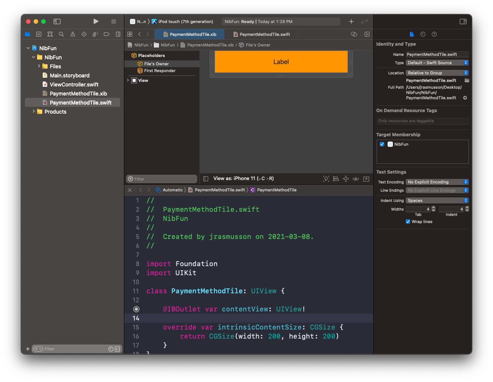
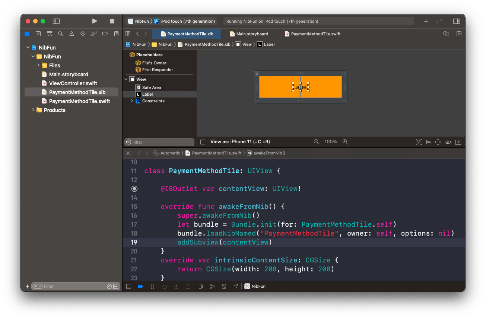
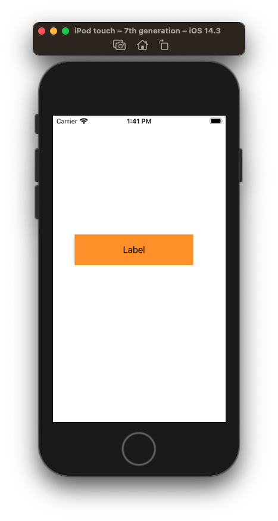
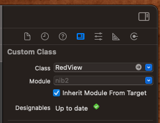

# Working with Nibs

Nibs (.nib) are views Interface builder uses to design and layout views in Xcode. The name is a bit confusing because the 'N' stands for Next as in Steve Jobs old company that Apple bought, but there are represented in XCode today as .xib where the 'X' stands for XML which is how they are represented in Xcode today. 

## Nibs into a View Controller

Simplest thing you can do is create a nib and then associated it with a View Controller.

- Create the nib (same name as view controller).
- Set it's File's Owner to the `ViewController`.
- Point the File's Owner `view` to the nib view


## Nibs into a View

Create a nib
Create a class.
Assign the nib's File Owner to the class.

### Load view in the nib

- Create a nib
- Create a class.
- Assign the nibs File Owner to the class.


Control drag the nibs view into the class.



- Load the nib.
- Add the content view.
- Note the owner is `self`.

```swift
import Foundation
import UIKit

class PaymentMethodTile: UIView {
        
    @IBOutlet var contentView: UIView!
    
    override func awakeFromNib() {
        super.awakeFromNib()
        let bundle = Bundle.init(for: PaymentMethodTile.self)
        bundle.loadNibNamed("PaymentMethodTile", owner: self, options: nil)
        addSubview(contentView)
    }
    override var intrinsicContentSize: CGSize {
        return CGSize(width: 200, height: 200)
    }
}
```



With this method, the nib is hosting the view. Can now load in a view controller by dragging out a plain view, and assigning it’s custom class to the nib.




### Load view programmatically after

- Create the nib.
- Create the class.
- Set the File's Owner


- Then also set the type on the view in the nib to the custom class.


- If loading a nib programmatically, make sure you set the `IBOutlet` property to the view and not the file owner when control dragging outlets into the file. If you don't do this you will get keycode non-compliance errors.


- Then you can load that nib programmatically in any view controller like this.

```swift
import UIKit

class ViewController: UIViewController {

    lazy var tile: PaymentMethodTile! = { ViewController.makePaymentMethodTile() }()

    override func viewDidLoad() {
        super.viewDidLoad()
    }
    
    override func viewWillAppear(_ animated: Bool) {
        super.viewWillAppear(animated)
        view.addSubview(tile)
        
        NSLayoutConstraint.activate([
            tile.centerXAnchor.constraint(equalTo: view.centerXAnchor),
            tile.centerYAnchor.constraint(equalTo: view.centerYAnchor),
        ])
    }

    static func makePaymentMethodTile() -> PaymentMethodTile? {
        let bundle = Bundle(for: PaymentMethodTile.self)
        let tile = bundle.loadNibNamed("PaymentMethodTile", owner: nil, options: nil)?.first as! PaymentMethodTile

        tile.translatesAutoresizingMaskIntoConstraints = false

        return tile
    }

}
```


## Making a Nib IBDesignable

You can make a Nib appear in Interface Builder (IB) with designable attributes by doing the following.
Create your new nib

- Create nib (i.e. `RedView.xib`).
- Create nib view (i.e. `RedView.swift`).
- Associate nib with view.

Then add it to your parent nib as a view by:

- Adding a plain `View` control to the parent
- Associate the plan `View` to your newly create nib view 

### Create your new nib

Create a plain old nib.


Create the view backing the nib. Make it `IBDesignable` and give it an intrinsic content size to simplify Auto Layout constraints.


```swift
import UIKit

@IBDesignable
class RedView: UIView {
    
    @IBInspectable var myColor: UIColor = .systemRed
    
    override func awakeFromNib() {
        super.awakeFromNib()
        backgroundColor = myColor
    }
    
    override var intrinsicContentSize: CGSize {
        return CGSize(width: 100, height: 100)
    }
}
```


Associate the view with the nib.



Your nib is now good to go.

### Add it your your parent

To add your newly created nib to your parent, drag out a plain old `View` onto your parent nib canvas. Give it some constraints (but don't worry about size).


Then associate this view with the newly created nib view created above.


This will automatically detect that it is `@IBDesignable`, use it's intrinsic content size, and layout it out.


## TableViewCells

There are some gotchas with `UITableViewCells`. Using the following code you can more conveniently load nibs and access their reuse identifiers as follows.

**ReusableView.swift**

```swift
import UIKit

protocol ReusableView: class {}
protocol NibLoadableView: class {}

extension ReusableView {
    static var reuseID: String { return "\(self)" }
}

extension NibLoadableView {
    static var nibName: String { return "\(self)" }
}

extension UITableViewCell: ReusableView, NibLoadableView {}
extension UICollectionViewCell: ReusableView, NibLoadableView {}
extension UITableViewHeaderFooterView: ReusableView, NibLoadableView {}

extension UITableView {
    func dequeueResuableCell<T: UITableViewCell>(for indexPath: IndexPath) -> T {
        guard let cell = dequeueReusableCell(withIdentifier: T.reuseID, for: indexPath) as? T else {
            fatalError("Could not dequeue cell with identifier: \(T.reuseID)")
        }
        return cell
    }

    func dequeueResuableHeaderFooter<T: UITableViewHeaderFooterView>() -> T {
        guard let headerFooter = dequeueReusableHeaderFooterView(withIdentifier: T.reuseID) as? T else {
            fatalError("Could not dequeue header footer view with identifier: \(T.reuseID)")
        }
        return headerFooter
    }

    func register<T: ReusableView & NibLoadableView>(_: T.Type) {
        let nib = UINib(nibName: T.nibName, bundle: nil)
        register(nib, forCellReuseIdentifier: T.reuseID)
    }

    func registerHeaderFooter<T: ReusableView & NibLoadableView>(_: T.Type) {
        let nib = UINib(nibName: T.nibName, bundle: nil)
        register(nib, forHeaderFooterViewReuseIdentifier: T.reuseID)
    }
}
```

And then simple load a cell as follows.

**QuickPaymentCell.swift**

```swift
import UIKit

class QuickPaymentCell: UITableViewCell {

    @IBOutlet var titleLabel: UILabel!
    
    override func awakeFromNib() {
        super.awakeFromNib()
        setupStyle()
    }

    func setupStyle() {
        titleLabel.textColor = .reBankGrey
    }
}
```

**ParentView/ViewController**

```swift
tableView.register(QuickPaymentCell.self) // Note: No cell resuseIdentifier used

func tableView(_ tableView: UITableView, cellForRowAt indexPath: IndexPath) -> UITableViewCell {
    let cell: QuickPaymentCell = tableView.dequeueResuableCell(for: indexPath)
    cell.titleLabel.text = games[indexPath.row]
    return cell
}
```

This method is key to triggering `awakeFromNib` but is nice because it saves a tonne of code.

### Trouble Shooting

- [Stack Overflow - EXC_BAD_ACCESS on custom UIView with custom XIB](https://stackoverflow.com/questions/19355104/exc-bad-access-on-custom-uiview-with-custom-xib)
- [Custom xibs](https://cheesecakelabs.com/blog/building-custom-ui-controls-xcodes-interface-builder/)

### Links that help
* [Apple Docs Nib Files](https://developer.apple.com/library/archive/documentation/Cocoa/Conceptual/LoadingResources/CocoaNibs/CocoaNibs.html)
