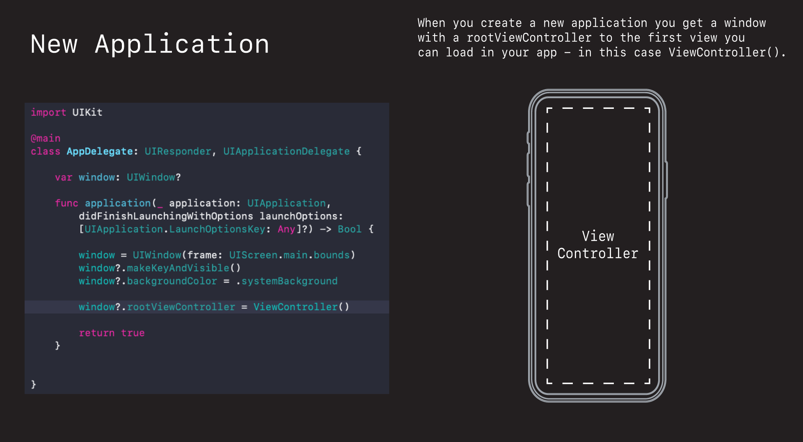
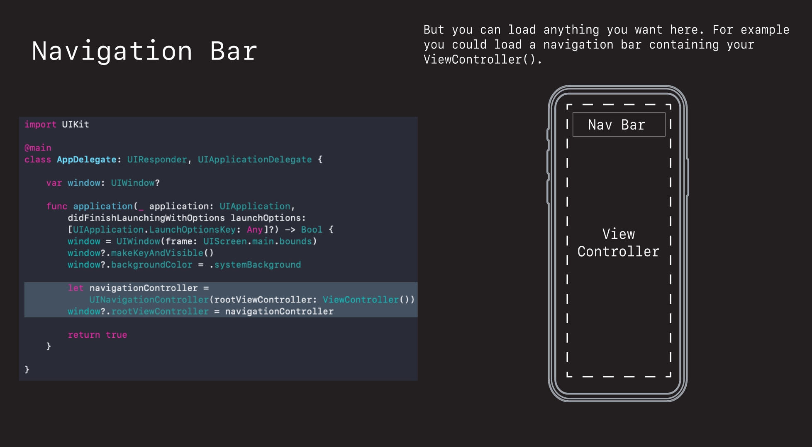
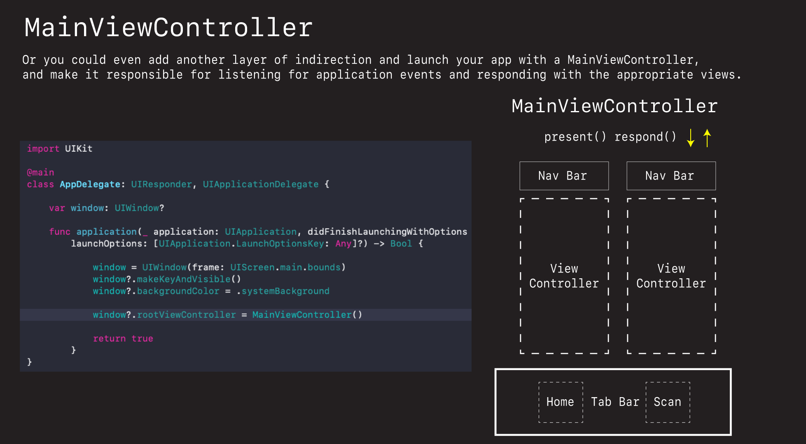

# MainViewController 🕹

Big idea here is to create a centralized place to receive and dispatch navigation events.


## Basic App



## Basic App with Navigation Bar



## Basic App with TabBar containing ViewControllers embedded in NavBars


## MainViewController



The advantage of having a main view controller like this is you have:

- one central place to receive and handle all navigation events
- you are are free to dispatch and navigate where ever you like

## An Example of MainViewController in action


This demo creates a `MainViewController` sitting at the top of the application, which contains all the subviews the app is able to display (`HomeViewController` and `ScanViewController`).

When the scan button is pressed, an event is fired up via the `Responder Chain` which the `MainViewController` is configured to handle.

When it gets it, it programmatically selects the `ScanViewController` in the tab bar and updates the via.

**AppDelegate.swift**

```swift
import UIKit

@main
class AppDelegate: UIResponder, UIApplicationDelegate {

    var window: UIWindow?
    
    func application(_ application: UIApplication, didFinishLaunchingWithOptions launchOptions: [UIApplication.LaunchOptionsKey: Any]?) -> Bool {
            
            window = UIWindow(frame: UIScreen.main.bounds)
            window?.makeKeyAndVisible()
            window?.backgroundColor = .systemBackground
                    
            window?.rootViewController = MainViewController()
            
            return true
        }
}
```

Here we simply start by displaying our `MainViewController` at startup.

**MainViewController.swift**

```swift
import Foundation
import UIKit

class MainViewController: UIViewController {
    
    let sbTabBarController = UITabBarController()
    
    override init(nibName nibNameOrNil: String?, bundle nibBundleOrNil: Bundle?) {
        super.init(nibName: nil, bundle: nil)
        setup()
        present()
    }
    
    required init?(coder: NSCoder) {
        fatalError("init(coder:) has not been implemented")
    }
}

extension MainViewController {
    func setup() {
        let homeVC = HomeViewController()
        let scanVC = ScanViewController()
                
        let homeNC = UINavigationController(rootViewController: homeVC)
        let scanNC = UINavigationController(rootViewController: scanVC)

        sbTabBarController.viewControllers = [homeNC, scanNC]
    }
    
    func present() {
        // This is how you add child VC to parent - x3 things
        addChild(sbTabBarController)
        view.addSubview(sbTabBarController.view)
        didMove(toParent: self)
    }
}

// MARK: Responder chain events

extension MainViewController: StarBucksResponder {
    func didTapScan(sender: UIButton?) {
        
        // remove currently displayed children VCs
        let existingChildren = children

        for child in existingChildren {
            child.view.removeFromSuperview()
            child.removeFromParent()
        }
        
        // add new one we want to present
        sbTabBarController.selectedIndex = 1 // Scan
        add(sbTabBarController)
    }
}
```

The `MainViewController` is responsible for setting up all the views in the app. In this case via a tab bar.

**StarBucksResponder.swift**

```swift
import Foundation
import UIKit

/*
 This is where we can capture all the responder chain events for our app.
 */

@objc protocol StarBucksResponder {
    @objc optional func didTapScan(sender: UIButton?)
}
```

If you have a lot of navigation events going on, it can be convenient to group them all in one place.

**HomeViewController.swif**

```swift
import Foundation
import UIKit

class HomeViewController: UIViewController {
    
    let button = makeButton(withText: "Scan")
    
    override init(nibName nibNameOrNil: String?, bundle nibBundleOrNil: Bundle?) {
        super.init(nibName: nil, bundle: nil)
        title = "Home"
        view.backgroundColor = .systemRed
        setTabBarImage(imageName: "house.fill", title: "Home")
    }
    
    required init?(coder: NSCoder) {
        fatalError("init(coder:) has not been implemented")
    }
    
    override func loadView() {
        super.loadView()
        setup()
        layout()
    }
}

extension HomeViewController {
    func setup() {
        
        /*
         If I wanted to handle this target action myself, would make `self` target
         and handle like any other button action. Need to define selector here
         */
        button.addTarget(self, action: #selector(performScanAction(sender:)), for: .primaryActionTriggered)

        /*
         But if I want to fire it up the responder chain, and let someone else handle it,
         I can define a protocol and add it to selector via extension, and set target = `nil`.
         
         In this case I want the `MainViewController` to intercept and handle this request
         and present the `ScanViewController` as a result of this button press.
         So I need to go implement this method there.
         
         By leaving both commented in the event will be handled in both places.
         */
        button.addTarget(nil, action: .didTapScan, for: .primaryActionTriggered)
        
    }
    
    func layout() {
        view.addSubview(button)
        NSLayoutConstraint.activate([
            button.centerXAnchor.constraint(equalTo: view.centerXAnchor),
            button.centerYAnchor.constraint(equalTo: view.centerYAnchor),
        ])
    }
    
    @objc func performScanAction(sender: Any?) {
        print("I got this.")
    }
}

// Syntactic sugar to make our code look nicer.
private extension Selector {
    static let didTapScan = #selector(StarBucksResponder.didTapScan(sender:))
}
```

This view controller doesn't do much. It simply displays a button, and when the button is pressed it fires an event up the responder chain by setting the target on the button to `nil`.

**ScanViewController.swift**

```swift
import Foundation
import UIKit

class ScanViewController: UIViewController {
    
    override init(nibName nibNameOrNil: String?, bundle nibBundleOrNil: Bundle?) {
        super.init(nibName: nil, bundle: nil)
        title = "Scan"
        view.backgroundColor = .systemIndigo
        setTabBarImage(imageName: "qrcode", title: "Scan")
    }
    
    required init?(coder: NSCoder) {
        fatalError("init(coder:) has not been implemented")
    }
}
```

This view controller doesn't do anything.

**ViewController+Ext.swift**

```swift
import Foundation
import UIKit

extension UIViewController {
    
    func setTabBarImage(imageName: String, title: String) {
        let configuration = UIImage.SymbolConfiguration(scale: .large)
        let image = UIImage(systemName: imageName, withConfiguration: configuration)
        tabBarItem = UITabBarItem(title: title, image: image, tag: 0)
    }
    
    func add(_ child: UIViewController) {
        addChild(child)
        view.addSubview(child.view)
        child.didMove(toParent: self)
    }
    
    func remove() {
        guard parent != nil else {
            return
        }
        
        willMove(toParent: nil)
        view.removeFromSuperview()
        removeFromParent()
    }
}

func makeButton(withText text: String) -> UIButton {
    let button = UIButton()
    button.translatesAutoresizingMaskIntoConstraints = false
    button.setTitle(text, for: .normal)
    button.titleLabel?.adjustsFontSizeToFitWidth = true
    button.contentEdgeInsets = UIEdgeInsets(top: 8, left: 16, bottom: 8, right: 16)
    button.backgroundColor = .systemBlue
    button.layer.cornerRadius = 8
    return button
}
```

Some extensions to help add and remove view controllers and make buttons and tab bar items.


#### Large ViewController Strategies

- [Model View Presenter (MVP)](https://github.com/jrasmusson/swift-arcade/blob/master/UIKIt/LargeViewController/MVP/README.md)
