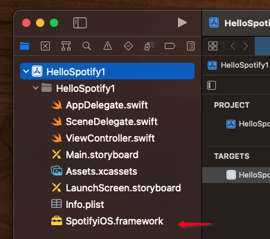
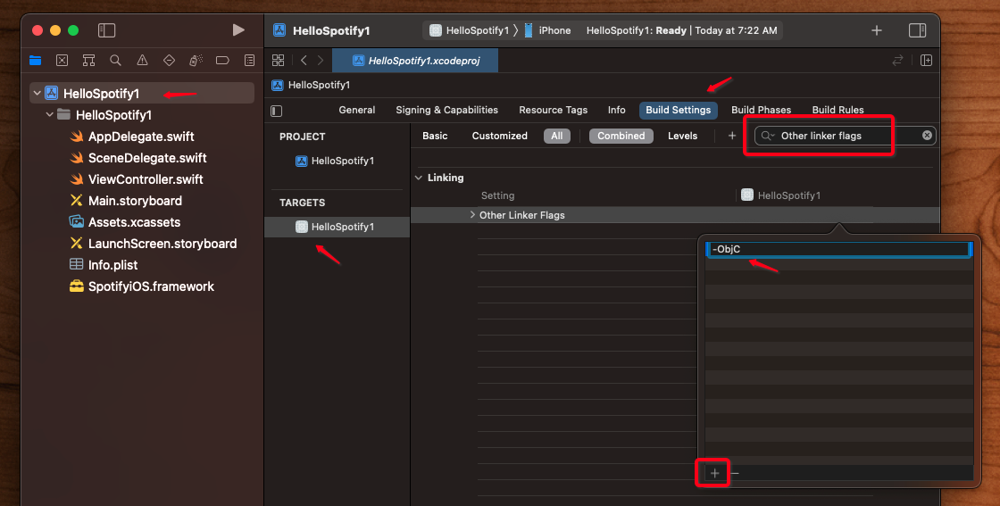
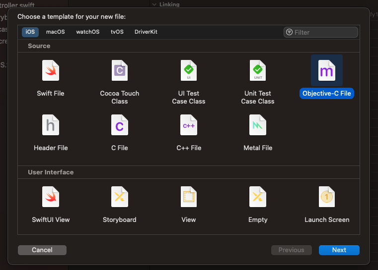
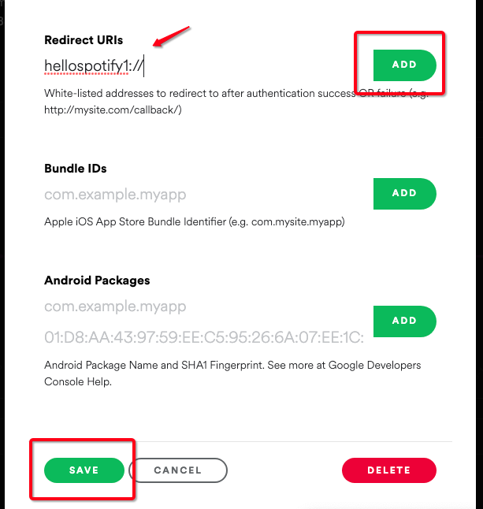
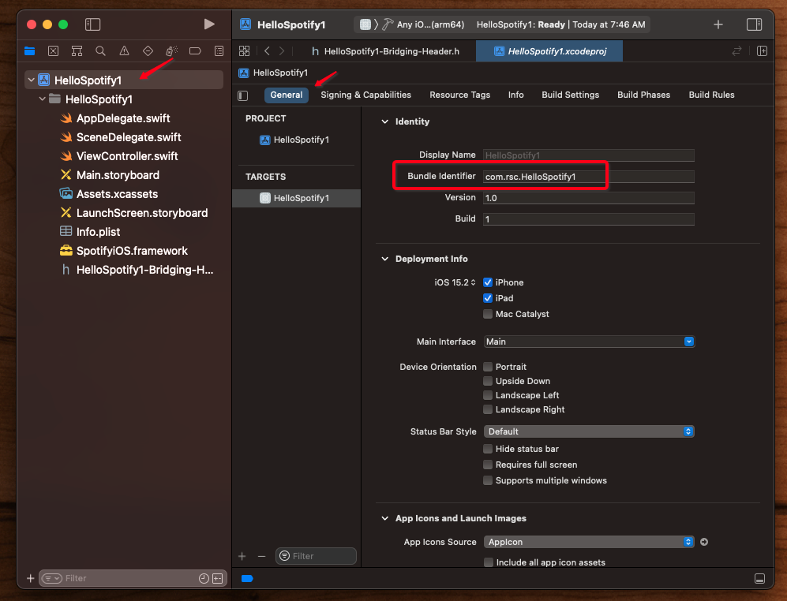
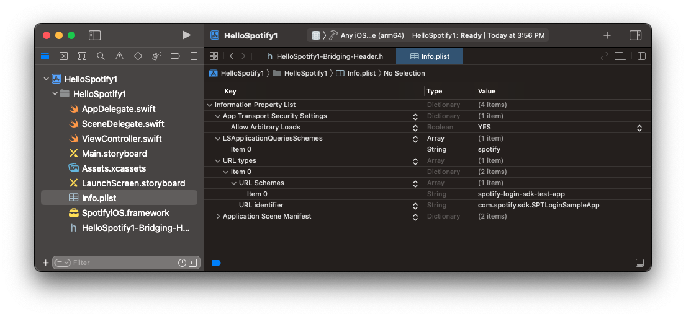
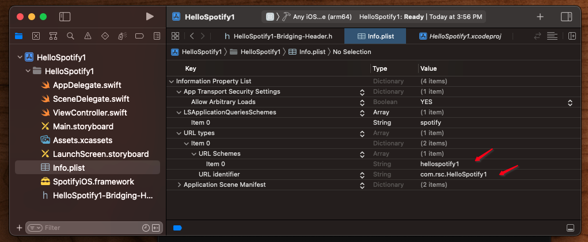
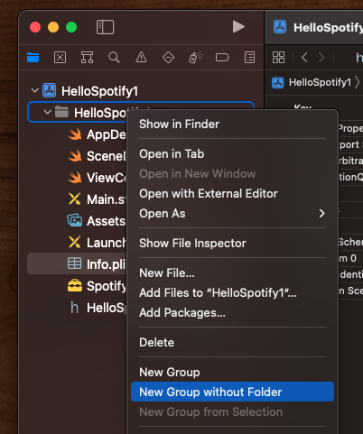

# Spotify SDK

How to setup Spotify iOS SDK.

Pre-requistes:

- Spotify account
- Spotify running on physical iOS device

## Overview

To build a simple app that integrates with Spotify we need to:

- Register a Developer App
- Create a simple app
- Configure to work with Spotify
- Run on physical device

## Register a Developer App

In order to authenticate and authorize actions, Spotify requires you create a developer app on their website.

Go to:

- [Spotify Developer Dashboard](https://developer.spotify.com/dashboard/)
- Login
- And select `Create an app`


Give it a name `hellospotify1`. And client `Create`.


This will create the app and IDs neccessary for our iOS app to run. 


This is all we need for now. Later we will come back and setup our app configuration. Next let's go setup our app.

## Create a simple app

Here we are going to:

- Create a simple iOS app
- Configure it to work with Spotify
- Run it on a physical device

### Create a new iOS application

- Fire up Xcode
- Create a new iOS app `HelloSpotify1`


### Install the Spotify SDK

Download the Spotify SDK from [here](https://github.com/spotify/ios-sdk). Unzip it somewhere on your desktop.

Drag the Spotify framework into your app like this:


Copy the files over.


The Spotify SDK should now appear as a library in your app.



## Configure iOS app to work with Spotify

Here are the following steps we need to perform to enable our Spotify iOS app to authenticate and work with Spotify

- Add ObjC flag
- Create bridge header
- Setup info.plist

### Add ObjC flag

Because much of the Spotify iOS SDK is written in Objective-C, we need to setup an `-ObjC` linker flag so we can run Objective-C, as well as a bridge header, to import the Spotify Objective-C library into our Swift application.

Too add the `-ObjC` flag:

- In the File Navigator, click on your project
- Click `Targets`
- In the search box, enter `Other Linker Flags`
- Beside `Other Linker Flags`, double click and enter `-ObjC`.



Linker flag should now look like this.


### Add bridging header

In order to bridge Swift and Objective-C code we need a bridging header file.

Easiest way to setup and configure this is to add a new Objective-C file.

Select project and go `File > New File` or `Command + N`.


Select Objective-C File.



Give it a random name like `foo` (don't worry we are going to delete it).


This will then ask you if you want Xcode to create a bridging file for your. Say yes `Create Bridging Header`.


Then go ahead and delete the `foo` file we just created.


Move to trash.


Then select the header file Xcode created for us and add the following line:

`#import <SpotifyiOS/SpotifyiOS.h>`


Bridge is now setup and complete.

## Setting up the info.plist

This is perhaps the most confusing part of the SDK configuration. What we are going to do here is flip back and forth between our Spotify Developer App, and our iOS client, adding entries one at a time, so you can see what's going on.

But in a nutshell we need to set the following our Developer App:

- `Bundle ID`
- `Redirect URI`

And then set the following plist entries in our iOS application:

- `URL Types`
- `LSApplicationQuriesSchemes`
- `App Transport Security Settings`


Let's start with the Developer app.

### Configure the developer App

Open up the Spotify Developer app we created earlier and click `Edit Settings`.


#### Set the Redirect URI

First thing we are going to configure is the `Redirect URI`. This is the URI Spotify is going to use to open your app. 

You can pick anyting you want here. But really you should think of it as something unique for opening your app as if it had it's own protol (like `http://`.

We'll use:

- `hellospotify1://`

Click `Add`. Enter `hellospotify1://`. And then hit `Save`.



#### Set the Bundle ID

Spotify wants to be able to uniquely identify your application. They do this through your `Bundle ID`.

You can find your applications `Bundle ID` by clicking on:



My `Bundle ID` is:

- `com.rsc.HelloSpotify1`

Your's will be something different. Whatever it is, copy it, head back over to the Spotify application, click `Edit Settings` again, and enter your `Bundle ID` in this field here:


Then click `Add` and `Save` again.


### Configure iOS application

There are three app settings we need to configure in the `info.plist` of our iOS application:

- `URL Types`
- `LSApplicationQueriesSchemes`
- `App Transport Security Settings`

I found the easiet way to do this was to open up the sample app that comes with the Spotify SDK.


Select the plist entry we want to copy.


And the select the root node of our plist entry file and `Command + V`.


If you repeat that process for:

- `LSApplicationQueriesSchemes`
- `App Transport Security Settings`

You will eventually end up with a plist entry that looks like this:



The `App Transport Security Settings` is a security setting Apple requires for apps that want to make HTTP connections.

`LSApplicationQueriesSchemes` specifies the URL schemes the app is allowed to test for. In our case this will be Spotify. When we run our app, it is going to check to see whether Spofity is installed on your phone and this plist entry allows your app to do that.

`URL Types` describes the URI protocol other apps can use to connect to and open our app up. Which is exactly what the Spotify app on your phone is going to do. When it is done authenticating, Spotify is going to call back and open your app. And this is the plist entry it is going to use to do it.

The only problem is right now it is configured for the test app. Not ours.

To make make the plist entry for `URL Types` right change:

- `Item 0`
 - from: `spotify-login-sdk-test-app` 
 - to: `hellospotify1`

 Likewise change the `URL identifier`:
 
 - from: `com.spotify.sdk.SPTLoginSampleApp`
 - to: `<your Bundle ID>`

 For me this was `com.rsc.HelloSpotify1`.
 
 These values from from the Application configuration we did earlier. So make sure they match.
 


When all is said and done, your `Info.plist` file should look something like this:



Next - let's build the app.

## Building the App

Spotify has an [Authorization Guide](https://developer.spotify.com/documentation/general/guides/authorization/code-flow/) that walks you through the various ways you can securely configure your Spotify app.

What your app really needs is a `refreshToken`. And while we could setup a web server doing `OAuth` to serve us one, we are instead going to rely on the Spotify app on our phones to authenticate who we are, and let it fetch the `refreshToken` for us.

### Create a Constants file

First let do a little clean up. Create a 

 and create a `Constants.swift` file to hold our app client ID and secret.

Create a `New Group without Folder` called `Files`.



And stick everything in there except `SceneDelegate` and `ViewController`.


Then create a `Constants.swift` file:


 an copy the following into there:

**Constants**

```swift
import Foundation

let accessTokenKey = "access-token-key"
let redirectUri = URL(string:"hellospotify1://")!
let spotifyClientId = "yourClientId"
let spotifyClientSecretKey = "yourSecretKey"

/*
Scopes let you specify exactly what types of data your application wants to
access, and the set of scopes you pass in your call determines what access
permissions the user is asked to grant.
For more information, see https://developer.spotify.com/web-api/using-scopes/.
*/
let scopes: SPTScope = [
                            .userReadEmail, .userReadPrivate,
                            .userReadPlaybackState, .userModifyPlaybackState, .userReadCurrentlyPlaying,
                            .streaming, .appRemoteControl,
                            .playlistReadCollaborative, .playlistModifyPublic, .playlistReadPrivate, .playlistModifyPrivate,
                            .userLibraryModify, .userLibraryRead,
                            .userTopRead, .userReadPlaybackState, .userReadCurrentlyPlaying,
                            .userFollowRead, .userFollowModify,
                        ]
let stringScopes = [
                        "user-read-email", "user-read-private",
                        "user-read-playback-state", "user-modify-playback-state", "user-read-currently-playing",
                        "streaming", "app-remote-control",
                        "playlist-read-collaborative", "playlist-modify-public", "playlist-read-private", "playlist-modify-private",
                        "user-library-modify", "user-library-read",
                        "user-top-read", "user-read-playback-position", "user-read-recently-played",
                        "user-follow-read", "user-follow-modify",
                    ]
```

Replace the placeholder text in `yourClientId` and your `yourSecretKey` with the ones for your developer app which you can find on your app's web page here.


Your constant values should now look something like this:

```swift
let accessTokenKey = "access-token-key"
let redirectUri = URL(string:"hellospotify1://")!
let spotifyClientId = "5198668b9cfb4947a03598940c9b3a1c"
let spotifyClientSecretKey = "6e89d449935341d49cce90baf1faa0ad"
```


### Fetch refresh token in SceneDelegate

### Links that help

- [QuickStart](https://developer.spotify.com/documentation/ios/quick-start/)
- [Applications](https://developer.spotify.com/dashboard/applications)
- [Authorization Guide](https://developer.spotify.com/documentation/general/guides/authorization/code-flow/)
- [Blog1](https://medium.com/swlh/authenticate-with-spotify-in-ios-ae6612ecca91)

