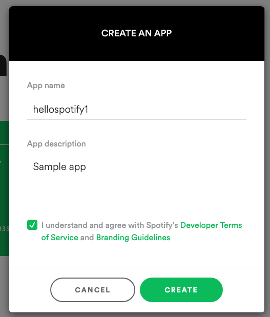
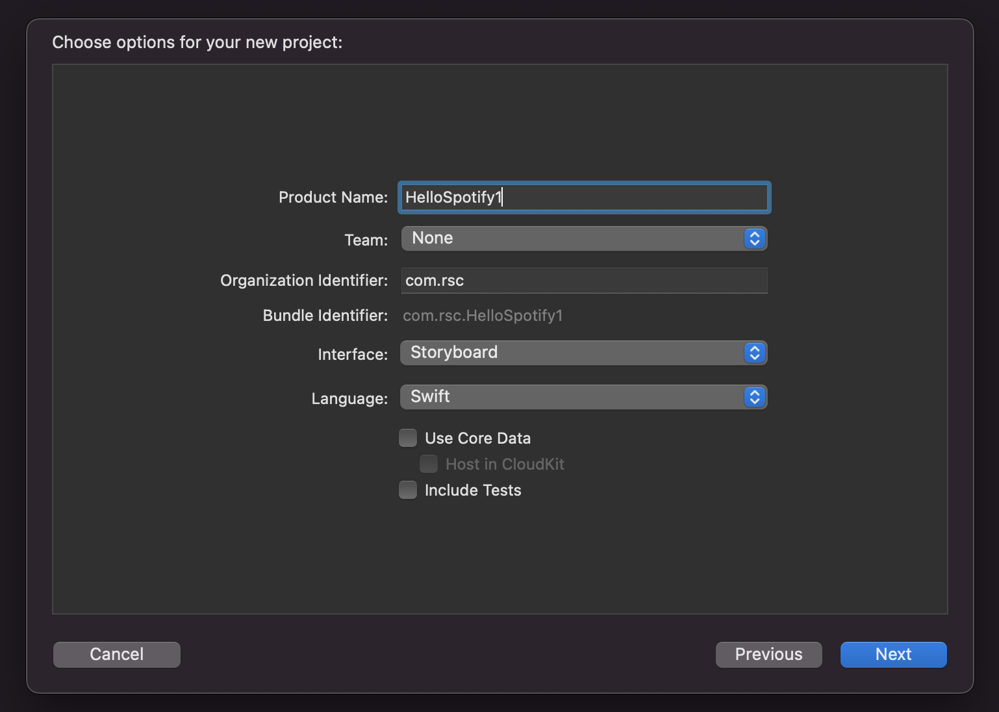
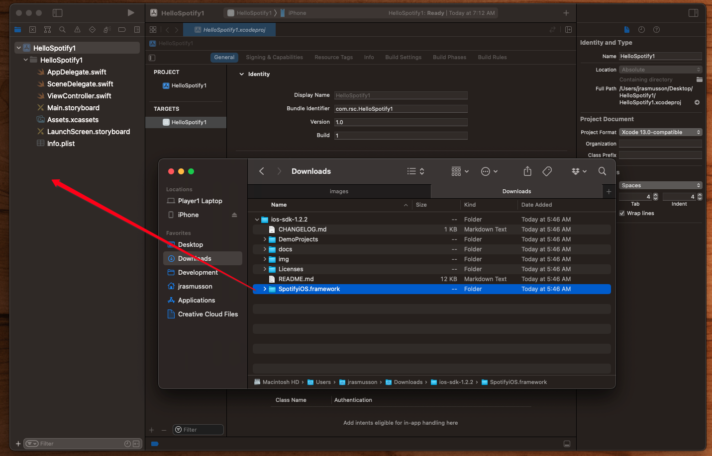
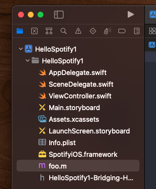
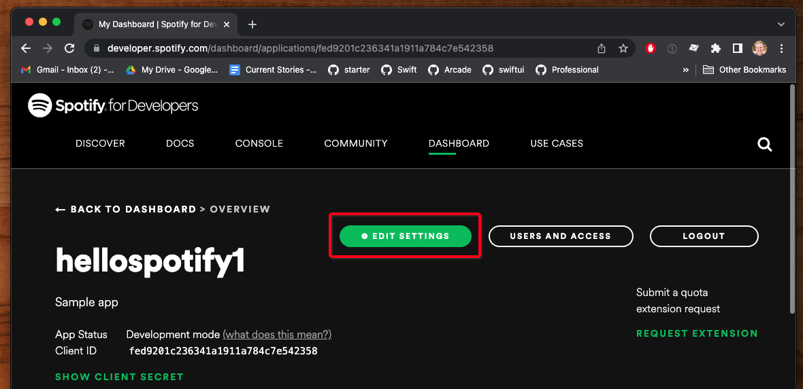

# Spotify SDK

How to setup Spotify iOS SDK.

Pre-requistes:

- Spotify account
- Spotify running on physical iOS device

## Overview

To build a simple app that integrates with Spotify we need to:

- Register a Developer App
- Create a simple app
- Configure to work with Spotify
- Run on physical device

## Register a Developer App

In order to authenticate and authorize actions, Spotify requires you create a developer app on their website.

Go to:

- [Spotify Developer Dashboard](https://developer.spotify.com/dashboard/)
- Login
- And select `Create an app`

Give it a name `hellospotify1`. And client `Create`.

This will create the app and IDs neccessary for our iOS app to run. 

This is all we need for now. Later we will come back and setup our app configuration. Next let's go setup our app.

## Create a simple app

Here we are going to:

- Create a simple iOS app
- Configure it to work with Spotify
- Run it on a physical device

### Create a new iOS application

- Fire up Xcode
- Create a new iOS app `HelloSpotify1`

### Install the Spotify SDK

Download the Spotify SDK from [here](https://github.com/spotify/ios-sdk). Unzip it somewhere on your desktop.

Drag the Spotify framework into your app like this:

Copy the files over.

The Spotify SDK should now appear as a library in your app.

## Configure iOS app to work with Spotify

Here are the following steps we need to perform to enable our Spotify iOS app to authenticate and work with Spotify

- Add ObjC flag
- Create bridge header
- Setup info.plist

### Add ObjC flag

Because much of the Spotify iOS SDK is written in Objective-C, we need to setup an `-ObjC` linker flag so we can run Objective-C, as well as a bridge header, to import the Spotify Objective-C library into our Swift application.

Too add the `-ObjC` flag:

- In the File Navigator, click on your project
- Click `Targets`
- In the search box, enter `Other Linker Flags`
- Beside `Other Linker Flags`, double click and enter `-ObjC`.

Linker flag should now look like this.

### Add bridging header

In order to bridge Swift and Objective-C code we need a bridging header file.

Easiest way to setup and configure this is to add a new Objective-C file.

Select project and go `File > New File` or `Command + N`.

Select Objective-C File.

Give it a random name like `foo` (don't worry we are going to delete it).

This will then ask you if you want Xcode to create a bridging file for your. Say yes `Create Bridging Header`.

Then go ahead and delete the `foo` file we just created.

Move to trash.

Then select the header file Xcode created for us and add the following line:

`#import <SpotifyiOS/SpotifyiOS.h>`

Bridge is now setup and complete.

## Setting up the info.plist

This is perhaps the most confusing part of the SDK configuration. What we are going to do here is flip back and forth between our Spotify Developer App, and our iOS client, adding entries one at a time, so you can see what's going on.

But in a nutshell we need to set the following our Developer App:

- `Bundle ID`
- `Redirect URI`

And then set the following plist entries in our iOS application:

- `LSApplicationQuriesSchemes`
- `URL Types`
- `App Transport Security Settings`

Let's start with the Developer app.

### Configuration the developer App

Open up the Spotify Developer app we created earlier and click `Edit Settings`.

### Links that help

- [QuickStart](https://developer.spotify.com/documentation/ios/quick-start/)
- [Applications](https://developer.spotify.com/dashboard/applications)
- [Authorization Guide](https://developer.spotify.com/documentation/general/guides/authorization/code-flow/)
- [Blog1](https://medium.com/swlh/authenticate-with-spotify-in-ios-ae6612ecca91)

