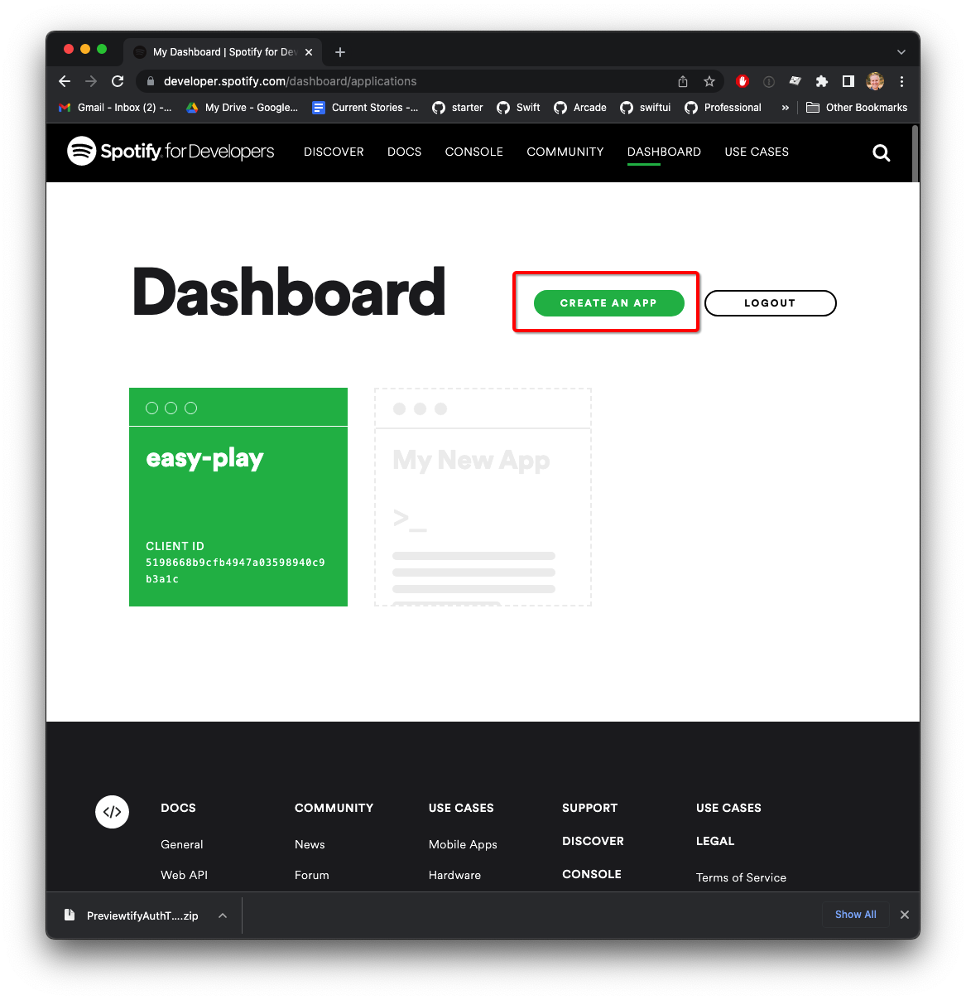
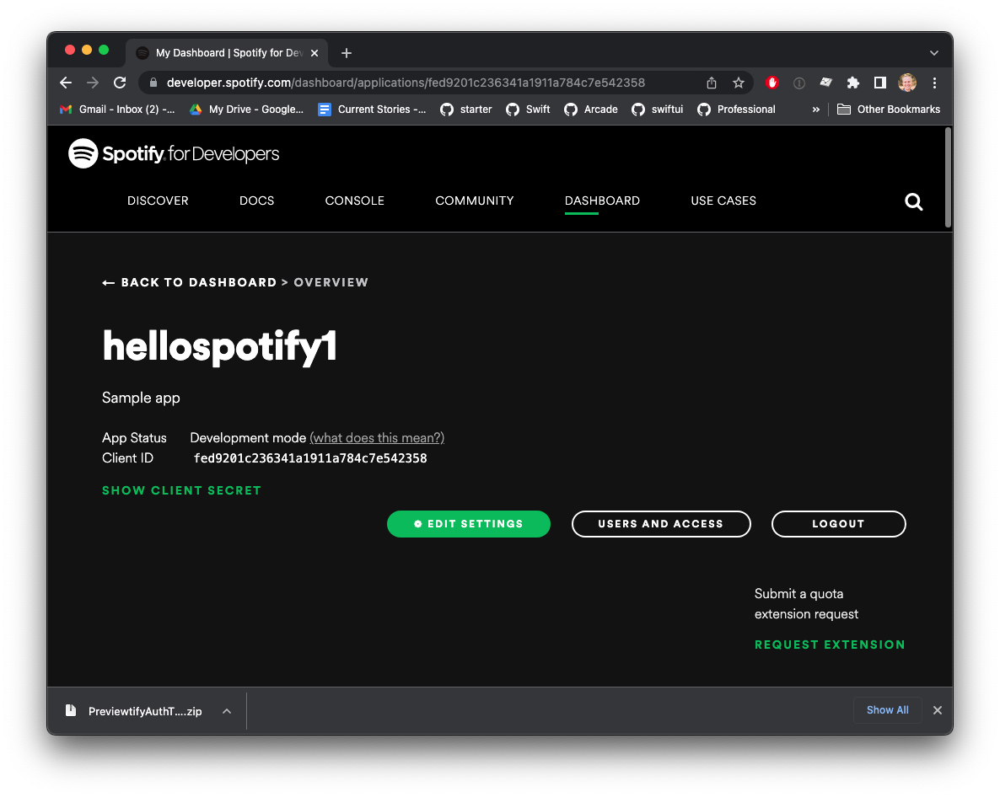
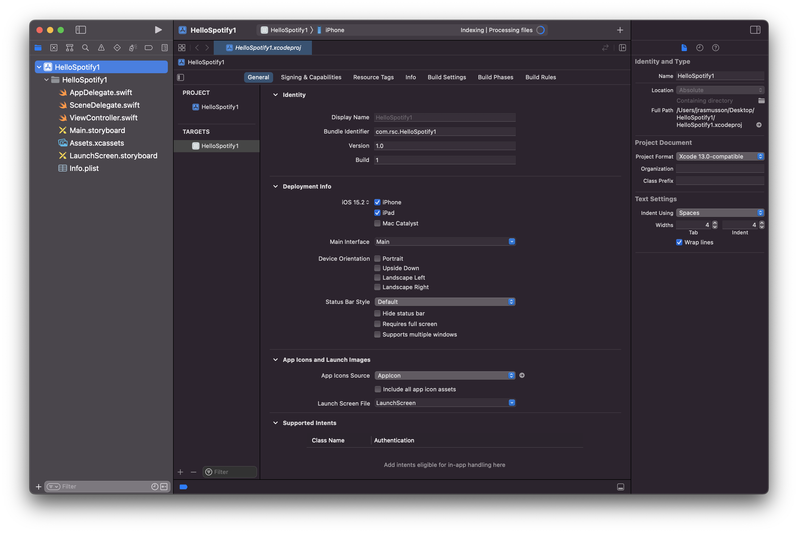
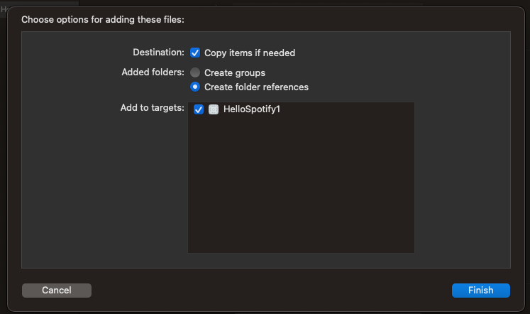
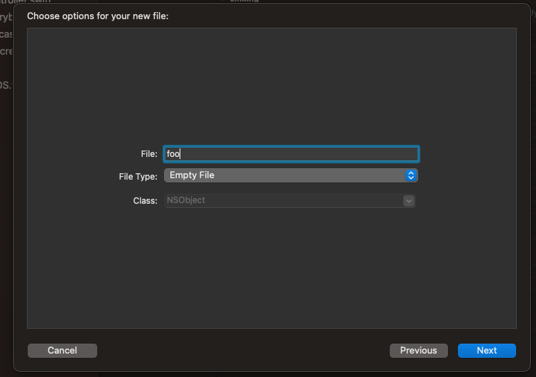
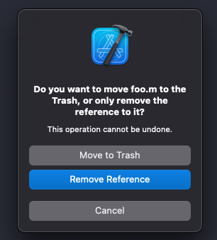
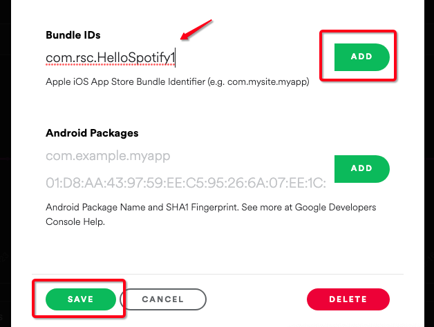
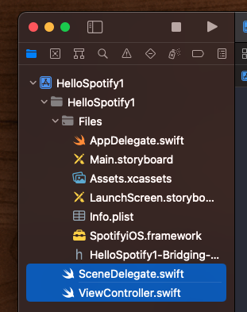
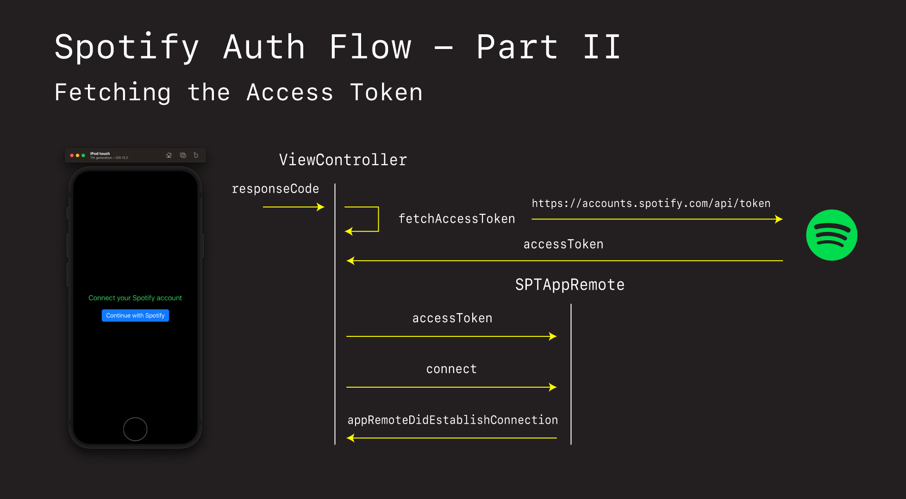
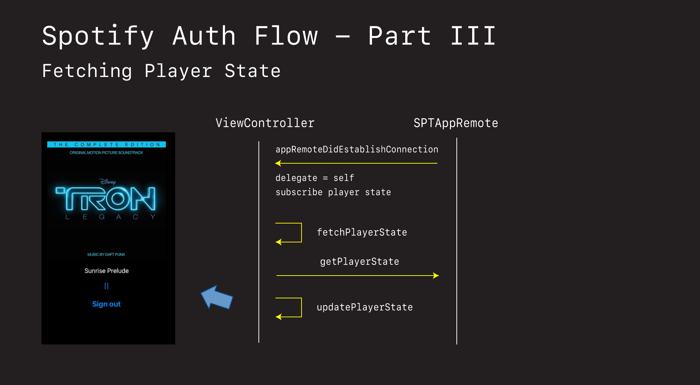

# Spotify SDK

How to setup Spotify iOS SDK.

Pre-requistes:

- Spotify account
- Spotify running on physical iOS device

## Overview

To build a simple app that integrates with Spotify we need to:

- Register a Developer App
- Create a simple app
- Configure to work with Spotify
- Run on physical device

## Register a Developer App

In order to authenticate and authorize actions, Spotify requires you create a developer app on their website.

Go to:

- [Spotify Developer Dashboard](https://developer.spotify.com/dashboard/)
- Login
- And select `Create an app`



Give it a name `hellospotify1`. And client `Create`.


This will create the app and IDs neccessary for our iOS app to run. 



This is all we need for now. Later we will come back and setup our app configuration. Next let's go setup our app.

## Create a simple app

Here we are going to:

- Create a simple iOS app
- Configure it to work with Spotify
- Run it on a physical device

### Create a new iOS application

- Fire up Xcode
- Create a new iOS app `HelloSpotify1`




### Install the Spotify SDK

Download the Spotify SDK from [here](https://github.com/spotify/ios-sdk). Unzip it somewhere on your desktop.

Drag the Spotify framework into your app like this:


Copy the files over.



The Spotify SDK should now appear as a library in your app.


## Configure iOS app to work with Spotify

Here are the following steps we need to perform to enable our Spotify iOS app to authenticate and work with Spotify

- Add ObjC flag
- Create bridge header
- Setup info.plist

### Add ObjC flag

Because much of the Spotify iOS SDK is written in Objective-C, we need to setup an `-ObjC` linker flag so we can run Objective-C, as well as a bridge header, to import the Spotify Objective-C library into our Swift application.

Too add the `-ObjC` flag:

- In the File Navigator, click on your project
- Click `Targets`
- In the search box, enter `Other Linker Flags`
- Beside `Other Linker Flags`, double click and enter `-ObjC`.


Linker flag should now look like this.


### Add bridging header

In order to bridge Swift and Objective-C code we need a bridging header file.

Easiest way to setup and configure this is to add a new Objective-C file.

Select project and go `File > New File` or `Command + N`.


Select Objective-C File.


Give it a random name like `foo` (don't worry we are going to delete it).



This will then ask you if you want Xcode to create a bridging file for your. Say yes `Create Bridging Header`.


Then go ahead and delete the `foo` file we just created.


Move to trash.



Then select the header file Xcode created for us and add the following line:

`#import <SpotifyiOS/SpotifyiOS.h>`


Bridge is now setup and complete.

## Setting up the info.plist

This is perhaps the most confusing part of the SDK configuration. What we are going to do here is flip back and forth between our Spotify Developer App, and our iOS client, adding entries one at a time, so you can see what's going on.

But in a nutshell we need to set the following our Developer App:

- `Bundle ID`
- `Redirect URI`

And then set the following plist entries in our iOS application:

- `URL Types`
- `LSApplicationQuriesSchemes`
- `App Transport Security Settings`


Let's start with the Developer app.

### Configure the developer App

Open up the Spotify Developer app we created earlier and click `Edit Settings`.


#### Set the Redirect URI

First thing we are going to configure is the `Redirect URI`. This is the URI Spotify is going to use to open your app. 

You can pick anyting you want here. But really you should think of it as something unique for opening your app as if it had it's own protol (like `http://`.

We'll use:

- `hellospotify1://`

Click `Add`. Enter `hellospotify1://`. And then hit `Save`.


#### Set the Bundle ID

Spotify wants to be able to uniquely identify your application. They do this through your `Bundle ID`.

You can find your applications `Bundle ID` by clicking on:


My `Bundle ID` is:

- `com.rsc.HelloSpotify1`

Your's will be something different. Whatever it is, copy it, head back over to the Spotify application, click `Edit Settings` again, and enter your `Bundle ID` in this field here:


Then click `Add` and `Save` again.



### Configure iOS application

There are three app settings we need to configure in the `info.plist` of our iOS application:

- `URL Types`
- `LSApplicationQueriesSchemes`
- `App Transport Security Settings`

I found the easiet way to do this was to open up the sample app that comes with the Spotify SDK.


Select the plist entry we want to copy.


And the select the root node of our plist entry file and `Command + V`.


If you repeat that process for:

- `LSApplicationQueriesSchemes`
- `App Transport Security Settings`

You will eventually end up with a plist entry that looks like this:


The `App Transport Security Settings` is a security setting Apple requires for apps that want to make HTTP connections.

`LSApplicationQueriesSchemes` specifies the URL schemes the app is allowed to test for. In our case this will be Spotify. When we run our app, it is going to check to see whether Spofity is installed on your phone and this plist entry allows your app to do that.

`URL Types` describes the URI protocol other apps can use to connect to and open our app up. Which is exactly what the Spotify app on your phone is going to do. When it is done authenticating, Spotify is going to call back and open your app. And this is the plist entry it is going to use to do it.

The only problem is right now it is configured for the test app. Not ours.

To make make the plist entry for `URL Types` right change:

- `Item 0`
 - from: `spotify-login-sdk-test-app` 
 - to: `hellospotify1`

 Likewise change the `URL identifier`:
 
 - from: `com.spotify.sdk.SPTLoginSampleApp`
 - to: `<your Bundle ID>`

 For me this was `com.rsc.HelloSpotify1`.
 
 These values from from the Application configuration we did earlier. So make sure they match.
 


When all is said and done, your `Info.plist` file should look something like this:


Next - let's build the app.

## Building the App

Spotify has an [Authorization Guide](https://developer.spotify.com/documentation/general/guides/authorization/code-flow/) that walks you through the various ways you can securely configure your Spotify app.

What your app really needs is a `refreshToken`. And while we could setup a web server doing `OAuth` to serve us one, we are instead going to rely on the Spotify app on our phones to authenticate who we are, and let it fetch the `refreshToken` for us.

### Create a Constants file

First let do a little clean up. Create a 

 and create a `Constants.swift` file to hold our app client ID and secret.

Create a `New Group without Folder` called `Files`.


And stick everything in there except `SceneDelegate` and `ViewController`.



Then create a `Constants.swift` file:


 an copy the following into there:

**Constants**

```swift
import Foundation

let accessTokenKey = "access-token-key"
let redirectUri = URL(string:"hellospotify1://")!
let spotifyClientId = "yourClientId"
let spotifyClientSecretKey = "yourSecretKey"

/*
Scopes let you specify exactly what types of data your application wants to
access, and the set of scopes you pass in your call determines what access
permissions the user is asked to grant.
For more information, see https://developer.spotify.com/web-api/using-scopes/.
*/
let scopes: SPTScope = [
                            .userReadEmail, .userReadPrivate,
                            .userReadPlaybackState, .userModifyPlaybackState, .userReadCurrentlyPlaying,
                            .streaming, .appRemoteControl,
                            .playlistReadCollaborative, .playlistModifyPublic, .playlistReadPrivate, .playlistModifyPrivate,
                            .userLibraryModify, .userLibraryRead,
                            .userTopRead, .userReadPlaybackState, .userReadCurrentlyPlaying,
                            .userFollowRead, .userFollowModify,
                        ]
let stringScopes = [
                        "user-read-email", "user-read-private",
                        "user-read-playback-state", "user-modify-playback-state", "user-read-currently-playing",
                        "streaming", "app-remote-control",
                        "playlist-read-collaborative", "playlist-modify-public", "playlist-read-private", "playlist-modify-private",
                        "user-library-modify", "user-library-read",
                        "user-top-read", "user-read-playback-position", "user-read-recently-played",
                        "user-follow-read", "user-follow-modify",
                    ]
```

Replace the placeholder text in `yourClientId` and your `yourSecretKey` with the ones for your developer app which you can find on your app's web page here.


Your constant values should now look something like this:

```swift
let accessTokenKey = "access-token-key"
let redirectUri = URL(string:"hellospotify1://")!
let spotifyClientId = "5198668b9cfb4947a03598940c9b3a1c"
let spotifyClientSecretKey = "6e89d449935341d49cce90baf1faa0ad"
```

### Creating the ViewController

Copy and paste the following into your `ViewController`.

```swift
//
//  ViewController.swift
//  easyplay
//
//  Created by jrasmusson on 2022-03-21.
//

import UIKit

class ViewController: UIViewController {

    // MARK: - Spotify Authorization & Configuration
    var responseCode: String? {
        didSet {
            fetchAccessToken { (dictionary, error) in
                if let error = error {
                    print("Fetching token request error \(error)")
                    return
                }
                let accessToken = dictionary!["access_token"] as! String
                DispatchQueue.main.async {
                    self.appRemote.connectionParameters.accessToken = accessToken
                    self.appRemote.connect()
                }
            }
        }
    }

    lazy var appRemote: SPTAppRemote = {
        let appRemote = SPTAppRemote(configuration: configuration, logLevel: .debug)
        appRemote.connectionParameters.accessToken = self.accessToken
        appRemote.delegate = self
        return appRemote
    }()

    var accessToken = UserDefaults.standard.string(forKey: accessTokenKey) {
        didSet {
            let defaults = UserDefaults.standard
            defaults.set(accessToken, forKey: accessTokenKey)
        }
    }

    lazy var configuration: SPTConfiguration = {
        let configuration = SPTConfiguration(clientID: spotifyClientId, redirectURL: redirectUri)
        // Set the playURI to a non-nil value so that Spotify plays music after authenticating
        // otherwise another app switch will be required
        configuration.playURI = ""
        // Set these url's to your backend which contains the secret to exchange for an access token
        // You can use the provided ruby script spotify_token_swap.rb for testing purposes
        configuration.tokenSwapURL = URL(string: "http://localhost:1234/swap")
        configuration.tokenRefreshURL = URL(string: "http://localhost:1234/refresh")
        return configuration
    }()

    lazy var sessionManager: SPTSessionManager? = {
        let manager = SPTSessionManager(configuration: configuration, delegate: self)
        return manager
    }()

    private var lastPlayerState: SPTAppRemotePlayerState?

    // MARK: - Subviews
    let stackView = UIStackView()
    let connectLabel = UILabel()
    let connectButton = UIButton(type: .system)
    let imageView = UIImageView()
    let trackLabel = UILabel()
    let pauseAndPlayButton = UIButton(type: .system)
    let signOutButton = UIButton(type: .system)

    // MARK: App Life Cycle
    override func viewDidLoad() {
        super.viewDidLoad()
        style()
        layout()
    }

    override func viewDidAppear(_ animated: Bool) {
        super.viewDidAppear(animated)
        updateViewBasedOnConnected()
    }

    func update(playerState: SPTAppRemotePlayerState) {
        if lastPlayerState?.track.uri != playerState.track.uri {
            fetchArtwork(for: playerState.track)
        }
        lastPlayerState = playerState
        trackLabel.text = playerState.track.name

        if playerState.isPaused {
            pauseAndPlayButton.setImage(UIImage(systemName: "play"), for: .normal)
        } else {
            pauseAndPlayButton.setImage(UIImage(systemName: "pause"), for: .normal)
        }
    }

    // MARK: - Actions
    @objc func didTapPauseOrPlay(_ button: UIButton) {
        if let lastPlayerState = lastPlayerState, lastPlayerState.isPaused {
            appRemote.playerAPI?.resume(nil)
        } else {
            appRemote.playerAPI?.pause(nil)
        }
    }

    @objc func didTapSignOut(_ button: UIButton) {
        if appRemote.isConnected == true {
            appRemote.disconnect()
        }
    }

    @objc func didTapConnect(_ button: UIButton) {
        guard let sessionManager = sessionManager else { return }
        sessionManager.initiateSession(with: scopes, options: .clientOnly)
    }

    // MARK: - Private Helpers
    private func presentAlertController(title: String, message: String, buttonTitle: String) {
        DispatchQueue.main.async {
            let controller = UIAlertController(title: title, message: message, preferredStyle: .alert)
            let action = UIAlertAction(title: buttonTitle, style: .default, handler: nil)
            controller.addAction(action)
            self.present(controller, animated: true)
        }
    }
}

// MARK: Style & Layout
extension ViewController {
    func style() {
        stackView.translatesAutoresizingMaskIntoConstraints = false
        stackView.axis = .vertical
        stackView.spacing = 20
        stackView.alignment = .center

        connectLabel.translatesAutoresizingMaskIntoConstraints = false
        connectLabel.text = "Connect your Spotify account"
        connectLabel.font = UIFont.preferredFont(forTextStyle: .title3)
        connectLabel.textColor = .systemGreen

        connectButton.translatesAutoresizingMaskIntoConstraints = false
        connectButton.configuration = .filled()
        connectButton.setTitle("Continue with Spotify", for: [])
        connectButton.titleLabel?.font = UIFont.preferredFont(forTextStyle: .title3)
        connectButton.addTarget(self, action: #selector(didTapConnect), for: .primaryActionTriggered)

        imageView.translatesAutoresizingMaskIntoConstraints = false
        imageView.contentMode = .scaleAspectFit

        trackLabel.translatesAutoresizingMaskIntoConstraints = false
        trackLabel.font = UIFont.preferredFont(forTextStyle: .body)
        trackLabel.textAlignment = .center

        pauseAndPlayButton.translatesAutoresizingMaskIntoConstraints = false
        pauseAndPlayButton.addTarget(self, action: #selector(didTapPauseOrPlay), for: .primaryActionTriggered)

        signOutButton.translatesAutoresizingMaskIntoConstraints = false
        signOutButton.setTitle("Sign out", for: .normal)
        signOutButton.titleLabel?.font = UIFont.systemFont(ofSize: 20, weight: .bold)
        signOutButton.addTarget(self, action: #selector(didTapSignOut(_:)), for: .touchUpInside)
    }

    func layout() {
        stackView.addArrangedSubview(connectLabel)
        stackView.addArrangedSubview(connectButton)
        stackView.addArrangedSubview(imageView)
        stackView.addArrangedSubview(trackLabel)
        stackView.addArrangedSubview(pauseAndPlayButton)
        stackView.addArrangedSubview(signOutButton)

        view.addSubview(stackView)

        NSLayoutConstraint.activate([
            stackView.centerXAnchor.constraint(equalTo: view.centerXAnchor),
            stackView.centerYAnchor.constraint(equalTo: view.centerYAnchor),
        ])
    }

    func updateViewBasedOnConnected() {
        if appRemote.isConnected == true {
            connectButton.isHidden = true
            signOutButton.isHidden = false
            connectLabel.isHidden = true
            imageView.isHidden = false
            trackLabel.isHidden = false
            pauseAndPlayButton.isHidden = false
        } else { // show login
            signOutButton.isHidden = true
            connectButton.isHidden = false
            connectLabel.isHidden = false
            imageView.isHidden = true
            trackLabel.isHidden = true
            pauseAndPlayButton.isHidden = true
        }
    }
}

// MARK: - SPTAppRemoteDelegate
extension ViewController: SPTAppRemoteDelegate {
    func appRemoteDidEstablishConnection(_ appRemote: SPTAppRemote) {
        updateViewBasedOnConnected()
        appRemote.playerAPI?.delegate = self
        appRemote.playerAPI?.subscribe(toPlayerState: { (success, error) in
            if let error = error {
                print("Error subscribing to player state:" + error.localizedDescription)
            }
        })
        fetchPlayerState()
    }

    func appRemote(_ appRemote: SPTAppRemote, didDisconnectWithError error: Error?) {
        updateViewBasedOnConnected()
        lastPlayerState = nil
    }

    func appRemote(_ appRemote: SPTAppRemote, didFailConnectionAttemptWithError error: Error?) {
        updateViewBasedOnConnected()
        lastPlayerState = nil
    }
}

// MARK: - SPTAppRemotePlayerAPIDelegate
extension ViewController: SPTAppRemotePlayerStateDelegate {
    func playerStateDidChange(_ playerState: SPTAppRemotePlayerState) {
        debugPrint("Spotify Track name: %@", playerState.track.name)
        update(playerState: playerState)
    }
}

// MARK: - SPTSessionManagerDelegate
extension ViewController: SPTSessionManagerDelegate {
    func sessionManager(manager: SPTSessionManager, didFailWith error: Error) {
        if error.localizedDescription == "The operation couldn’t be completed. (com.spotify.sdk.login error 1.)" {
            print("AUTHENTICATE with WEBAPI")
        } else {
            presentAlertController(title: "Authorization Failed", message: error.localizedDescription, buttonTitle: "Bummer")
        }
    }

    func sessionManager(manager: SPTSessionManager, didRenew session: SPTSession) {
        presentAlertController(title: "Session Renewed", message: session.description, buttonTitle: "Sweet")
    }

    func sessionManager(manager: SPTSessionManager, didInitiate session: SPTSession) {
        appRemote.connectionParameters.accessToken = session.accessToken
        appRemote.connect()
    }
}

// MARK: - Networking
extension ViewController {

    func fetchAccessToken(completion: @escaping ([String: Any]?, Error?) -> Void) {
        let url = URL(string: "https://accounts.spotify.com/api/token")!
        var request = URLRequest(url: url)
        request.httpMethod = "POST"
        let spotifyAuthKey = "Basic \((spotifyClientId + ":" + spotifyClientSecretKey).data(using: .utf8)!.base64EncodedString())"
        request.allHTTPHeaderFields = ["Authorization": spotifyAuthKey,
                                       "Content-Type": "application/x-www-form-urlencoded"]

        var requestBodyComponents = URLComponents()
        let scopeAsString = stringScopes.joined(separator: " ")

        requestBodyComponents.queryItems = [
            URLQueryItem(name: "client_id", value: spotifyClientId),
            URLQueryItem(name: "grant_type", value: "authorization_code"),
            URLQueryItem(name: "code", value: responseCode!),
            URLQueryItem(name: "redirect_uri", value: redirectUri.absoluteString),
            URLQueryItem(name: "code_verifier", value: ""), // not currently used
            URLQueryItem(name: "scope", value: scopeAsString),
        ]

        request.httpBody = requestBodyComponents.query?.data(using: .utf8)

        let task = URLSession.shared.dataTask(with: request) { data, response, error in
            guard let data = data,                              // is there data
                  let response = response as? HTTPURLResponse,  // is there HTTP response
                  (200 ..< 300) ~= response.statusCode,         // is statusCode 2XX
                  error == nil else {                           // was there no error, otherwise ...
                      print("Error fetching token \(error?.localizedDescription ?? "")")
                      return completion(nil, error)
                  }
            let responseObject = try? JSONSerialization.jsonObject(with: data) as? [String: Any]
            print("Access Token Dictionary=", responseObject ?? "")
            completion(responseObject, nil)
        }
        task.resume()
    }

    func fetchArtwork(for track: SPTAppRemoteTrack) {
        appRemote.imageAPI?.fetchImage(forItem: track, with: CGSize.zero, callback: { [weak self] (image, error) in
            if let error = error {
                print("Error fetching track image: " + error.localizedDescription)
            } else if let image = image as? UIImage {
                self?.imageView.image = image
            }
        })
    }

    func fetchPlayerState() {
        appRemote.playerAPI?.getPlayerState({ [weak self] (playerState, error) in
            if let error = error {
                print("Error getting player state:" + error.localizedDescription)
            } else if let playerState = playerState as? SPTAppRemotePlayerState {
                self?.update(playerState: playerState)
            }
        })
    }
}
```

Copy and paste the following in to your `SceneDelegate`.

**SceneDelegate**

```swift
import UIKit

class SceneDelegate: UIResponder, UIWindowSceneDelegate {

    var window: UIWindow?
    lazy var rootViewController = ViewController()

    func scene(_ scene: UIScene, willConnectTo session: UISceneSession, options connectionOptions: UIScene.ConnectionOptions) {
        guard let windowScene = (scene as? UIWindowScene) else { return }
        window = UIWindow(frame: UIScreen.main.bounds)
        window!.makeKeyAndVisible()
        window!.windowScene = windowScene
        window!.rootViewController = rootViewController
    }

    // For spotify authorization and authentication flow
    func scene(_ scene: UIScene, openURLContexts URLContexts: Set<UIOpenURLContext>) {
        guard let url = URLContexts.first?.url else { return }
        let parameters = rootViewController.appRemote.authorizationParameters(from: url)
        if let code = parameters?["code"] {
            rootViewController.responseCode = code
        } else if let access_token = parameters?[SPTAppRemoteAccessTokenKey] {
            rootViewController.accessToken = access_token
        } else if let error_description = parameters?[SPTAppRemoteErrorDescriptionKey] {
            print("No access token error =", error_description)
        }
    }

    func sceneDidBecomeActive(_ scene: UIScene) {
        if let accessToken = rootViewController.appRemote.connectionParameters.accessToken {
            rootViewController.appRemote.connectionParameters.accessToken = accessToken
            rootViewController.appRemote.connect()
        } else if let accessToken = rootViewController.accessToken {
            rootViewController.appRemote.connectionParameters.accessToken = accessToken
            rootViewController.appRemote.connect()
        }
    }

    func sceneWillResignActive(_ scene: UIScene) {
        if rootViewController.appRemote.isConnected {
            rootViewController.appRemote.disconnect()
        }
    }
}
```

## Walk through of Spotify Authorization

To make sense of this code we just copied and pasted, let's walk through the Spotify authorization process.


When the user taps the `Continue with Spotify` button the view controller instantiates a `SPTSessionManager` and passes it the configuration information it needs to connect to your app:

```swift
let redirectUri = URL(string:"easyplay://")!
let spotifyClientId = "5198668b9cfb4947a03598940c9b3a1c"
```

It then initates a session using the `SPTSessionManager` which opens up the Spotify app on your phone, asks you to login, and then redirects you back to your app via the `easyplay://` URL. This is how Spotify is able to communicate back to your app.

It these sends back a `responseCode`.



This `responseCode` is then used by the view controller to fetch the Spotify access token. It calls Spotify, gets the `accessToken` and then uses that to establish and connect to the `SPTAppRemote`.

When the app remote is ready, it calls back to use via `appRemoteDidEstablishConnection`.



With the remote connection established, the view controller can then register itself as the delegate, fetch player state, and be notified whenever the state of the player changes.

Once it `fetchesPlayerState` it can update the artwork, set the play/pause button, and show what is currently playing.

And that's basically it 🎉.


## Running on a physical device

U R HERE

### Links that help

- [QuickStart](https://developer.spotify.com/documentation/ios/quick-start/)
- [Applications](https://developer.spotify.com/dashboard/applications)
- [Authorization Guide](https://developer.spotify.com/documentation/general/guides/authorization/code-flow/)
- [Blog1](https://medium.com/swlh/authenticate-with-spotify-in-ios-ae6612ecca91)

