# Starbucks App ☕

This walk through shows you some of the architecture, mechanics, and designs that went into building the Starbucks application.

## Episode #1 High-Level Architecture

The Starbucks app is made up for various view controllers, each containing their own navigation bar.

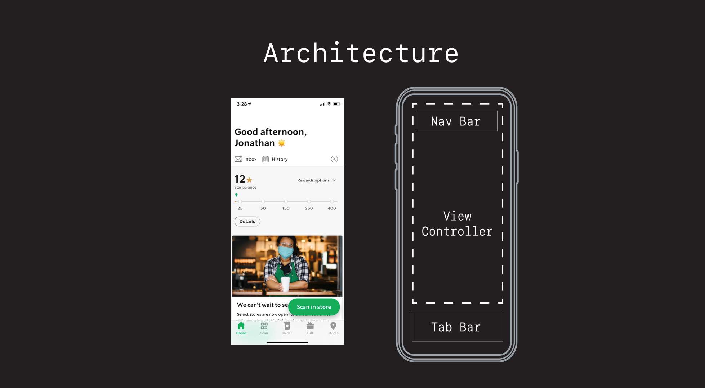
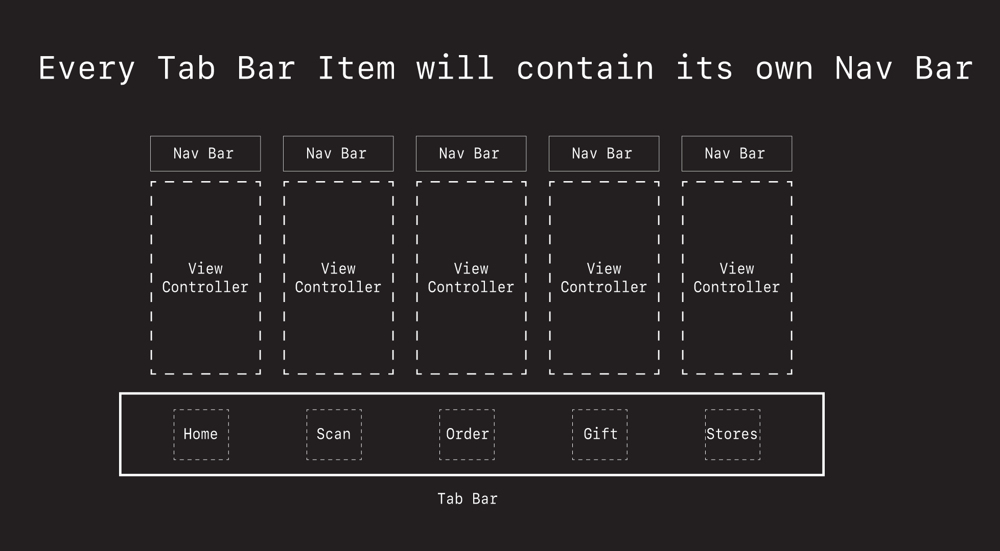

We can set this up in our `AppDelegate` and present in our main `Window` like this.

**AppDelegate.swift**

```swift
@UIApplicationMain
class AppDelegate: UIResponder, UIApplicationDelegate {

    var window: UIWindow?

    func application(_ application: UIApplication, didFinishLaunchingWithOptions launchOptions: [UIApplication.LaunchOptionsKey: Any]?) -> Bool {
        
        window = UIWindow(frame: UIScreen.main.bounds)
        window?.makeKeyAndVisible()
        window?.backgroundColor = .systemBackground
                
        let homeVC = HomeViewController()
        let scanVC = ScanViewController()
        let orderVC = OrderViewController()
        let giftVC = GiftViewController()
        let storeVC = StoreViewController()
                
        let homeNC = UINavigationController(rootViewController: homeVC)
        let scanNC = UINavigationController(rootViewController: scanVC)
        let orderNC = UINavigationController(rootViewController: orderVC)
        let giftNC = UINavigationController(rootViewController: giftVC)
        let storeNC = UINavigationController(rootViewController: storeVC)

        let tabBarController = UITabBarController()
        tabBarController.viewControllers = [homeNC, scanNC, orderNC, giftNC, storeNC]

        window?.rootViewController = tabBarController
        
        return true
    }
 }
```

## Episode #2 Collapsible Header

The home screen has a header that collapses and expands as you swipe up and down.


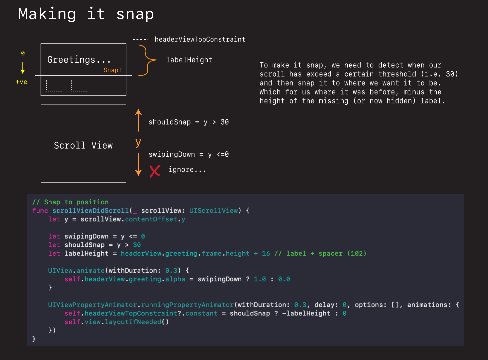

To get this affect first build a custom header.

**HomeHeaderView.swift**

```swift
import UIKit

class HomeHeaderView: UIView {
    
    let greeting = UILabel()
    let inboxButton = UIButton()
    
    override init(frame: CGRect) {
        super.init(frame: .zero)
        layout()
    }
    
    required init?(coder: NSCoder) {
        fatalError("init(coder:) has not been implemented")
    }
}

extension HomeHeaderView {
    func layout() {
        
        greeting.translatesAutoresizingMaskIntoConstraints = false
        greeting.font = UIFont.preferredFont(forTextStyle: .largeTitle)
        greeting.text = "Good afternoon, Jonathan ☀️"
        greeting.numberOfLines = 0
        greeting.lineBreakMode = .byWordWrapping
        
        inboxButton.translatesAutoresizingMaskIntoConstraints = false
        inboxButton.setTitleColor(.label, for: .normal)
        inboxButton.setTitle("Inbox", for: .normal)
        
        addSubview(greeting)
        addSubview(inboxButton)
        
        NSLayoutConstraint.activate([
            greeting.topAnchor.constraint(equalToSystemSpacingBelow: topAnchor, multiplier: 1),
            greeting.leadingAnchor.constraint(equalToSystemSpacingAfter: leadingAnchor, multiplier: 2),
            trailingAnchor.constraint(equalToSystemSpacingAfter: greeting.trailingAnchor, multiplier: 2),
            
            inboxButton.topAnchor.constraint(equalToSystemSpacingBelow: greeting.bottomAnchor, multiplier: 2),
            inboxButton.leadingAnchor.constraint(equalToSystemSpacingAfter: leadingAnchor, multiplier: 2),
            bottomAnchor.constraint(equalToSystemSpacingBelow: inboxButton.bottomAnchor, multiplier: 1)
        ])
    }
    
    override var intrinsicContentSize: CGSize {
        return CGSize(width: 100, height: 100)
    }
}
```

Then make it collapse and snap by tying the scroll offset to the height of the header via an auto layout constraint.

**HomeViewController.swift**

```swift
// MARK: Animating scrollView
extension HomeViewController: UITableViewDelegate {
    
    // Snap to position
    func scrollViewDidScroll(_ scrollView: UIScrollView) {
        let y = scrollView.contentOffset.y

        let swipingDown = y <= 0
        let shouldSnap = y > 30
        let labelHeight = headerView.greeting.frame.height + 16 // label + spacer (102)

        UIView.animate(withDuration: 0.3) {
            self.headerView.greeting.alpha = swipingDown ? 1.0 : 0.0
        }

        UIViewPropertyAnimator.runningPropertyAnimator(withDuration: 0.3, delay: 0, options: [], animations: {
            self.headerViewTopConstraint?.constant = shouldSnap ? -labelHeight : 0
            self.view.layoutIfNeeded()
        })
    }
 }
```

## Episode #3 Scroll View > Stack View > Tiles

The home screen can be built as a series of Tiles (View Controllers) embedded in a stack view, embedded in a scroll view.


The trick with scroll views is making sure you have an unbroken chain of continous constraints.


That, and remembering that when you layout a scroll view, there are two sets of constraints. The scroll view to the the view. Then the contents to the scroll view.

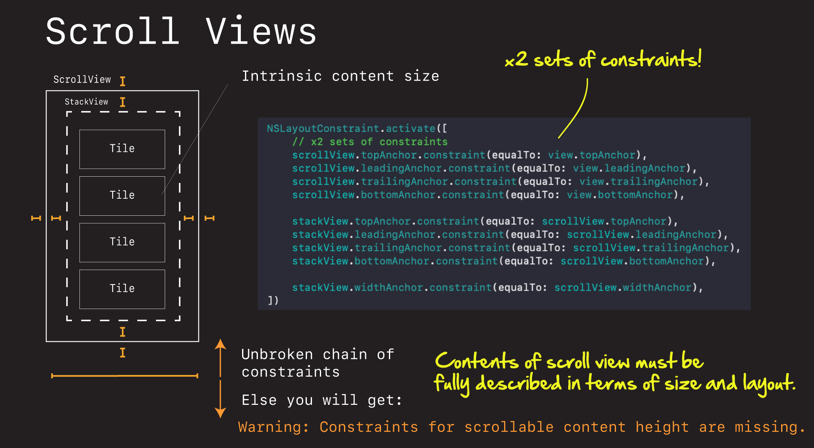

Adding child view controllers to a parent view controller requires we follow these three steps.

```swift
for tile in tiles {
    addChild(tile)
    stackView.addArrangedSubview(tile.view)
    tile.didMove(toParent: self)
}
```


**HomeViewController.swift**

```swift
import UIKit

class HomeViewController: StarBucksViewController {
    
    let headerView = HeaderView()
    let scrollView = UIScrollView()
    let rootStackView = UIStackView()
    
    var headerViewTopConstraint: NSLayoutConstraint?
    
    let tiles = [
                Tile("Star balance"),
                Tile("Bonus stars"),
                Tile("Try these"),
                Tile("Welcome back"),
                Tile("Uplifting")
                ]

    override func viewDidLoad() {
        super.viewDidLoad()
        layout()
        setupScrollView()
    }
    
    override func commonInit() {
        setTabBarImage(imageName: "house.fill", title: "Home")
    }
    
    func setupScrollView() {
        scrollView.delegate = self
    }
    
}

// MARK: Layout
extension HomeViewController {
    func layout() {
        headerView.translatesAutoresizingMaskIntoConstraints = false
        headerView.backgroundColor = .systemPink

        scrollView.translatesAutoresizingMaskIntoConstraints = false
        rootStackView.translatesAutoresizingMaskIntoConstraints = false
        
        rootStackView.axis = .vertical
        rootStackView.spacing = 8
        
        view.addSubview(headerView)
        view.addSubview(scrollView)
        
        scrollView.addSubview(rootStackView)
        
        for tile in tiles {
            addChild(tile)
            rootStackView.addArrangedSubview(tile.view)
            tile.didMove(toParent: self)
        }
        
        headerViewTopConstraint = headerView.topAnchor.constraint(equalTo: view.safeAreaLayoutGuide.topAnchor)

        NSLayoutConstraint.activate([
            headerViewTopConstraint!,
            headerView.leadingAnchor.constraint(equalTo: view.leadingAnchor),
            headerView.trailingAnchor.constraint(equalTo: view.trailingAnchor),
            
            scrollView.topAnchor.constraint(equalTo: headerView.bottomAnchor, constant: 8),
            scrollView.leadingAnchor.constraint(equalTo: view.leadingAnchor, constant: 8),
            scrollView.trailingAnchor.constraint(equalTo: view.trailingAnchor, constant: -8),
            scrollView.bottomAnchor.constraint(equalTo: view.safeAreaLayoutGuide.bottomAnchor),
            
            rootStackView.topAnchor.constraint(equalTo: scrollView.topAnchor),
            rootStackView.leadingAnchor.constraint(equalTo: scrollView.leadingAnchor),
            rootStackView.trailingAnchor.constraint(equalTo: scrollView.trailingAnchor),
            rootStackView.bottomAnchor.constraint(equalTo: scrollView.bottomAnchor),
            rootStackView.widthAnchor.constraint(equalTo: scrollView.widthAnchor),
        ])
    }
}

// MARK: Animating scrollView
extension HomeViewController: UIScrollViewDelegate {
        
    // Snap to position
    func scrollViewDidScroll(_ scrollView: UIScrollView) {
        let y = scrollView.contentOffset.y

        let swipingDown = y <= 0
        let shouldSnap = y > 30
        let labelHeight = headerView.greeting.frame.height + 16

        UIView.animate(withDuration: 0.3) {
            self.headerView.greeting.alpha = swipingDown ? 1.0 : 0.0
        }

        UIViewPropertyAnimator.runningPropertyAnimator(withDuration: 0.3, delay: 0, options: [], animations: {
            self.headerViewTopConstraint?.constant = shouldSnap ? -labelHeight : 0
            self.view.layoutIfNeeded()
        })
    }
    
}
```

**Tile.swift**

```swift
import UIKit

class Tile: UIViewController {
    
    let label = UILabel()
    
    init(_ text: String) {
        super.init(nibName: nil, bundle: nil)
        label.text = text
    }

    override func viewDidLoad() {
        super.viewDidLoad()
        view.backgroundColor = .systemYellow
        layout()
    }
        
    required init?(coder: NSCoder) {
        fatalError("init(coder:) has not been implemented")
    }
    
    func layout() {
        label.translatesAutoresizingMaskIntoConstraints = false
        
        view.addSubview(label)
        
        NSLayoutConstraint.activate([
            label.centerXAnchor.constraint(equalTo: view.centerXAnchor),
            label.centerYAnchor.constraint(equalTo: view.centerYAnchor),
            view.heightAnchor.constraint(equalToConstant: 300)
        ])
    }
}
```

## Episode #4 Adding Tile Views

To keep our view controllers less cluttered, we are going to add our Tiles as _ViewControllers_ with extracted child _views_.

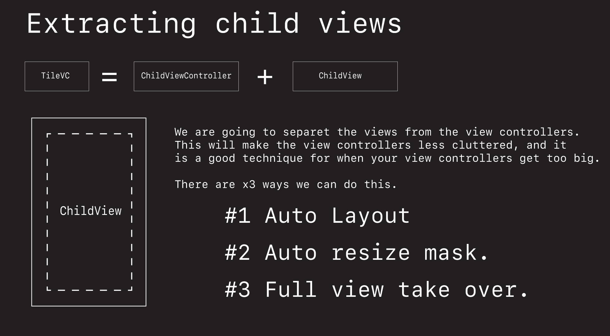

There are x3 ways we can go about this.

* Auto Layout
* Auto resise mask
* Full view take over

### Auto Layout

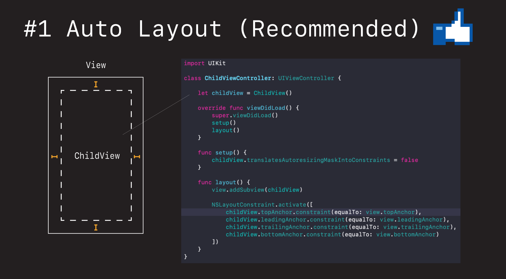

While it takes a few more lines of code, adding a child view with auto layout is the easiest, most flexible way of adding a sub view to a parent view controller.

Auto layout is well understood. It handles the widest variety of layout cases. And it is the method we are going to use when adding tiles to our parent view controllers.

### Auto resize mask

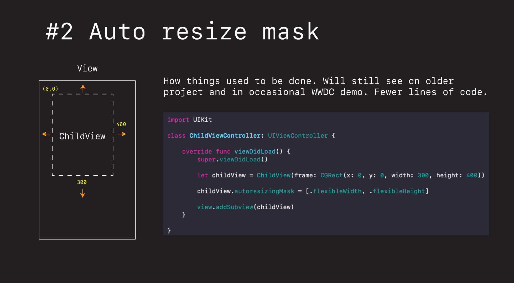

An older technique that pre-dates auto layout. This is still viable. Requires fewer lines of code. But isn't used as much as auto layout is now the recommended way. But you will still see this occasionally. And now you will know what it is.

### Fill view take over

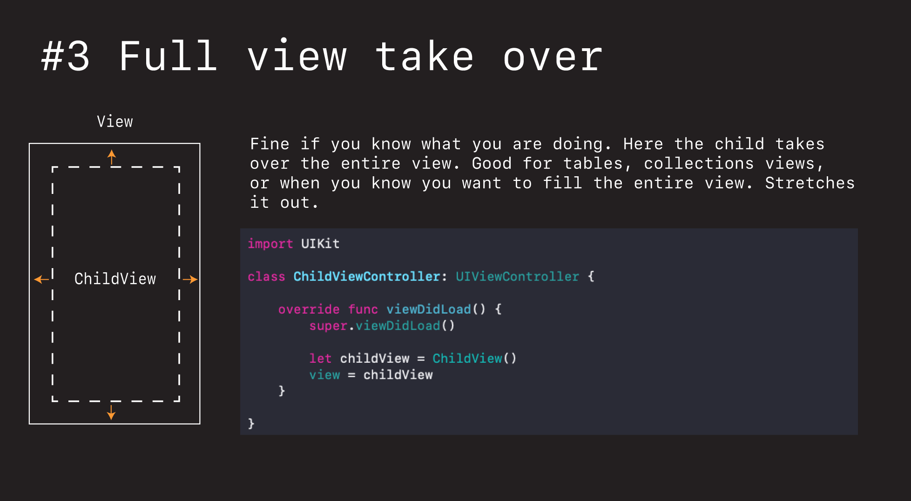

If you know your child view is going to take over the entirety of the view, you can just set it on the view controller's _view_ directly. This will stretch out the child, pin it to the edges of the parent, and so long as that is the affect you want, requires the fewest lines of code. Handly for laying out other full screen views like _TableViews_ and _CollectionViews_.

### Tiles

Here is how we will add our new tiles, and their associated subviews.

**TileViewController.swift**

```swift
import UIKit

class TileViewController: UIViewController {
    
    let tileView = TileView()
    
    init(title: String, subtitle: String, imageName: String) {
        super.init(nibName: nil, bundle: nil)
        
        tileView.titleLabel.text = title
        tileView.subtitleLabel.text = subtitle
        tileView.imageView.image = UIImage(named: imageName)
    }
    
    required init?(coder: NSCoder) {
        fatalError("init(coder:) has not been implemented")
    }
    
    override func viewDidLoad() {
        super.viewDidLoad()
        style()
        layout()
    }
    
    func style() {
        tileView.translatesAutoresizingMaskIntoConstraints = false
    }
    
    func layout() {
        view.addSubview(tileView)
        
        NSLayoutConstraint.activate([
            tileView.topAnchor.constraint(equalTo: view.topAnchor),
            tileView.leadingAnchor.constraint(equalTo: view.leadingAnchor),
            tileView.trailingAnchor.constraint(equalTo: view.trailingAnchor),
            tileView.bottomAnchor.constraint(equalTo: view.bottomAnchor),
        ])
    }
}
```

**TileView.swift**

```swift
import UIKit

class TileView: UIView {
    
    let imageView = UIImageView()
    let titleLabel = UILabel()
    let subtitleLabel = UILabel()
    let ctaButton = makeGreenButton(withText: "Order")

    override init(frame: CGRect) {
        super.init(frame: frame)
        style()
        layout()
    }
    
    required init?(coder: NSCoder) {
        fatalError("init(coder:) has not been implemented")
    }
    
    private var shadowLayer: CAShapeLayer!
    private var cornerRadius: CGFloat = 6
    private var fillColor: UIColor = .white
     
    override func layoutSubviews() {
        super.layoutSubviews()
        addShadow()
    }
    
    func addShadow() {
        shadowLayer = CAShapeLayer()
        
        shadowLayer.path = UIBezierPath(roundedRect: bounds, cornerRadius: cornerRadius).cgPath
        shadowLayer.fillColor = fillColor.cgColor
        
        shadowLayer.shadowColor = UIColor.black.cgColor
        shadowLayer.shadowPath = shadowLayer.path
        shadowLayer.shadowOffset = CGSize(width: 0.0, height: 1.0)
        shadowLayer.shadowOpacity = 0.2
        shadowLayer.shadowRadius = 1
        
        layer.insertSublayer(shadowLayer, at: 0)
    }
}

extension TileView {
    func style() {
        layer.cornerRadius = cornerRadius
                
        imageView.translatesAutoresizingMaskIntoConstraints = false
        imageView.contentMode = .scaleAspectFit
        imageView.clipsToBounds = true
        
        titleLabel.translatesAutoresizingMaskIntoConstraints = false
        titleLabel.font = UIFont.preferredFont(forTextStyle: .title3).bold()
        titleLabel.textColor = .label
        
        subtitleLabel.translatesAutoresizingMaskIntoConstraints = false
        subtitleLabel.font = UIFont.preferredFont(forTextStyle: .footnote)
        subtitleLabel.numberOfLines = 0
        subtitleLabel.lineBreakMode = .byWordWrapping
        
        ctaButton.translatesAutoresizingMaskIntoConstraints = false
    }
    
    func layout() {
        addSubview(imageView)
        addSubview(titleLabel)
        addSubview(subtitleLabel)
        addSubview(ctaButton)
        
        NSLayoutConstraint.activate([
            imageView.topAnchor.constraint(equalTo: topAnchor),
            imageView.leadingAnchor.constraint(equalTo: leadingAnchor),
            imageView.trailingAnchor.constraint(equalTo: trailingAnchor),

            titleLabel.topAnchor.constraint(equalToSystemSpacingBelow: imageView.bottomAnchor, multiplier: 2),
            titleLabel.leadingAnchor.constraint(equalToSystemSpacingAfter: leadingAnchor, multiplier: 2),
            trailingAnchor.constraint(equalToSystemSpacingAfter: titleLabel.trailingAnchor, multiplier: 2),

            subtitleLabel.topAnchor.constraint(equalToSystemSpacingBelow: titleLabel.bottomAnchor, multiplier: 2),
            subtitleLabel.leadingAnchor.constraint(equalTo: titleLabel.leadingAnchor),
            subtitleLabel.trailingAnchor.constraint(equalTo: titleLabel.trailingAnchor),

            ctaButton.topAnchor.constraint(equalToSystemSpacingBelow: subtitleLabel.bottomAnchor, multiplier: 2),
            ctaButton.leadingAnchor.constraint(equalTo: titleLabel.leadingAnchor),
            bottomAnchor.constraint(equalToSystemSpacingBelow: ctaButton.bottomAnchor, multiplier: 2),
        ])
    }
}
```

## Episode #5 Reward Tile

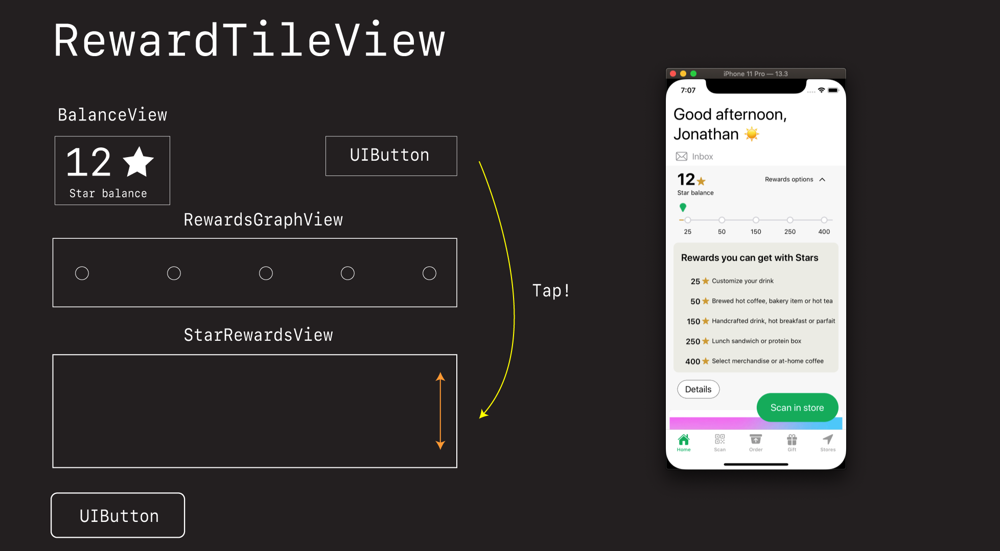

## Episode #6 Core Graphics


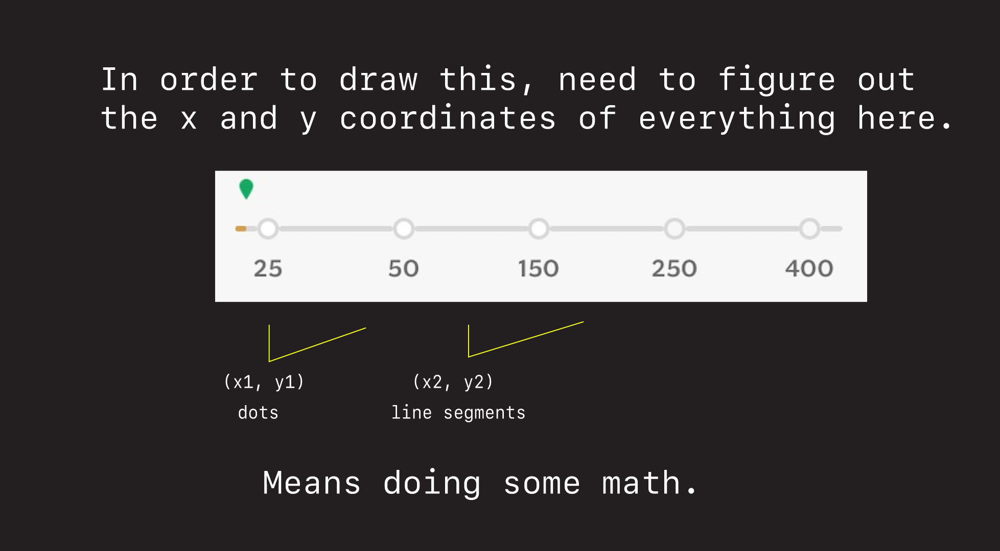

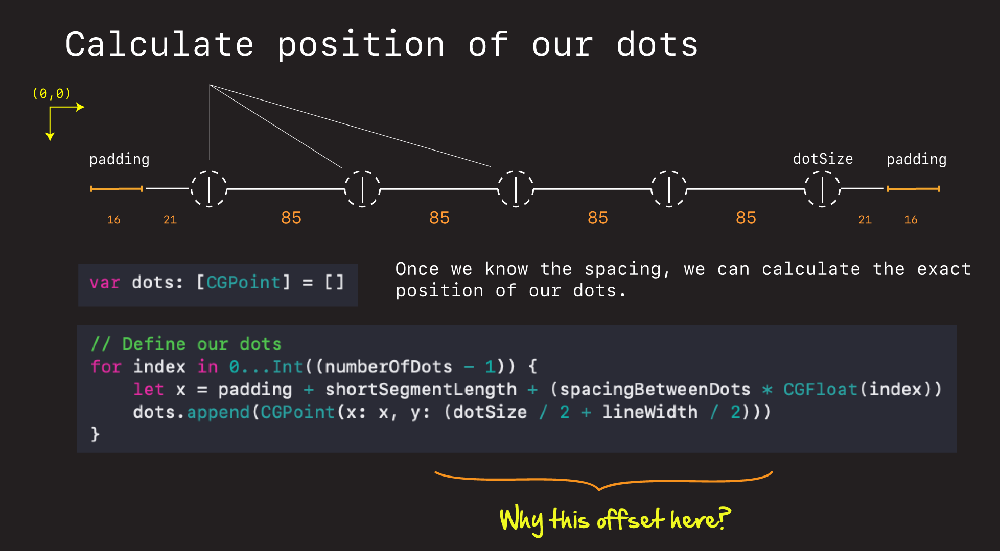
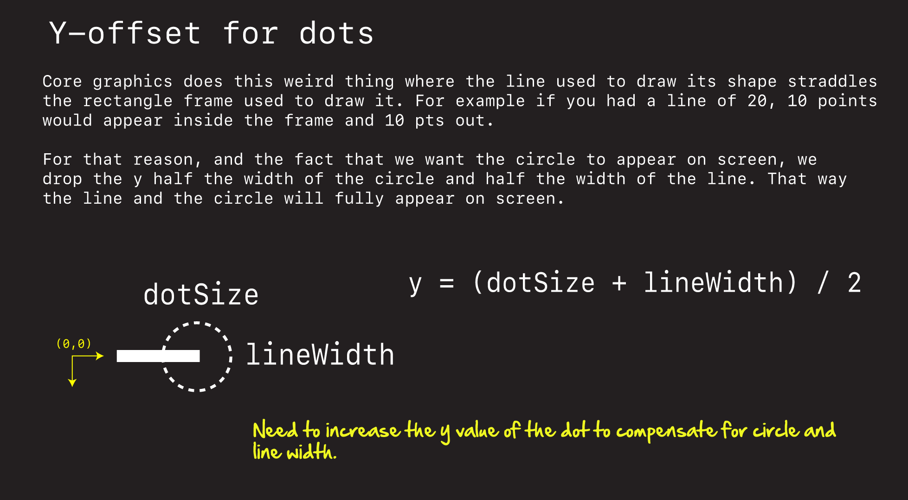
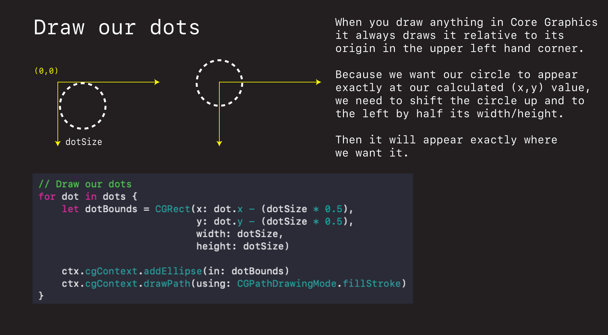

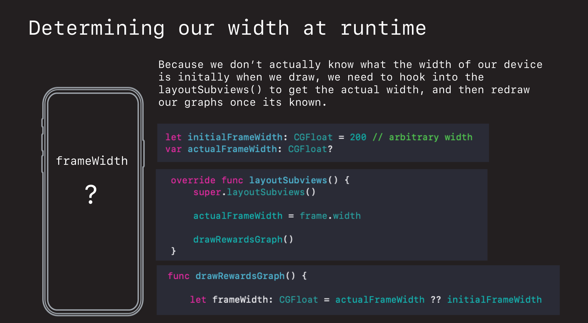

## Episode #7 Animate within Scroll View


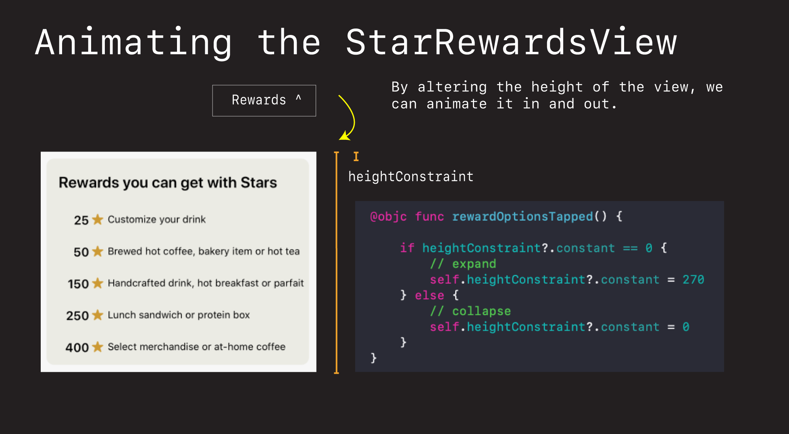

We can animate the appearance of a view within a scroll view by altering its height, and then wrapping it within an animation. We can also alter its alpha and the updown chrevon of the reward button itself.

**RewardsTileView.swift**

```swift
// MARK: Actions
extension RewardsTileView {
    @objc func rewardOptionsTapped() {
        
        if heightConstraint?.constant == 0 {
            self.setChevronUp()

            let heightAnimator = UIViewPropertyAnimator(duration: 0.75, curve: .easeInOut) {
                self.heightConstraint?.constant = 270
                self.layoutIfNeeded()
            }
            heightAnimator.startAnimation()

            let alphaAnimator = UIViewPropertyAnimator(duration: 0.25, curve: .easeInOut) {
                self.starRewardsView.isHidden = false
                self.starRewardsView.alpha = 1
            }
            alphaAnimator.startAnimation(afterDelay: 0.5)

        } else {
            self.setChevronDown()

            let animator = UIViewPropertyAnimator(duration: 0.75, curve: .easeInOut) {
                self.heightConstraint?.constant = 0
                self.starRewardsView.isHidden = true
                self.starRewardsView.alpha = 0
                self.layoutIfNeeded()
            }
            animator.startAnimation()
        }
    }

    private func setChevronUp() {
        let configuration = UIImage.SymbolConfiguration(scale: .small)
        let image = UIImage(systemName: "chevron.up", withConfiguration: configuration)
        rewardsButton.setImage(image, for: .normal)
    }

    private func setChevronDown() {
        let configuration = UIImage.SymbolConfiguration(scale: .small)
        let image = UIImage(systemName: "chevron.down", withConfiguration: configuration)
        rewardsButton.setImage(image, for: .normal)
    }
}
```

## Episode 8 JSON HTTP & View Models

### HTTP


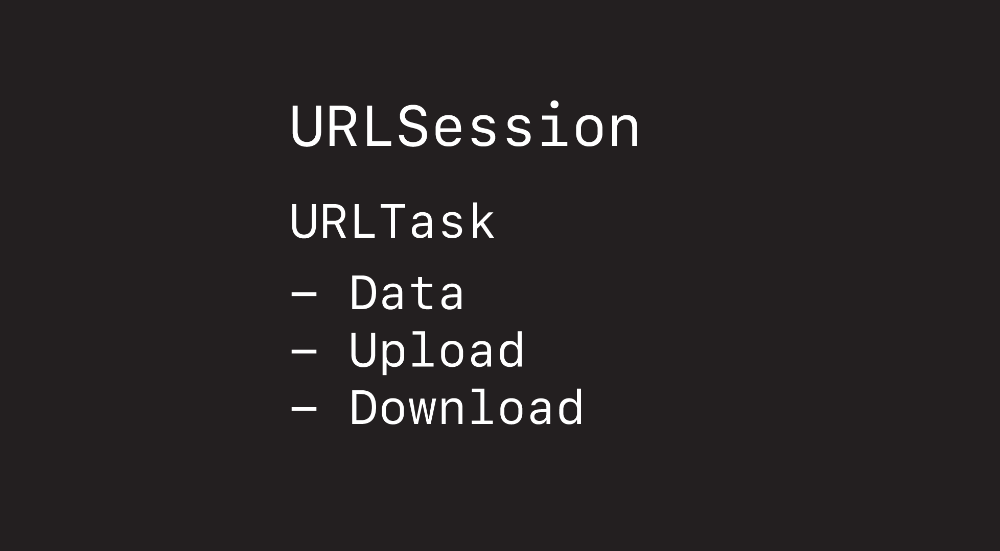
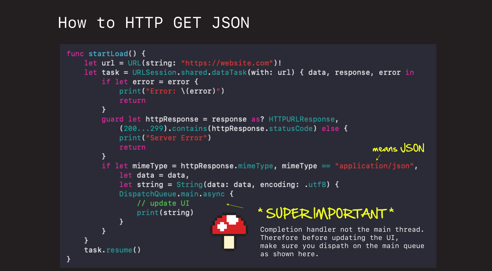

The key to working with the raw iOS networking classes to to always remember which thread you are on. Before updating the UI, make sure you are on the main thread.

From the [Apple documentation](https://developer.apple.com/documentation/foundation/url_loading_system/fetching_website_data_into_memory):

	Important

	The completion handler is called on a different Grand Central Dispatch queue than the one that created the task. Therefore, any work that uses data or error to update the UI — like updating webView — should be explicitly placed on the main queue, as shown here.
	
**HistoryService.swift**

```swift
import Foundation

enum ServiceError: Error {
    case server
    case parsing
}

struct HistoryService {
    static let shared = HistoryService()
    
    func fetchTransactions(completion: @escaping ((Result<[Transaction], Error>) -> Void)) {

        let url = URL(string: "https://uwyg0quc7d.execute-api.us-west-2.amazonaws.com/prod/history")!
        
        let task = URLSession.shared.dataTask(with: url) { data, response, error in
            
            if let error = error {
                DispatchQueue.main.async {
                    completion(Result.failure(error))
                }
            }

            guard let data = data else { return }
            
            guard let httpResponse = response as? HTTPURLResponse,
                (200...299).contains(httpResponse.statusCode) else {
                    completion(Result.failure(ServiceError.server))
                return
            }
            
            let decoder = JSONDecoder()
            decoder.dateDecodingStrategy = .iso8601
            
            do {
                let result = try decoder.decode(History.self, from: data)
                DispatchQueue.main.async {
                    completion(Result.success(result.transactions)) // update UI
                }
            } catch {
                DispatchQueue.main.async {
                    completion(Result.failure(ServiceError.parsing))
                }
            }
        }
        task.resume()
    }
}
```
	
### JSON

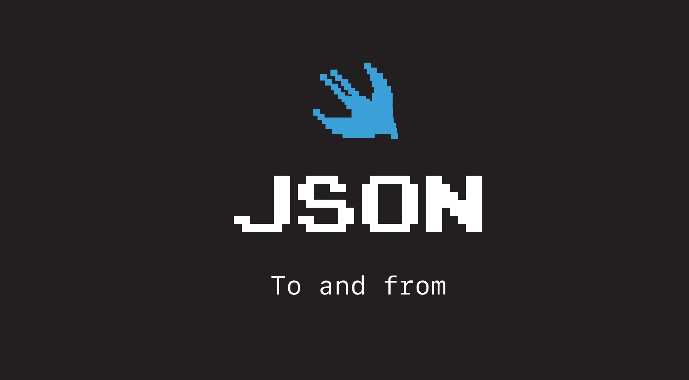

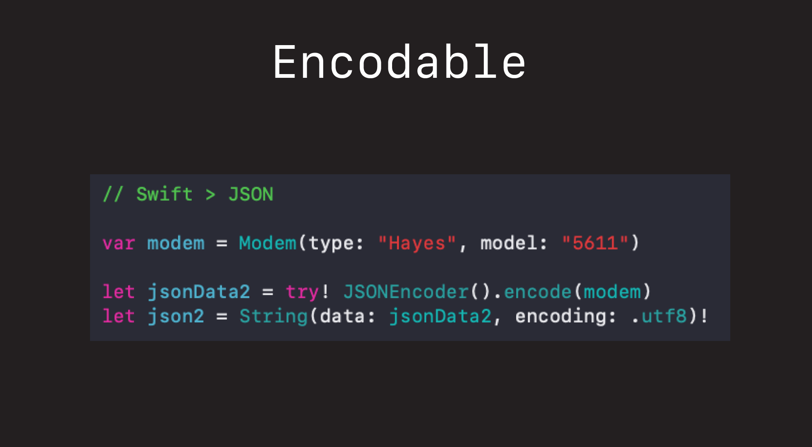
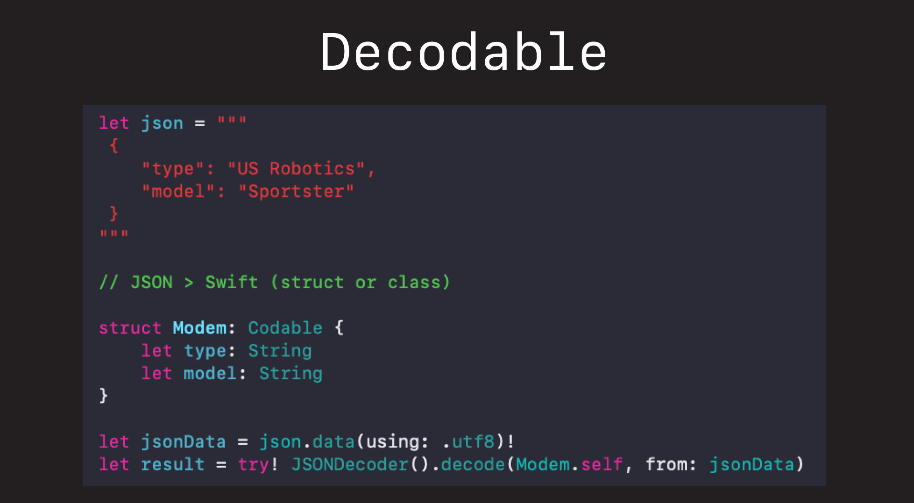

The great things about Swift JSON is all the mapping and coding is automatically down for you by virture of you defining the _struct_. Simply define the _struct_ and Swift does the rest for you.

```swift
import Foundation

/*
 let json = """
 {
 "transactions": [
   {
     "id": 699519475,
     "type": "redeemed",
     "amount": "150",
     "processed_at": "2020-07-17T12:56:27-04:00"
   }
  ]
 }
 """
 */

struct History: Codable {
    let transactions: [Transaction]
}

struct Transaction: Codable {
    let id: Int
    let type: String
    let amount: String
    let date: Date
    
    enum CodingKeys: String, CodingKey {
        case id
        case type
        case amount
        case date = "processed_at"
    }
}
```

### View Model

To make our views easier to populate, it would be nice if we had a data structure that exactly fit our purposes and our needs. That's where the _View Model_ comes in.

A _View Model_ is a data structure that perfectly mataches our UI. It takes data from the outside world, and converts it into a form for our inside world, or UI.

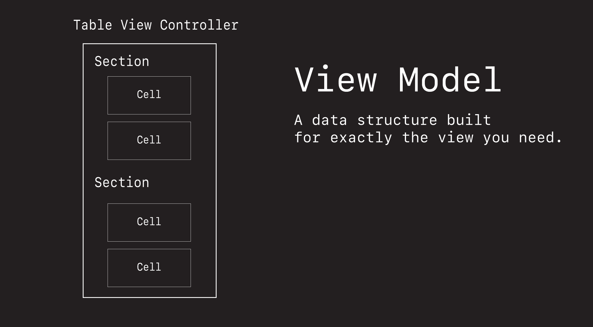
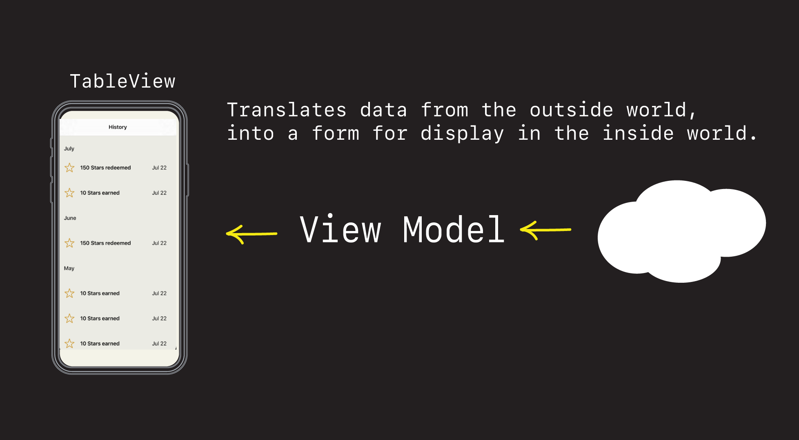
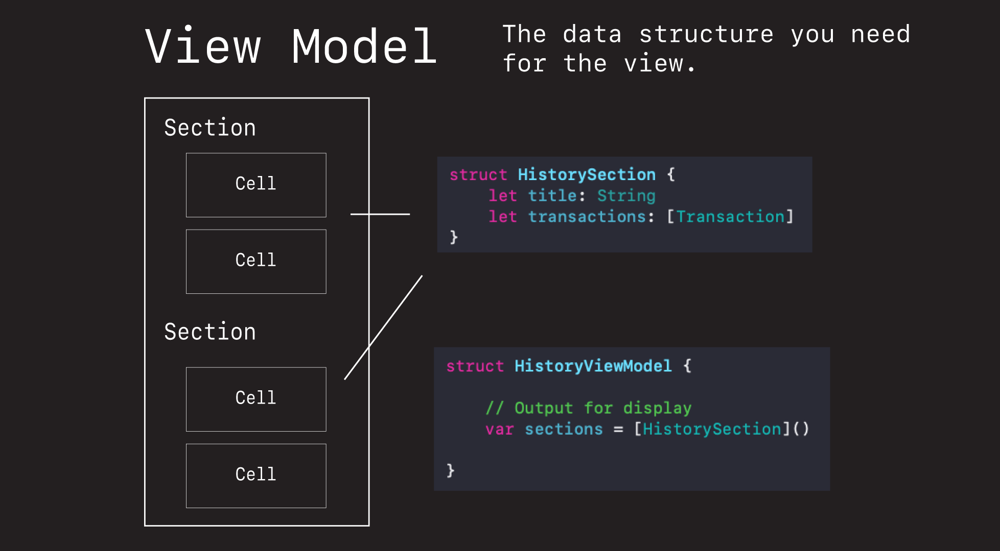


**HistoryViewModel.swift**

```swift
import Foundation

struct HistorySection {
    let title: String
    let transactions: [Transaction]
}

struct HistoryViewModel {
    
    // Output for display
    var sections = [HistorySection]()
    
    // Input
    var transactions: [Transaction]? {
        didSet {
            guard let txs = transactions else { return }
            
            // filter by month - hard coded
            let firstMonth = "Jul"
            let secondMonth = "Jun"
            let thirdMonth = "May"
            
            let dateFormatter = DateFormatter()
            dateFormatter.dateStyle = .medium
            
            let firstMonthTransactions = txs.filter {
                let dateString = dateFormatter.string(from: $0.date)
                return dateString.starts(with: firstMonth)
            }

            let secondMonthTransactions = txs.filter {
                let dateString = dateFormatter.string(from: $0.date)
                return dateString.starts(with: secondMonth)
            }

            let thirdMonthTransactions = txs.filter {
                let dateString = dateFormatter.string(from: $0.date)
                return dateString.starts(with: thirdMonth)
            }

            // create sections
            let firstMonthSection = HistorySection(title: "July", transactions: firstMonthTransactions)
            let secondMonthSection = HistorySection(title: "June", transactions: secondMonthTransactions)
            let thirdMonthSection = HistorySection(title: "May", transactions: thirdMonthTransactions)
            
            // collect for display
            sections = [HistorySection]()
            sections.append(firstMonthSection)
            sections.append(secondMonthSection)
            sections.append(thirdMonthSection)
        }
    }
}
```

### Links that help
- [Apple docs on networking](https://developer.apple.com/documentation/foundation/url_loading_system)
- [Apple docs fetching network data](https://developer.apple.com/documentation/foundation/url_loading_system/fetching_website_data_into_memory)
- [Learn App Making](https://learnappmaking.com/urlsession-swift-networking-how-to/)
- [Sample JSON Data](https://shopify.dev/docs/admin-api/rest/reference/shopify_payments/transaction?api)


