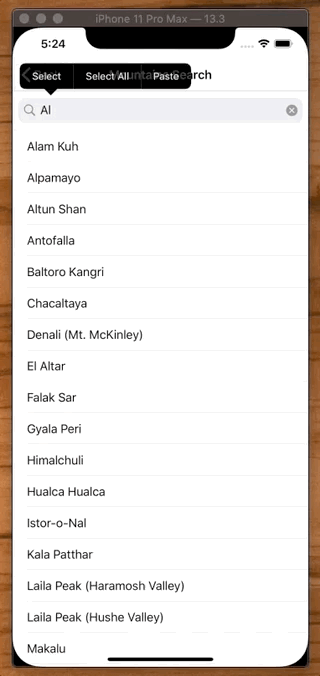

# Diffable Data Source

## UITableView



Here's what you need to know about `UITableViewDiffableDataSource`:

- The item you stick in needs to be _Hashable_.

```swift
    struct Mountain: Hashable {
        
        let name: String
        let height: Int
        let identifier = UUID()
        
        func hash(into hasher: inout Hasher) {
            hasher.combine(identifier)
        }
        
        static func == (lhs: Mountain, rhs: Mountain) -> Bool {
            return lhs.identifier == rhs.identifier
        }
    }
```


- You return the _UITableViewCell_ as part of the initializer.
- No more _indexPath_ (through you can still translate between indexPaths and current cell you have if you need to).
- It is thread safe 
 - Just be consistent - always work on the main thread or a background thread but not both.
- You still need a cell _reuseIdentifier_ else you will get an error about a tableCell not being able to lay itself out.

## How it works

### Configure the Data Source

First you configure the `UITableViewDiffableDataSource`. 

```swift
func configureDataSource() {
    dataSource = UITableViewDiffableDataSource<Section, MountainsController.Mountain>(tableView: tableView) {
        (tableView: UITableView, indexPath: IndexPath, item: MountainsController.Mountain) -> UITableViewCell?  in
        
        let cell = tableView.dequeueReusableCell(withIdentifier: self.reuseIdentifier, for: indexPath)
        cell.textLabel?.text = item.name
        return cell
    }
}
```

A data source takes a _SectionIdentifierType_, an _ItemIdentifierType_, a _tableView_, and a closure returning the _UITableViewCell_ you would like the data source to use for each cell.

Here is the constructor:

```swift
@available(iOS 13.0, tvOS 13.0, *)
open class UITableViewDiffableDataSource<SectionIdentifierType, ItemIdentifierType> : NSObject, UITableViewDataSource where SectionIdentifierType : Hashable, ItemIdentifierType : Hashable {

    public typealias CellProvider = (UITableView, IndexPath, ItemIdentifierType) -> UITableViewCell?

    public init(tableView: UITableView, cellProvider: @escaping UITableViewDiffableDataSource<SectionIdentifierType, ItemIdentifierType>.CellProvider)

```

This is different from the `UITableView` that returns a cell as part of it's delegate. Here it's returned in the constructor.

### Then you update

When you get a new updated collection of items to display, it's just four lines of code to update the _tableView_.

```swift
func performQuery(with filter: String?) {
    let mountains = mountainsController.filteredMountains(with: filter).sorted { $0.name < $1.name }

    var snapshot = NSDiffableDataSourceSnapshot<Section, MountainsController.Mountain>()
    snapshot.appendSections([.main])
    snapshot.appendItems(mountains, toSection: .main)
    dataSource.apply(snapshot, animatingDifferences: true)
}
```

### Common pattern in the WWDC videos

One patten the WWDC folks like to use when creating demso (in the Wifi example) is passing closures in as part of the initializer. Here is an example where the _updateHandler_ is passed in, and then later executed withe `WIFIController` pass itself back to the `ViewController` that created it.

```swift
class WIFIController {
    typealias UpdateHandler = (WIFIController) -> Void
    private let updateHandler: UpdateHandler
    
    init(updateHandler: @escaping UpdateHandler) {
        self.updateHandler = updateHandler
    }
}

class WiFiSettingsViewController: UIViewController {
    
    var wifiController: WIFIController! = nil
    
    override func viewDidLoad() {
        super.viewDidLoad()
        configureDataSource()
    }
    
    func configureDataSource() {
        wifiController = WIFIController { [weak self] (controller: WIFIController) in
            guard let self = self else { return }
            self.updateUI()
        }
    }
    
    func updateUI() {
        print("Update")
    }
}
```

While strange looking at first, it is quite elegant. Basically you create _Controllers_ for handling your diffable data. Only when you create them, you pass in an _UpdateHandler_ which is an alias to a closure defined like this.

`typealias UpdateHandler = (WIFIController) -> Void`

which passes itself in as an input and returns nothing. What this effectively does is when the controller does an update, it executes this code passing itself in. This is how the WWDC callback when the WIFI settings change, thus allowing the _ WiFiSettingsViewController_ to update it's UI.

## Full source

See repos for full source. Here is the _ViewController_.

```swift
//
//  MountainTableViewController.swift
//  DemoArcade
//
//  Created by Jonathan Rasmusson Work Pro on 2020-04-07.
//  Copyright © 2020 Rasmusson Software Consulting. All rights reserved.
//

import UIKit

class MountainTableViewController: UIViewController {

    enum Section {
        case main
    }
    
    let searchBar = UISearchBar()
    let tableView = UITableView()
    
    var dataSource: UITableViewDiffableDataSource<Section, MountainsController.Mountain>!
    var nameFilter: String?
    
    let reuseIdentifier = "reuse-identifier"
    
    let mountainsController = MountainsController()
    
    override func viewDidLoad() {
        super.viewDidLoad()
        navigationItem.title = "Mountains Search"
        
        layout()
        configureDataSource()
        performQuery(with: nil)
    }
    
    func layout() {
        for viewable in [searchBar, tableView] {
            view.addSubview(viewable)
            viewable.translatesAutoresizingMaskIntoConstraints = false
        }
        
        searchBar.delegate = self
        tableView.register(UITableViewCell.self, forCellReuseIdentifier: reuseIdentifier)
        
        searchBar.topAnchor.constraint(equalToSystemSpacingBelow: view.safeAreaLayoutGuide.topAnchor, multiplier: 3).isActive = true
        searchBar.leadingAnchor.constraint(equalToSystemSpacingAfter: view.leadingAnchor, multiplier: 1).isActive = true
        view.trailingAnchor.constraint(equalToSystemSpacingAfter: searchBar.trailingAnchor, multiplier: 1).isActive = true
        
        tableView.topAnchor.constraint(equalToSystemSpacingBelow: searchBar.bottomAnchor, multiplier: 0).isActive = true
        tableView.leadingAnchor.constraint(equalToSystemSpacingAfter: view.leadingAnchor, multiplier: 0).isActive = true
        view.trailingAnchor.constraint(equalToSystemSpacingAfter: tableView.trailingAnchor, multiplier: 0).isActive = true
        view.bottomAnchor.constraint(equalToSystemSpacingBelow: tableView.bottomAnchor, multiplier: 0).isActive = true
    }
    
    func configureDataSource() {
        dataSource = UITableViewDiffableDataSource<Section, MountainsController.Mountain>(tableView: tableView) {
            (tableView: UITableView, indexPath: IndexPath, item: MountainsController.Mountain) -> UITableViewCell?  in
            
            let cell = tableView.dequeueReusableCell(withIdentifier: self.reuseIdentifier, for: indexPath)
            cell.textLabel?.text = item.name
            return cell
        }
    }
        
    func performQuery(with filter: String?) {
        let mountains = mountainsController.filteredMountains(with: filter).sorted { $0.name < $1.name }

        var snapshot = NSDiffableDataSourceSnapshot<Section, MountainsController.Mountain>()
        snapshot.appendSections([.main])
        snapshot.appendItems(mountains, toSection: .main)
        dataSource.apply(snapshot, animatingDifferences: true)
    }
}

extension MountainTableViewController: UISearchBarDelegate {
    func searchBar(_ searchBar: UISearchBar, textDidChange searchText: String) {
        performQuery(with: searchText)
    }
}
```

### Links that help

- [Apple WWDC 2019](https://developer.apple.com/videos/play/wwdc2019/220/)