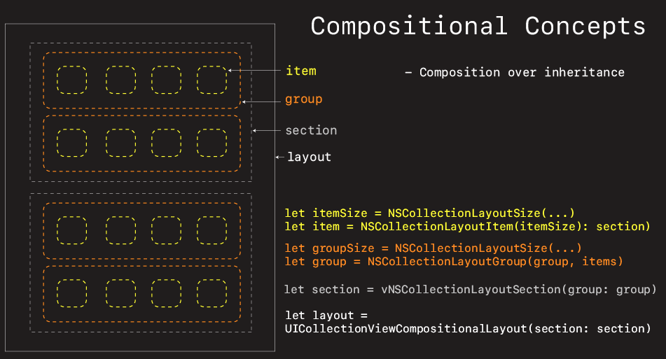
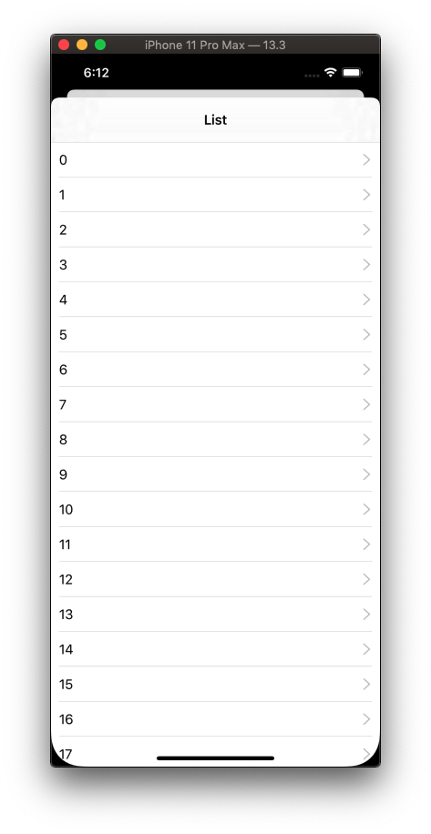
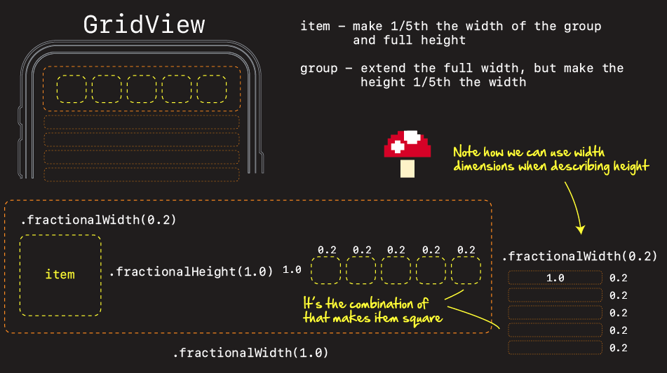
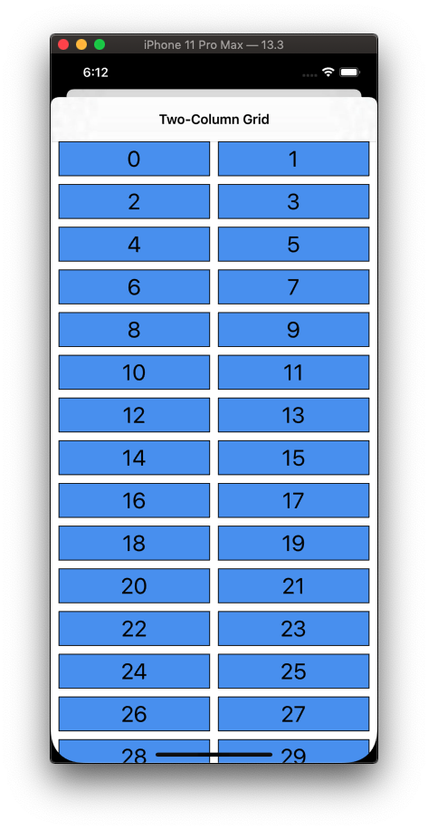
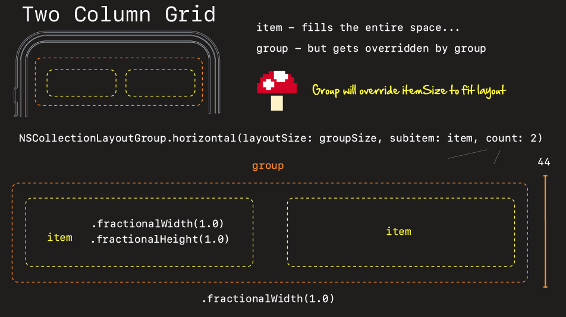
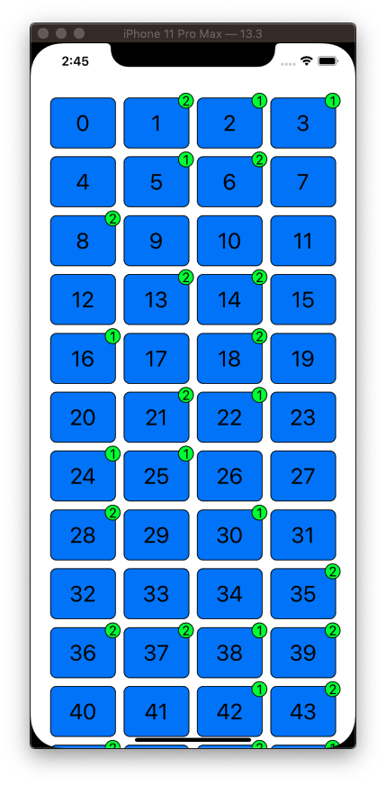
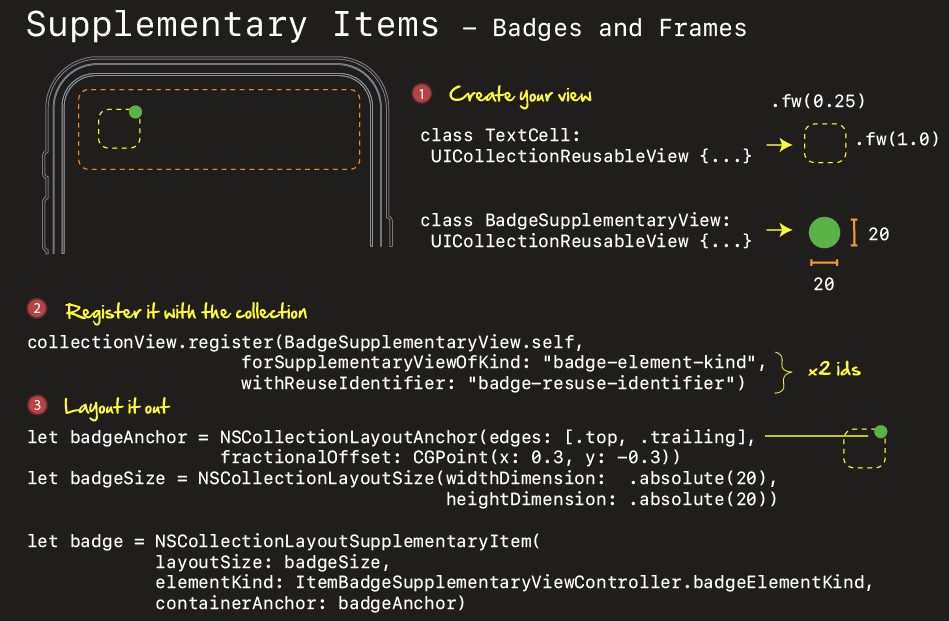
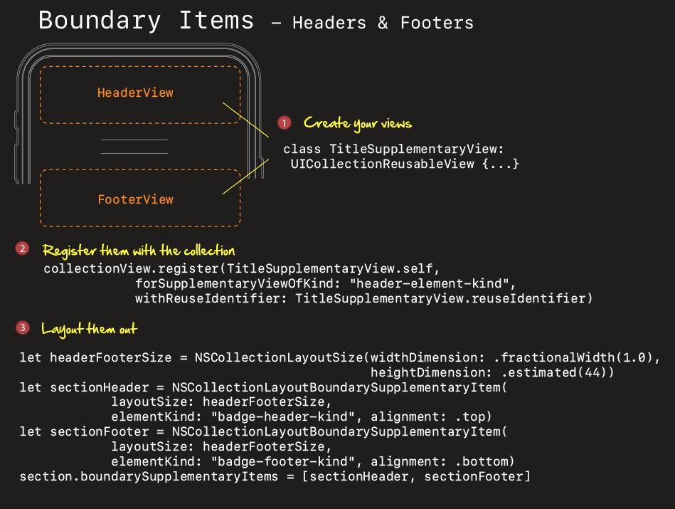
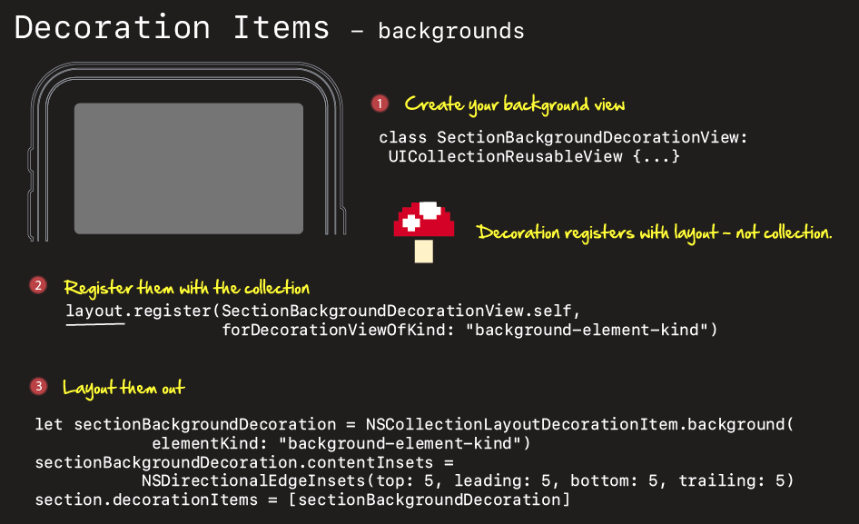

# UICollectionView - Compositional Layout

## Concepts

Compositional Layout is a concrete `UICollectionViewLayout` where you compose new layouts by combining _items_, _groups_, _sections_, and _layout_ together.



By specifying sizes either _fractionally_, _absolutely_, or _estimated_ you give every item a size around which it can be laid out.

```swift
class NSCollectionLayoutSize {
   init(widthDimension: NSCollectionLayoutDimension,
   heightDimension: NSCollectionLayoutDimension)
}

class NSCollectionLayoutDimension {
   class func fractionalWidth(_ fractionalWidth: CGFloat) -> Self 
   class func fractionalHeight(_ fractionalHeight: CGFloat) -> Self 
   class func absolute(_ absoluteDimension: CGFloat) -> Self
   class func estimated(_ estimatedDimension: CGFloat) -> Self
}
```

## HelloWorld


```swift
private func createLayout() -> UICollectionViewLayout {

    // item
    let itemSize = NSCollectionLayoutSize(widthDimension: .fractionalWidth(1.0),
                                         heightDimension: .fractionalHeight(1.0))
    
    let item = NSCollectionLayoutItem(layoutSize: itemSize)
    item.contentInsets = NSDirectionalEdgeInsets(top: 8, leading: 8, bottom: 8, trailing: 8)
    
    // group
    let groupSize = NSCollectionLayoutSize(widthDimension: .fractionalWidth(1.0),
                                           heightDimension: .fractionalHeight(1.0))
    let group = NSCollectionLayoutGroup.horizontal(layoutSize: groupSize, subitems: [item])

    let section = NSCollectionLayoutSection(group: group)

    let layout = UICollectionViewCompositionalLayout(section: section)

    return layout
}
```


## List View




```swift
/*

Abstract:
A basic list described by compositional layout
*/

import UIKit

class ListCell: UICollectionViewCell {
    static let reuseIdentifier = "list-cell-reuse-identifier"
    let label = UILabel()
    let accessoryImageView = UIImageView()
    let seperatorView = UIView()

    override init(frame: CGRect) {
        super.init(frame: frame)
        configure()
    }
    required init?(coder: NSCoder) {
        fatalError("not implemented")
    }
}

extension ListCell {
    func configure() {
        label.translatesAutoresizingMaskIntoConstraints = false
        label.adjustsFontForContentSizeCategory = true
        label.font = UIFont.preferredFont(forTextStyle: .body)
        contentView.addSubview(label)

        seperatorView.translatesAutoresizingMaskIntoConstraints = false
        seperatorView.backgroundColor = .lightGray
        contentView.addSubview(seperatorView)

        selectedBackgroundView = UIView()
        selectedBackgroundView?.backgroundColor = UIColor.lightGray.withAlphaComponent(0.3)

        accessoryImageView.translatesAutoresizingMaskIntoConstraints = false
        contentView.addSubview(accessoryImageView)

        let rtl = effectiveUserInterfaceLayoutDirection == .rightToLeft
        let chevronImageName = rtl ? "chevron.left" : "chevron.right"
        let chevronImage = UIImage(systemName: chevronImageName)
        accessoryImageView.image = chevronImage
        accessoryImageView.tintColor = UIColor.lightGray.withAlphaComponent(0.7)

        let inset = CGFloat(10)
        NSLayoutConstraint.activate([
            label.leadingAnchor.constraint(equalTo: contentView.leadingAnchor, constant: inset),
            label.topAnchor.constraint(equalTo: contentView.topAnchor, constant: inset),
            label.bottomAnchor.constraint(equalTo: contentView.bottomAnchor, constant: -inset),
            label.trailingAnchor.constraint(equalTo: accessoryImageView.leadingAnchor, constant: -inset),

            accessoryImageView.centerYAnchor.constraint(equalTo: contentView.centerYAnchor),
            accessoryImageView.widthAnchor.constraint(equalToConstant: 13),
            accessoryImageView.heightAnchor.constraint(equalToConstant: 20),
            accessoryImageView.trailingAnchor.constraint(equalTo: contentView.trailingAnchor, constant: -inset),

            seperatorView.leadingAnchor.constraint(equalTo: contentView.leadingAnchor, constant: inset),
            seperatorView.bottomAnchor.constraint(equalTo: contentView.bottomAnchor),
            seperatorView.trailingAnchor.constraint(equalTo: contentView.trailingAnchor, constant: -inset),
            seperatorView.heightAnchor.constraint(equalToConstant: 0.5)
            ])
    }
}

class ViewController: UIViewController {

    enum Section {
        case main
    }

    var dataSource: UICollectionViewDiffableDataSource<Section, Int>! = nil
    var collectionView: UICollectionView! = nil

    override func viewDidLoad() {
        super.viewDidLoad()
        navigationItem.title = "List"
        configureHierarchy()
        configureDataSource()
    }

    private func configureHierarchy() {
        collectionView = UICollectionView(frame: view.bounds, collectionViewLayout: createLayout())
        collectionView.autoresizingMask = [.flexibleWidth, .flexibleHeight]
        collectionView.backgroundColor = .systemBackground
        collectionView.register(ListCell.self, forCellWithReuseIdentifier: ListCell.reuseIdentifier)
        view.addSubview(collectionView)
    }

    // HelloWorld Compositional Layout
    private func createLayout() -> UICollectionViewLayout {

        let itemSize = NSCollectionLayoutSize(widthDimension: .fractionalWidth(1.0),
                                             heightDimension: .fractionalHeight(1.0))
        let item = NSCollectionLayoutItem(layoutSize: itemSize)

        let groupSize = NSCollectionLayoutSize(widthDimension: .fractionalWidth(1.0),
                                              heightDimension: .absolute(44))
        let group = NSCollectionLayoutGroup.horizontal(layoutSize: groupSize, subitems: [item])

        let section = NSCollectionLayoutSection(group: group)

        let layout = UICollectionViewCompositionalLayout(section: section)

        return layout
    }

    /*
     Discussion:

       It is the group size the ultimate decides the cell layout. A group is some repeating structure
     you may have. Each item is going to get its own group. The item can either fill, or fractionally
     adjust is size relative to the group.

     */

    private func configureDataSource() {

        // Create Diffable Data Source and connect to Collection View
        dataSource = UICollectionViewDiffableDataSource<Section, Int>(collectionView: collectionView) {
            (collectionView: UICollectionView, indexPath: IndexPath, identifier: Int) -> UICollectionViewCell? in

            // A constructor that passes the collection view as input, and returns a cell as output

            guard let cell = collectionView.dequeueReusableCell(
                withReuseIdentifier: ListCell.reuseIdentifier,
                for: indexPath) as? ListCell else { fatalError("Cannot create new cell") }

            cell.label.text = "\(identifier)"

            return cell
        }

        // initial data
        var snapshot = NSDiffableDataSourceSnapshot<Section, Int>()
        snapshot.appendSections([.main])
        snapshot.appendItems(Array(0..<94))
        dataSource.apply(snapshot, animatingDifferences: false)
    }
}
```


## Grid View




```swift
/*
Abstract:
A basic grid described by compositional layout
*/

import UIKit

class ViewController: UIViewController {

    enum Section {
        case main
    }

    var dataSource: UICollectionViewDiffableDataSource<Section, Int>! = nil
    var collectionView: UICollectionView! = nil

    override func viewDidLoad() {
        super.viewDidLoad()
        navigationItem.title = "Grid"
        configureHierarchy()
        configureDataSource()
    }
}

extension ViewController {
    private func createLayout() -> UICollectionViewLayout {

        let itemSize = NSCollectionLayoutSize(widthDimension: .fractionalWidth(0.2),
                                             heightDimension: .fractionalHeight(1.0))
        let item = NSCollectionLayoutItem(layoutSize: itemSize)
        item.contentInsets = NSDirectionalEdgeInsets(top: 5, leading: 5, bottom: 5, trailing: 5)

        let groupSize = NSCollectionLayoutSize(widthDimension: .fractionalWidth(1.0),
                                              heightDimension: .fractionalWidth(0.2))
        let group = NSCollectionLayoutGroup.horizontal(layoutSize: groupSize,
                                                         subitems: [item])

        let section = NSCollectionLayoutSection(group: group)

        let layout = UICollectionViewCompositionalLayout(section: section)
        return layout
    }
}

extension ViewController {
    private func configureHierarchy() {
        collectionView = UICollectionView(frame: view.bounds, collectionViewLayout: createLayout())
        collectionView.autoresizingMask = [.flexibleWidth, .flexibleHeight]
        collectionView.backgroundColor = .black
        collectionView.register(TextCell.self, forCellWithReuseIdentifier: TextCell.reuseIdentifier)
        view.addSubview(collectionView)
    }
    private func configureDataSource() {
        dataSource = UICollectionViewDiffableDataSource<Section, Int>(collectionView: collectionView) {
            (collectionView: UICollectionView, indexPath: IndexPath, identifier: Int) -> UICollectionViewCell? in

            // Get a cell of the desired kind.
            guard let cell = collectionView.dequeueReusableCell(
                withReuseIdentifier: TextCell.reuseIdentifier,
                for: indexPath) as? TextCell else { fatalError("Could not create new cell") }

            // Populate the cell with our item description.
            cell.label.text = "\(identifier)"
            cell.contentView.backgroundColor = .systemBlue
            cell.layer.borderColor = UIColor.black.cgColor
            cell.layer.borderWidth = 1
            cell.label.textAlignment = .center
            cell.label.font = UIFont.preferredFont(forTextStyle: .title1)

            // Return the cell.
            return cell
        }

        // initial data
        var snapshot = NSDiffableDataSourceSnapshot<Section, Int>()
        snapshot.appendSections([.main])
        snapshot.appendItems(Array(0..<94))
        dataSource.apply(snapshot, animatingDifferences: false)
    }
}

class TextCell: UICollectionViewCell {
    let label = UILabel()
    static let reuseIdentifier = "text-cell-reuse-identifier"
    
    override init(frame: CGRect) {
        super.init(frame: frame)
        configure()
    }
    required init?(coder: NSCoder) {
        fatalError("not implemnted")
    }
    
}

extension TextCell {
    func configure() {
        label.translatesAutoresizingMaskIntoConstraints = false
        label.adjustsFontForContentSizeCategory = true
        contentView.addSubview(label)
        label.font = UIFont.preferredFont(forTextStyle: .caption1)
        let inset = CGFloat(10)
        NSLayoutConstraint.activate([
            label.leadingAnchor.constraint(equalTo: contentView.leadingAnchor, constant: inset),
            label.trailingAnchor.constraint(equalTo: contentView.trailingAnchor, constant: -inset),
            label.topAnchor.constraint(equalTo: contentView.topAnchor, constant: inset),
            label.bottomAnchor.constraint(equalTo: contentView.bottomAnchor, constant: -inset)
        ])
    }
}
```

## Two Column View





```swift
import UIKit

class ViewController: UIViewController {

    enum Section {
        case main
    }

    var dataSource: UICollectionViewDiffableDataSource<Section, Int>! = nil
    var collectionView: UICollectionView! = nil

    override func viewDidLoad() {
        super.viewDidLoad()
        navigationItem.title = "Two-Column Grid"
        configureHierarchy()
        configureDataSource()
    }
}

extension ViewController {
    func createLayout() -> UICollectionViewLayout {
        let itemSize = NSCollectionLayoutSize(widthDimension: .fractionalWidth(1.0),
                                             heightDimension: .fractionalHeight(1.0))
        let item = NSCollectionLayoutItem(layoutSize: itemSize)

        //
        // Here we are saying make me two columns. Horizontal count: 2.
        // Even though the itemSize say - make me 1:1, the group layout overrides that and makes
        // it stretch to something longer. So group overrides item.

        let groupSize = NSCollectionLayoutSize(widthDimension: .fractionalWidth(1.0),
                                              heightDimension: .absolute(44))
        let group = NSCollectionLayoutGroup.horizontal(layoutSize: groupSize, subitem: item, count: 2)
        let spacing = CGFloat(10)
        group.interItemSpacing = .fixed(spacing)

        let section = NSCollectionLayoutSection(group: group)
        section.interGroupSpacing = spacing

        // Another way to add spacing. This is done for the section.
        section.contentInsets = NSDirectionalEdgeInsets(top: 0, leading: 10, bottom: 0, trailing: 10)

        let layout = UICollectionViewCompositionalLayout(section: section)
        return layout
    }
}

extension ViewController {
    func configureHierarchy() {
        collectionView = UICollectionView(frame: view.bounds, collectionViewLayout: createLayout())
        collectionView.autoresizingMask = [.flexibleWidth, .flexibleHeight]
        collectionView.backgroundColor = .systemBackground
        collectionView.register(TextCell.self, forCellWithReuseIdentifier: TextCell.reuseIdentifier)
        view.addSubview(collectionView)
    }
    func configureDataSource() {
        dataSource = UICollectionViewDiffableDataSource<Section, Int>(collectionView: collectionView) {
            (collectionView: UICollectionView, indexPath: IndexPath, identifier: Int) -> UICollectionViewCell? in

            // Get a cell of the desired kind.
            guard let cell = collectionView.dequeueReusableCell(
                withReuseIdentifier: TextCell.reuseIdentifier,
                for: indexPath) as? TextCell else { fatalError("Cannot create new cell") }

            // Populate the cell with our item description.
            cell.label.text = "\(identifier)"
            cell.contentView.backgroundColor = .systemBlue
            cell.layer.borderColor = UIColor.black.cgColor
            cell.layer.borderWidth = 1
            cell.label.textAlignment = .center
            cell.label.font = UIFont.preferredFont(forTextStyle: .title1)

            // Return the cell.
            return cell
        }

        // initial data
        var snapshot = NSDiffableDataSourceSnapshot<Section, Int>()
        snapshot.appendSections([.main])
        snapshot.appendItems(Array(0..<94))
        dataSource.apply(snapshot, animatingDifferences: false)
    }
}

class TextCell: UICollectionViewCell {
    let label = UILabel()
    static let reuseIdentifier = "text-cell-reuse-identifier"

    override init(frame: CGRect) {
        super.init(frame: frame)
        configure()
    }
    required init?(coder: NSCoder) {
        fatalError("not implemnted")
    }

}

extension TextCell {
    func configure() {
        label.translatesAutoresizingMaskIntoConstraints = false
        label.adjustsFontForContentSizeCategory = true
        contentView.addSubview(label)
        label.font = UIFont.preferredFont(forTextStyle: .caption1)
        let inset = CGFloat(10)
        NSLayoutConstraint.activate([
            label.leadingAnchor.constraint(equalTo: contentView.leadingAnchor, constant: inset),
            label.trailingAnchor.constraint(equalTo: contentView.trailingAnchor, constant: -inset),
            label.topAnchor.constraint(equalTo: contentView.topAnchor, constant: inset),
            label.bottomAnchor.constraint(equalTo: contentView.bottomAnchor, constant: -inset)
            ])
    }
}
```

## Badge Supplementary Item





```swift
//
//  ViewController.swift
//  BadgeDemo
//
//  Created by Jonathan Rasmusson Work Pro on 2020-05-26.
//  Copyright © 2020 Rasmusson Software Consulting. All rights reserved.
//

import UIKit

class TextCell: UICollectionViewCell {
    let label = UILabel()
    static let reuseIdentifier = "text-cell-reuse-identifier"
    
    override init(frame: CGRect) {
        super.init(frame: frame)
        configure()
    }
    required init?(coder: NSCoder) {
        fatalError("not implemnted")
    }
}

extension TextCell {
    func configure() {
        label.translatesAutoresizingMaskIntoConstraints = false
        label.adjustsFontForContentSizeCategory = true
        contentView.addSubview(label)
        label.font = UIFont.preferredFont(forTextStyle: .caption1)
        let inset = CGFloat(10)
        NSLayoutConstraint.activate([
            label.leadingAnchor.constraint(equalTo: contentView.leadingAnchor, constant: inset),
            label.trailingAnchor.constraint(equalTo: contentView.trailingAnchor, constant: -inset),
            label.topAnchor.constraint(equalTo: contentView.topAnchor, constant: inset),
            label.bottomAnchor.constraint(equalTo: contentView.bottomAnchor, constant: -inset)
            ])
    }
}

class BadgeSupplementaryView: UICollectionViewCell {
    static let reuseIdentifier = "badge-reuse-identifier"
    let label = UILabel()

    override init(frame: CGRect) {
        super.init(frame: frame)
        configure()
    }

    required init?(coder: NSCoder) {
        fatalError("Not implemented")
    }
    
    override var frame: CGRect {
        didSet {
            configureBorder()
        }
    }
    override var bounds: CGRect {
        didSet {
            configureBorder()
        }
    }
}

extension BadgeSupplementaryView {
    func configure() {
        label.translatesAutoresizingMaskIntoConstraints = false
        label.adjustsFontForContentSizeCategory = true
        addSubview(label)
        NSLayoutConstraint.activate([
            label.centerXAnchor.constraint(equalTo: centerXAnchor),
            label.centerYAnchor.constraint(equalTo: centerYAnchor)
            ])
        label.font = UIFont.preferredFont(forTextStyle: .body)
        label.textAlignment = .center
        label.textColor = .black
        backgroundColor = .green
        configureBorder()
    }
    func configureBorder() {
        let radius = bounds.width / 2.0
        layer.cornerRadius = radius
        layer.borderColor = UIColor.black.cgColor
        layer.borderWidth = 1.0
    }
}

class ViewController: UIViewController {
    
    static let badgeElementKind = "badge-element-kind"
    enum Section {
        case main
    }
    
    // Diffable data source model items need to be hashable
    struct Model: Hashable {
        let title: String
        let badgeCount: Int
        
        let identifier = UUID()
        func hash(into hasher: inout Hasher) {
            hasher.combine(identifier)
        }
    }
    
    var dataSource: UICollectionViewDiffableDataSource<Section, Model>! = nil
    var collectionView: UICollectionView! = nil
    
    override func viewDidLoad() {
        super.viewDidLoad()
        configureHierarchy()
        configureDataSource()
    }
}

extension ViewController {
    func configureHierarchy() {
        collectionView = UICollectionView(frame: view.bounds, collectionViewLayout: createLayout())
        collectionView.autoresizingMask = [.flexibleWidth, .flexibleHeight]
        collectionView.backgroundColor = .systemBackground
        collectionView.register(TextCell.self, forCellWithReuseIdentifier: TextCell.reuseIdentifier)
        collectionView.register(BadgeSupplementaryView.self,
                    forSupplementaryViewOfKind: ViewController.badgeElementKind,
                    withReuseIdentifier: BadgeSupplementaryView.reuseIdentifier)
        view.addSubview(collectionView)
    }
    
    func createLayout() -> UICollectionViewLayout {
        let badgeAnchor = NSCollectionLayoutAnchor(edges: [.top, .trailing],
                                                   fractionalOffset: CGPoint(x: 0.3, y: -0.3))
        let badgeSize = NSCollectionLayoutSize(widthDimension: .absolute(20),
                                              heightDimension: .absolute(20))
        let badge = NSCollectionLayoutSupplementaryItem(
            layoutSize: badgeSize,
            elementKind: ViewController.badgeElementKind,
            containerAnchor: badgeAnchor)
        
        let itemSize = NSCollectionLayoutSize(widthDimension: .fractionalWidth(0.25),
                                             heightDimension: .fractionalHeight(1.0))
        let item = NSCollectionLayoutItem(layoutSize: itemSize, supplementaryItems: [badge])
        item.contentInsets = NSDirectionalEdgeInsets(top: 5, leading: 5, bottom: 5, trailing: 5)

        let groupSize = NSCollectionLayoutSize(widthDimension: .fractionalWidth(1.0),
                                              heightDimension: .fractionalWidth(0.2))
        let group = NSCollectionLayoutGroup.horizontal(layoutSize: groupSize, subitems: [item])

        let section = NSCollectionLayoutSection(group: group)
        section.contentInsets = NSDirectionalEdgeInsets(top: 20, leading: 20, bottom: 20, trailing: 20)

        let layout = UICollectionViewCompositionalLayout(section: section)
        return layout
    }
    
    func configureDataSource() {
        
        dataSource = UICollectionViewDiffableDataSource<Section, Model>(collectionView: collectionView) {
            (collectionView: UICollectionView, indexPath: IndexPath, model: Model) -> UICollectionViewCell? in
            
            // Get a cell of the desired kind.
            guard let cell = collectionView.dequeueReusableCell(
                withReuseIdentifier: TextCell.reuseIdentifier,
                for: indexPath) as? TextCell else { fatalError("Cannot create new cell") }

            // Populate the cell with our item description.
            cell.label.text = model.title
            cell.contentView.backgroundColor = .systemBlue
            cell.contentView.layer.borderColor = UIColor.black.cgColor
            cell.contentView.layer.borderWidth = 1
            cell.contentView.layer.cornerRadius = 8
            cell.label.textAlignment = .center
            cell.label.font = UIFont.preferredFont(forTextStyle: .title1)

            // Return the cell.
            return cell
        }

        dataSource.supplementaryViewProvider = {
            [weak self] (
            collectionView: UICollectionView,
            kind: String,
            indexPath: IndexPath) -> UICollectionReusableView? in

            guard let self = self, let model = self.dataSource.itemIdentifier(for: indexPath) else { return nil }
            let hasBadgeCount = model.badgeCount > 0

            // Get a supplementary view of the desired kind.
            if let badgeView = collectionView.dequeueReusableSupplementaryView(
                ofKind: kind,
                withReuseIdentifier: BadgeSupplementaryView.reuseIdentifier,
                for: indexPath) as? BadgeSupplementaryView {

                // Set the badge count as its label (and hide the view if the badge count is zero).
                badgeView.label.text = "\(model.badgeCount)"
                badgeView.isHidden = !hasBadgeCount

                // Return the view.
                return badgeView
            } else {
                fatalError("Cannot create new supplementary")
            }
        }
        
        // initial data
        var snapshot = NSDiffableDataSourceSnapshot<Section, Model>()
        snapshot.appendSections([.main])
        let models = (0..<100).map { Model(title: "\($0)", badgeCount: Int.random(in: 0..<3)) }
        snapshot.appendItems(models)
        dataSource.apply(snapshot, animatingDifferences: false)

    }
}
```

## Header & Footer Boundary Supplementary Item




```swift
//
//  ViewController.swift
//  HeaderFooter
//
//  Created by Jonathan Rasmusson Work Pro on 2020-05-26.
//  Copyright © 2020 Rasmusson Software Consulting. All rights reserved.
//

import UIKit

class ListCell: UICollectionViewCell {
    static let reuseIdentifier = "list-cell-reuse-identifier"
    let label = UILabel()
    let accessoryImageView = UIImageView()
    let seperatorView = UIView()

    override init(frame: CGRect) {
        super.init(frame: frame)
        configure()
    }
    required init?(coder: NSCoder) {
        fatalError("not implemented")
    }
}

extension ListCell {
    func configure() {
        seperatorView.translatesAutoresizingMaskIntoConstraints = false
        seperatorView.backgroundColor = .lightGray
        contentView.addSubview(seperatorView)

        label.translatesAutoresizingMaskIntoConstraints = false
        label.adjustsFontForContentSizeCategory = true
        label.font = UIFont.preferredFont(forTextStyle: .body)
        contentView.addSubview(label)

        accessoryImageView.translatesAutoresizingMaskIntoConstraints = false
        contentView.addSubview(accessoryImageView)

        selectedBackgroundView = UIView()
        selectedBackgroundView?.backgroundColor = UIColor.lightGray.withAlphaComponent(0.3)

        let rtl = effectiveUserInterfaceLayoutDirection == .rightToLeft
        let chevronImageName = rtl ? "chevron.left" : "chevron.right"
        let chevronImage = UIImage(systemName: chevronImageName)
        accessoryImageView.image = chevronImage
        accessoryImageView.tintColor = UIColor.lightGray.withAlphaComponent(0.7)

        let inset = CGFloat(10)
        NSLayoutConstraint.activate([
            label.leadingAnchor.constraint(equalTo: contentView.leadingAnchor, constant: inset),
            label.topAnchor.constraint(equalTo: contentView.topAnchor, constant: inset),
            label.bottomAnchor.constraint(equalTo: contentView.bottomAnchor, constant: -inset),
            label.trailingAnchor.constraint(equalTo: accessoryImageView.leadingAnchor, constant: -inset),

            accessoryImageView.centerYAnchor.constraint(equalTo: contentView.centerYAnchor),
            accessoryImageView.widthAnchor.constraint(equalToConstant: 13),
            accessoryImageView.heightAnchor.constraint(equalToConstant: 20),
            accessoryImageView.trailingAnchor.constraint(equalTo: contentView.trailingAnchor, constant: -inset),

            seperatorView.leadingAnchor.constraint(equalTo: contentView.leadingAnchor, constant: inset),
            seperatorView.bottomAnchor.constraint(equalTo: contentView.bottomAnchor),
            seperatorView.trailingAnchor.constraint(equalTo: contentView.trailingAnchor, constant: -inset),
            seperatorView.heightAnchor.constraint(equalToConstant: 0.5)
            ])
    }
}

class TitleSupplementaryView: UICollectionReusableView {
    let label = UILabel()
    static let reuseIdentifier = "title-supplementary-reuse-identifier"

    override init(frame: CGRect) {
        super.init(frame: frame)
        configure()
    }
    required init?(coder: NSCoder) {
        fatalError()
    }
}

extension TitleSupplementaryView {
    func configure() {
        addSubview(label)
        label.translatesAutoresizingMaskIntoConstraints = false
        label.adjustsFontForContentSizeCategory = true
        let inset = CGFloat(10)
        NSLayoutConstraint.activate([
            label.leadingAnchor.constraint(equalTo: leadingAnchor, constant: inset),
            label.trailingAnchor.constraint(equalTo: trailingAnchor, constant: -inset),
            label.topAnchor.constraint(equalTo: topAnchor, constant: inset),
            label.bottomAnchor.constraint(equalTo: bottomAnchor, constant: -inset)
        ])
        label.font = UIFont.preferredFont(forTextStyle: .title3)
    }
}

// SectionHeadersFootersViewController
class ViewController: UIViewController {

    static let sectionHeaderElementKind = "section-header-element-kind"
    static let sectionFooterElementKind = "section-footer-element-kind"

    var dataSource: UICollectionViewDiffableDataSource<Int, Int>! = nil
    var collectionView: UICollectionView! = nil

    override func viewDidLoad() {
        super.viewDidLoad()
        configureHierarchy()
        configureDataSource()
    }
}

extension ViewController {
    func createLayout() -> UICollectionViewLayout {
        let itemSize = NSCollectionLayoutSize(widthDimension: .fractionalWidth(1.0),
                                             heightDimension: .fractionalHeight(1.0))
        let item = NSCollectionLayoutItem(layoutSize: itemSize)

        let groupSize = NSCollectionLayoutSize(widthDimension: .fractionalWidth(1.0),
                                              heightDimension: .absolute(44))
        let group = NSCollectionLayoutGroup.horizontal(layoutSize: groupSize, subitems: [item])

        let section = NSCollectionLayoutSection(group: group)
        section.interGroupSpacing = 5
        section.contentInsets = NSDirectionalEdgeInsets(top: 0, leading: 10, bottom: 0, trailing: 10)

        let headerFooterSize = NSCollectionLayoutSize(widthDimension: .fractionalWidth(1.0),
                                                     heightDimension: .estimated(44))
        let sectionHeader = NSCollectionLayoutBoundarySupplementaryItem(
            layoutSize: headerFooterSize,
            elementKind: ViewController.sectionHeaderElementKind, alignment: .top)
        let sectionFooter = NSCollectionLayoutBoundarySupplementaryItem(
            layoutSize: headerFooterSize,
            elementKind: ViewController.sectionFooterElementKind, alignment: .bottom)
        section.boundarySupplementaryItems = [sectionHeader, sectionFooter]

        let layout = UICollectionViewCompositionalLayout(section: section)
        return layout
    }
}

extension ViewController {
    func configureHierarchy() {
        collectionView = UICollectionView(frame: view.bounds, collectionViewLayout: createLayout())
        collectionView.autoresizingMask = [.flexibleWidth, .flexibleHeight]
        collectionView.backgroundColor = .systemBackground
        collectionView.register(ListCell.self, forCellWithReuseIdentifier: ListCell.reuseIdentifier)
        collectionView.register(
            TitleSupplementaryView.self,
            forSupplementaryViewOfKind: ViewController.sectionHeaderElementKind,
            withReuseIdentifier: TitleSupplementaryView.reuseIdentifier)
        collectionView.register(
            TitleSupplementaryView.self,
            forSupplementaryViewOfKind: ViewController.sectionFooterElementKind,
            withReuseIdentifier: TitleSupplementaryView.reuseIdentifier)
        view.addSubview(collectionView)
    }
    func configureDataSource() {
        dataSource = UICollectionViewDiffableDataSource<Int, Int>(collectionView: collectionView) {
            (collectionView: UICollectionView, indexPath: IndexPath, identifier: Int) -> UICollectionViewCell? in

            // Get a cell of the desired kind.
            guard let cell = collectionView.dequeueReusableCell(withReuseIdentifier: ListCell.reuseIdentifier,
                                                    for: indexPath) as? ListCell
                else { fatalError("Cannot create new cell") }

            // Populate the cell with our item description.
            cell.label.text = "\(indexPath.section),\(indexPath.item)"

            // Return the cell.
            return cell
        }
        dataSource.supplementaryViewProvider = { (
            collectionView: UICollectionView,
            kind: String,
            indexPath: IndexPath) -> UICollectionReusableView? in

            // Get a supplementary view of the desired kind.
            guard let supplementaryView = collectionView.dequeueReusableSupplementaryView(
                ofKind: kind,
                withReuseIdentifier: TitleSupplementaryView.reuseIdentifier,
                for: indexPath) as? TitleSupplementaryView else { fatalError("Cannot create new supplementary") }

            // Populate the view with our section's description.
            let viewKind = kind == ViewController.sectionHeaderElementKind ? "Header" : "Footer"
            supplementaryView.label.text = "\(viewKind) for section \(indexPath.section)"
            supplementaryView.backgroundColor = .lightGray
            supplementaryView.layer.borderColor = UIColor.black.cgColor
            supplementaryView.layer.borderWidth = 1.0

            // Return the view.
            return supplementaryView
        }

        // initial data
        let itemsPerSection = 5
        let sections = Array(0..<5)
        var snapshot = NSDiffableDataSourceSnapshot<Int, Int>()
        var itemOffset = 0
        sections.forEach {
            snapshot.appendSections([$0])
            snapshot.appendItems(Array(itemOffset..<itemOffset + itemsPerSection))
            itemOffset += itemsPerSection
        }
        dataSource.apply(snapshot, animatingDifferences: false)
    }
}
```

## Background Decoration Item

The difference when adding a background to a `UICollectionView` layout is that the background gets added to the section and not the group.

```swift
let sectionBackgroundDecoration = NSCollectionLayoutDecorationItem.background(
            elementKind: ViewController.sectionBackgroundDecorationElementKind)
```




```swift
/*
See LICENSE folder for this sample’s licensing information.

Abstract:
Section background decoration view example
*/

import UIKit

class SectionBackgroundDecorationView: UICollectionReusableView {

    override init(frame: CGRect) {
        super.init(frame: frame)
        configure()
    }
    required init?(coder: NSCoder) {
        fatalError("not implemented")
    }
}

extension SectionBackgroundDecorationView {
    func configure() {
        backgroundColor = UIColor.lightGray.withAlphaComponent(0.5)
        layer.borderColor = UIColor.black.cgColor
        layer.borderWidth = 1
        layer.cornerRadius = 12
    }
}

class ListCell: UICollectionViewCell {
    static let reuseIdentifier = "list-cell-reuse-identifier"
    let label = UILabel()
    let accessoryImageView = UIImageView()
    let seperatorView = UIView()

    override init(frame: CGRect) {
        super.init(frame: frame)
        configure()
    }
    required init?(coder: NSCoder) {
        fatalError("not implemented")
    }
}

extension ListCell {
    func configure() {
        seperatorView.translatesAutoresizingMaskIntoConstraints = false
        seperatorView.backgroundColor = .lightGray
        contentView.addSubview(seperatorView)

        label.translatesAutoresizingMaskIntoConstraints = false
        label.adjustsFontForContentSizeCategory = true
        label.font = UIFont.preferredFont(forTextStyle: .body)
        contentView.addSubview(label)

        accessoryImageView.translatesAutoresizingMaskIntoConstraints = false
        contentView.addSubview(accessoryImageView)

        selectedBackgroundView = UIView()
        selectedBackgroundView?.backgroundColor = UIColor.lightGray.withAlphaComponent(0.3)

        let rtl = effectiveUserInterfaceLayoutDirection == .rightToLeft
        let chevronImageName = rtl ? "chevron.left" : "chevron.right"
        let chevronImage = UIImage(systemName: chevronImageName)
        accessoryImageView.image = chevronImage
        accessoryImageView.tintColor = UIColor.lightGray.withAlphaComponent(0.7)

        let inset = CGFloat(10)
        NSLayoutConstraint.activate([
            label.leadingAnchor.constraint(equalTo: contentView.leadingAnchor, constant: inset),
            label.topAnchor.constraint(equalTo: contentView.topAnchor, constant: inset),
            label.bottomAnchor.constraint(equalTo: contentView.bottomAnchor, constant: -inset),
            label.trailingAnchor.constraint(equalTo: accessoryImageView.leadingAnchor, constant: -inset),

            accessoryImageView.centerYAnchor.constraint(equalTo: contentView.centerYAnchor),
            accessoryImageView.widthAnchor.constraint(equalToConstant: 13),
            accessoryImageView.heightAnchor.constraint(equalToConstant: 20),
            accessoryImageView.trailingAnchor.constraint(equalTo: contentView.trailingAnchor, constant: -inset),

            seperatorView.leadingAnchor.constraint(equalTo: contentView.leadingAnchor, constant: inset),
            seperatorView.bottomAnchor.constraint(equalTo: contentView.bottomAnchor),
            seperatorView.trailingAnchor.constraint(equalTo: contentView.trailingAnchor, constant: -inset),
            seperatorView.heightAnchor.constraint(equalToConstant: 0.5)
            ])
    }
}

class ViewController: UIViewController {

    static let sectionBackgroundDecorationElementKind = "section-background-element-kind"

    var currentSnapshot: NSDiffableDataSourceSnapshot<Int, Int>! = nil
    var dataSource: UICollectionViewDiffableDataSource<Int, Int>! = nil
    var collectionView: UICollectionView! = nil

    override func viewDidLoad() {
        super.viewDidLoad()
        navigationItem.title = "Section Background Decoration View"
        configureHierarchy()
        configureDataSource()
    }
}

extension ViewController {
    func createLayout() -> UICollectionViewLayout {
        let itemSize = NSCollectionLayoutSize(widthDimension: .fractionalWidth(1.0),
                                             heightDimension: .fractionalHeight(1.0))
        let item = NSCollectionLayoutItem(layoutSize: itemSize)

        let groupSize = NSCollectionLayoutSize(widthDimension: .fractionalWidth(1.0),
                                              heightDimension: .absolute(44))
        let group = NSCollectionLayoutGroup.horizontal(layoutSize: groupSize, subitems: [item])

        let section = NSCollectionLayoutSection(group: group)
        section.interGroupSpacing = 5
        section.contentInsets = NSDirectionalEdgeInsets(top: 10, leading: 10, bottom: 10, trailing: 10)

        let sectionBackgroundDecoration = NSCollectionLayoutDecorationItem.background(
            elementKind: ViewController.sectionBackgroundDecorationElementKind)
        sectionBackgroundDecoration.contentInsets = NSDirectionalEdgeInsets(top: 5, leading: 5, bottom: 5, trailing: 5)
        section.decorationItems = [sectionBackgroundDecoration]

        let layout = UICollectionViewCompositionalLayout(section: section)
        layout.register(
            SectionBackgroundDecorationView.self,
            forDecorationViewOfKind: ViewController.sectionBackgroundDecorationElementKind)
        return layout
    }
}

extension ViewController {
    func configureHierarchy() {
        collectionView = UICollectionView(frame: view.bounds, collectionViewLayout: createLayout())
        collectionView.autoresizingMask = [.flexibleWidth, .flexibleHeight]
        collectionView.backgroundColor = .systemBackground
        collectionView.register(ListCell.self, forCellWithReuseIdentifier: ListCell.reuseIdentifier)
        view.addSubview(collectionView)
        collectionView.delegate = self
    }
    func configureDataSource() {
        dataSource = UICollectionViewDiffableDataSource
            <Int, Int>(collectionView: collectionView) { [weak self]
                (collectionView: UICollectionView, indexPath: IndexPath, identifier: Int) -> UICollectionViewCell? in

            guard let self = self, let currentSnapshot = self.currentSnapshot else { return nil }
            let sectionIdentifier = currentSnapshot.sectionIdentifiers[indexPath.section]
            let numberOfItemsInSection = currentSnapshot.numberOfItems(inSection: sectionIdentifier)
            let isLastCell = indexPath.item + 1 == numberOfItemsInSection

            // Get a cell of the desired kind.
            if let cell = collectionView.dequeueReusableCell(
                withReuseIdentifier: ListCell.reuseIdentifier,
                for: indexPath) as? ListCell {

                // Populate the cell with our item description.
                cell.label.text = "\(indexPath.section),\(indexPath.item)"
                cell.seperatorView.isHidden = isLastCell

                // Return the cell.
                return cell
            } else {
                fatalError("Cannot create new cell")
            }
        }

        // initial data
        let itemsPerSection = 5
        let sections = Array(0..<5)
        currentSnapshot = NSDiffableDataSourceSnapshot<Int, Int>()
        var itemOffset = 0
        sections.forEach {
            currentSnapshot.appendSections([$0])
            currentSnapshot.appendItems(Array(itemOffset..<itemOffset + itemsPerSection))
            itemOffset += itemsPerSection
        }
        dataSource.apply(currentSnapshot, animatingDifferences: false)
    }
}

extension ViewController: UICollectionViewDelegate {
    func collectionView(_ collectionView: UICollectionView, didSelectItemAt indexPath: IndexPath) {
        collectionView.deselectItem(at: indexPath, animated: true)
    }
}
```

## Orthogonal Scrolling


```swift
func createFeaturedSection(using section: Section) -> NSCollectionLayoutSection {
    let itemSize = NSCollectionLayoutSize(widthDimension: .fractionalWidth(1), heightDimension: .fractionalHeight(1))

    let layoutItem = NSCollectionLayoutItem(layoutSize: itemSize)
    layoutItem.contentInsets = NSDirectionalEdgeInsets(top: 0, leading: 5, bottom: 0, trailing: 5)

    let layoutGroupSize = NSCollectionLayoutSize(widthDimension: .fractionalWidth(0.93), heightDimension: .estimated(350))
    let layoutGroup = NSCollectionLayoutGroup.horizontal(layoutSize: layoutGroupSize, subitems: [layoutItem])

    let layoutSection = NSCollectionLayoutSection(group: layoutGroup)
    layoutSection.orthogonalScrollingBehavior = .groupPagingCentered
    return layoutSection
}
```

Compositional layout has the ability to scroll in the opposite direction it is layed out. So if you lay something out top-to-bottom horizontally

```swift
let layoutGroup = NSCollectionLayoutGroup.horizontal(layoutSize: layoutGroupSize, subitems: [layoutItem])
``` 

It will flip it, and scroll it vertically if you set `orthogonalScrollingBehavior`.

```
layoutSection.orthogonalScrollingBehavior = .groupPagingCentered
```

Here are the various ways you can swipe orthogonally.

```swift
@available(iOS 13.0, *)
public enum UICollectionLayoutSectionOrthogonalScrollingBehavior : Int {
    case none
    case continuous
    case continuousGroupLeadingBoundary
    case paging
    case groupPaging
    case groupPagingCentered
}
```


### Links that help

- [Apple Flow Layout](https://developer.apple.com/library/archive/documentation/WindowsViews/Conceptual/CollectionViewPGforIOS/UsingtheFlowLayout/UsingtheFlowLayout.html)
- [How to Header & Footer](https://stackoverflow.com/questions/29655652/how-to-make-both-header-and-footer-in-collection-view-with-swift)
- [Default Cell Size 50x50](https://developer.apple.com/documentation/uikit/uicollectionviewflowlayout/1617711-itemsize)