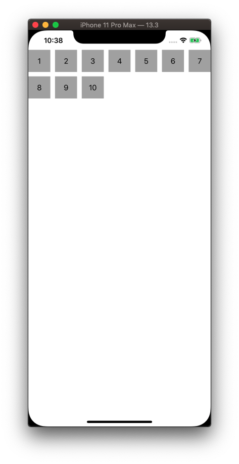
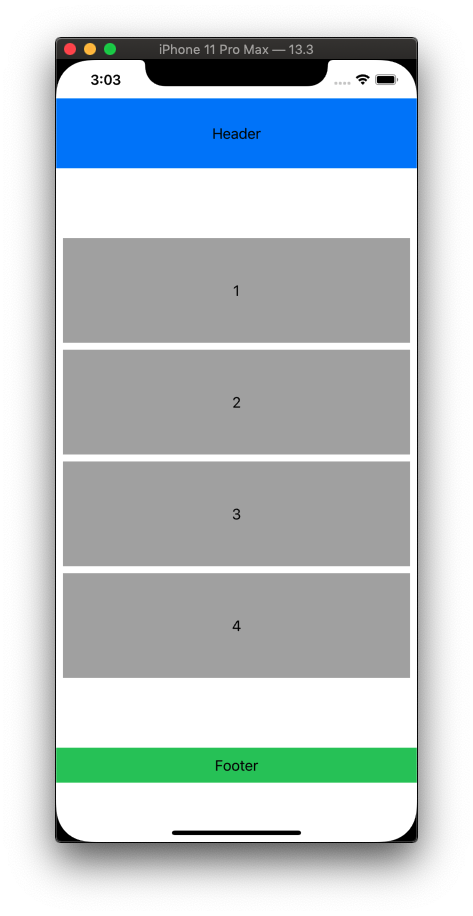

# UICollectionView Flow Layout

## Basic



```swift
import UIKit

class ViewController: UIViewController {

    weak var collectionView: UICollectionView!

    override func loadView() {
        super.loadView()

        let cv = UICollectionView(frame: .zero, collectionViewLayout: UICollectionViewFlowLayout())
        cv.translatesAutoresizingMaskIntoConstraints = false
        view.addSubview(cv)
        NSLayoutConstraint.activate([
            cv.topAnchor.constraint(equalTo: view.topAnchor),
            cv.bottomAnchor.constraint(equalTo: view.bottomAnchor),
            cv.leadingAnchor.constraint(equalTo: view.leadingAnchor),
            cv.trailingAnchor.constraint(equalTo: view.trailingAnchor),
        ])
        self.collectionView = cv
    }

    override func viewDidLoad() {
        super.viewDidLoad()

        collectionView.backgroundColor = .white
        collectionView.dataSource = self
        collectionView.delegate = self

        collectionView.register(MyCell.self, forCellWithReuseIdentifier: "MyCell")
    }
}

extension ViewController: UICollectionViewDataSource {

    func collectionView(_ collectionView: UICollectionView, numberOfItemsInSection section: Int) -> Int {
        return 10
    }

    func collectionView(_ collectionView: UICollectionView, cellForItemAt indexPath: IndexPath) -> UICollectionViewCell {
        let cell = collectionView.dequeueReusableCell(withReuseIdentifier: "MyCell", for: indexPath) as! MyCell
        cell.textLabel.text = String(indexPath.row + 1)
        return cell
    }
}

extension ViewController: UICollectionViewDelegate {

    func collectionView(_ collectionView: UICollectionView, didSelectItemAt indexPath: IndexPath) {
        print(indexPath.row + 1)
    }
}

class MyCell: UICollectionViewCell {

    weak var textLabel: UILabel!

    override init(frame: CGRect) {
        super.init(frame: frame)

        let label = UILabel()
        label.translatesAutoresizingMaskIntoConstraints = false
        contentView.addSubview(label)
        NSLayoutConstraint.activate([
            label.topAnchor.constraint(equalTo: contentView.topAnchor),
            label.bottomAnchor.constraint(equalTo: contentView.bottomAnchor),
            label.leadingAnchor.constraint(equalTo: contentView.leadingAnchor),
            label.trailingAnchor.constraint(equalTo: contentView.trailingAnchor),
        ])
        textLabel = label

        contentView.backgroundColor = .lightGray
        textLabel.textAlignment = .center
    }

    required init?(coder: NSCoder) {
        fatalError("init(coder:) has not been implemented")
    }
}
```

## List with Header & Footer



```swift
import UIKit

class MyHeaderClass: UICollectionReusableView {
    
    weak var textLabel: UILabel!
    
    override init(frame: CGRect) {
        super.init(frame: frame)
        
        let label = UILabel()
        label.translatesAutoresizingMaskIntoConstraints = false
        addSubview(label)
        NSLayoutConstraint.activate([
            label.topAnchor.constraint(equalTo: topAnchor),
            label.bottomAnchor.constraint(equalTo: bottomAnchor),
            label.leadingAnchor.constraint(equalTo: leadingAnchor),
            label.trailingAnchor.constraint(equalTo: trailingAnchor),
        ])
        textLabel = label
        textLabel.textAlignment = .center
        textLabel.text = "Header"
        
        backgroundColor = .systemBlue
    }
    
    required init?(coder: NSCoder) {
        fatalError("init(coder:) has not been implemented")
    }
}

class MyFooterClass: UICollectionReusableView {
    
    weak var textLabel: UILabel!
    
    override init(frame: CGRect) {
        super.init(frame: frame)
        
        let label = UILabel()
        label.translatesAutoresizingMaskIntoConstraints = false
        addSubview(label)
        NSLayoutConstraint.activate([
            label.topAnchor.constraint(equalTo: topAnchor),
            label.bottomAnchor.constraint(equalTo: bottomAnchor),
            label.leadingAnchor.constraint(equalTo: leadingAnchor),
            label.trailingAnchor.constraint(equalTo: trailingAnchor),
        ])
        textLabel = label
        textLabel.textAlignment = .center
        textLabel.text = "Footer"
        
        backgroundColor = .systemGreen
    }
    
    required init?(coder: NSCoder) {
        fatalError("init(coder:) has not been implemented")
    }
}
class ViewController: UIViewController {

    weak var collectionView: UICollectionView!
    
    // Define resuse identifiers
    let headerReuseIdentifier = "headerReuseIdentifier"
    let footerReuseIdentifier = "footerReuseIdentifier"
    
    override func loadView() {
        super.loadView()

        let cv = UICollectionView(frame: .zero, collectionViewLayout: UICollectionViewFlowLayout())
        cv.translatesAutoresizingMaskIntoConstraints = false
        view.addSubview(cv)
        NSLayoutConstraint.activate([
            cv.topAnchor.constraint(equalTo: view.topAnchor),
            cv.bottomAnchor.constraint(equalTo: view.bottomAnchor),
            cv.leadingAnchor.constraint(equalTo: view.leadingAnchor),
            cv.trailingAnchor.constraint(equalTo: view.trailingAnchor),
        ])
        
        // Register headers & footer with resuse identifiers
        cv.register(MyHeaderClass.self, forSupplementaryViewOfKind: UICollectionView.elementKindSectionHeader, withReuseIdentifier: headerReuseIdentifier)

        cv.register(MyFooterClass.self, forSupplementaryViewOfKind: UICollectionView.elementKindSectionFooter, withReuseIdentifier: footerReuseIdentifier)

        self.collectionView = cv
    }

    override func viewDidLoad() {
        super.viewDidLoad()

        collectionView.backgroundColor = .white
        collectionView.dataSource = self
        collectionView.delegate = self

        collectionView.register(MyCell.self, forCellWithReuseIdentifier: "MyCell")
    }
}

extension ViewController: UICollectionViewDataSource {

    func numberOfSections(in collectionView: UICollectionView) -> Int {
        return 1
    }

    func collectionView(_ collectionView: UICollectionView,
                        numberOfItemsInSection section: Int) -> Int {
        return 4
    }

    func collectionView(_ collectionView: UICollectionView,
                        cellForItemAt indexPath: IndexPath) -> UICollectionViewCell {
        let cell = collectionView.dequeueReusableCell(withReuseIdentifier: "MyCell", for: indexPath) as! MyCell
        cell.textLabel.text = String(indexPath.row + 1)
        return cell
    }

}

extension ViewController: UICollectionViewDelegate {

    func collectionView(_ collectionView: UICollectionView, didSelectItemAt indexPath: IndexPath) {
        print(indexPath.row + 1)
    }
}

extension ViewController: UICollectionViewDelegateFlowLayout {

    func collectionView(_ collectionView: UICollectionView,
                        layout collectionViewLayout: UICollectionViewLayout,
                        sizeForItemAt indexPath: IndexPath) -> CGSize {

        return CGSize(width: collectionView.bounds.size.width - 16, height: 120)
    }

    //  If unspecified default value of 10 is used.
    func collectionView(_ collectionView: UICollectionView,
                        layout collectionViewLayout: UICollectionViewLayout,
                        minimumLineSpacingForSectionAt section: Int) -> CGFloat {
        return 8
    }

    // Only top and bottom spaced if vertical scrolling (dependent on scroll direction)
    func collectionView(_ collectionView: UICollectionView,
                        layout collectionViewLayout: UICollectionViewLayout,
                        insetForSectionAt section: Int) -> UIEdgeInsets {
        return UIEdgeInsets.init(top: 80, left: -80, bottom: 80, right: -80)
    }

    // Support new header and footer in collection
    func collectionView(_ collectionView: UICollectionView,
                        viewForSupplementaryElementOfKind kind: String,
                        at indexPath: IndexPath) -> UICollectionReusableView {

        switch kind {

        case UICollectionView.elementKindSectionHeader:

            let headerCell = collectionView.dequeueReusableSupplementaryView(ofKind: kind, withReuseIdentifier: headerReuseIdentifier, for: indexPath) as! MyHeaderClass
                        
            return headerCell

        case UICollectionView.elementKindSectionFooter:
            
            let footerCell = collectionView.dequeueReusableSupplementaryView(ofKind: kind, withReuseIdentifier: footerReuseIdentifier, for: indexPath) as! MyFooterClass
                        
            return footerCell

        default:
            assert(false, "Unexpected element kind")
        }
    }
    
    // Width doesn't matter because scroll is vertical. Only height used.
    func collectionView(_ collectionView: UICollectionView,
                        layout collectionViewLayout: UICollectionViewLayout,
                        referenceSizeForHeaderInSection section: Int) -> CGSize {
            return CGSize(width: 0, height: 80.0)
    }

    func collectionView(_ collectionView: UICollectionView,
                        layout collectionViewLayout: UICollectionViewLayout,
                        referenceSizeForFooterInSection section: Int) -> CGSize {
            return CGSize(width: 0, height: 40.0)
    }

}


class MyCell: UICollectionViewCell {

    weak var textLabel: UILabel!

    override init(frame: CGRect) {
        super.init(frame: frame)

        let label = UILabel()
        label.translatesAutoresizingMaskIntoConstraints = false
        contentView.addSubview(label)
        NSLayoutConstraint.activate([
            label.topAnchor.constraint(equalTo: contentView.topAnchor),
            label.bottomAnchor.constraint(equalTo: contentView.bottomAnchor),
            label.leadingAnchor.constraint(equalTo: contentView.leadingAnchor),
            label.trailingAnchor.constraint(equalTo: contentView.trailingAnchor),
        ])
        textLabel = label

        contentView.backgroundColor = .lightGray
        textLabel.textAlignment = .center
    }

    required init?(coder: NSCoder) {
        fatalError("init(coder:) has not been implemented")
    }
}
```