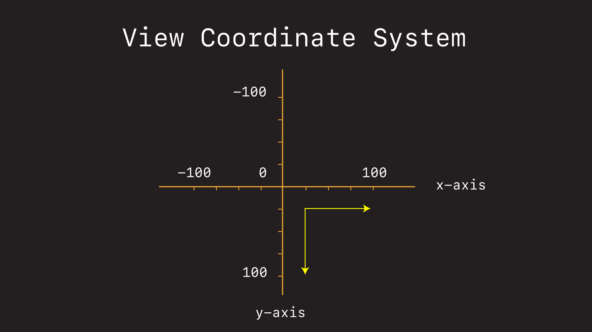
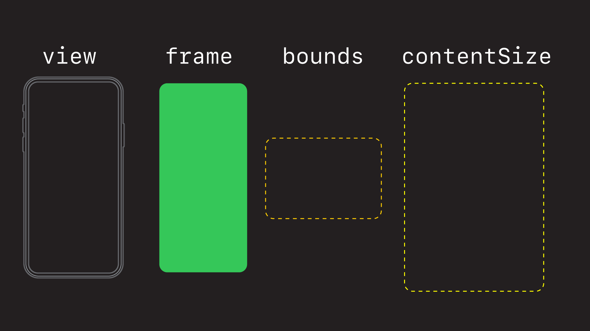
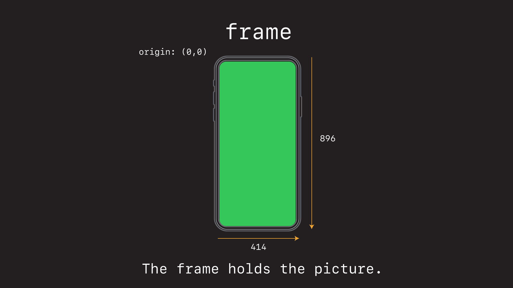
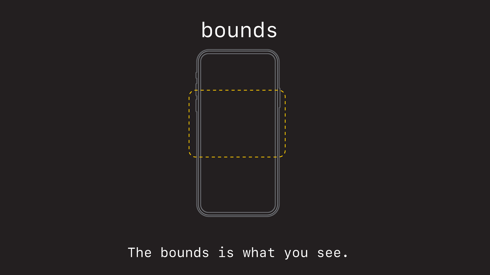
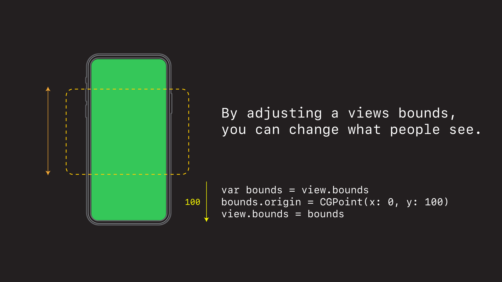
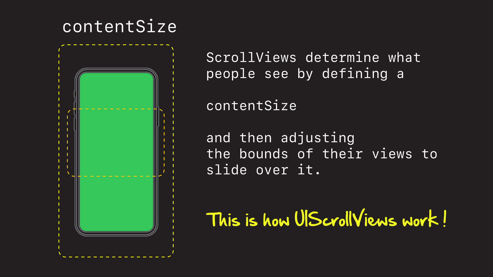
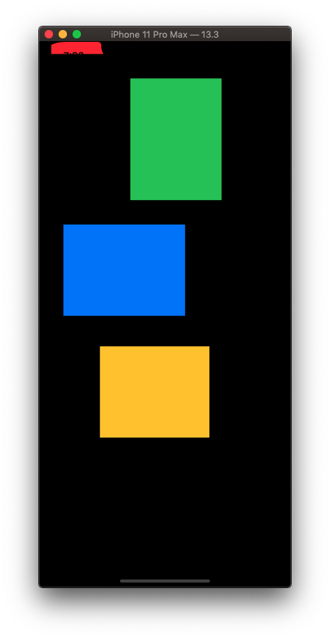
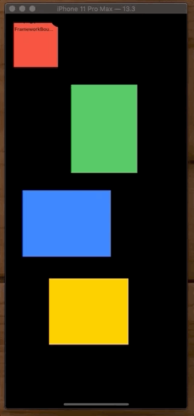
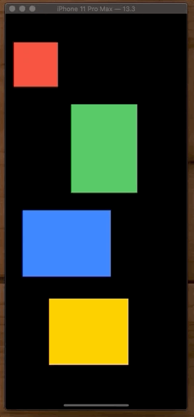

# UIScrollView

Key to understanding `UIScrollView` is to wrap your head around these three things - `frame`, `bounds`, `contentSize`.














## Demo Changing the Bounds

Changing the bounds is how you make a `UIView` scroll. For example we can shift (or scroll) an entire view up, simply by changing its `bounds`.



```swift
import UIKit

class ViewController: UIViewController {

    override func viewDidLoad() {
        super.viewDidLoad()
        layout()
    }

    func layout() {
        let redView = UIView(frame: CGRect(x: 20, y: 20, width: 100, height: 100))
        let greenView = UIView(frame: CGRect(x: 150, y: 160, width: 150, height: 200))
        let blueView = UIView(frame: CGRect(x: 40, y: 400, width: 200, height: 150))
        let yellowView = UIView(frame: CGRect(x: 100, y: 600, width: 180, height: 150))

        redView.backgroundColor = .systemRed
        greenView.backgroundColor = .systemGreen
        blueView.backgroundColor = .systemBlue
        yellowView.backgroundColor = .systemYellow

        view.addSubview(redView)
        view.addSubview(greenView)
        view.addSubview(blueView)
        view.addSubview(yellowView)

        ///
        /// By changing the views bounds, we can change what the user sees.
        ///

        var bounds = view.bounds
        bounds.origin = CGPoint(x: 0, y: 100)
        view.bounds = bounds
    }
}
```

### Demo CustomScrollView

We can take this concept one step further, and build our own custom `UIScrollView` by adding a `UIPanGestureRecognizer`, measuring its offset, and then applying that offset in the y-direction to the `view.bounds`.




All we are doing here is measuring the distance the gesture moves in the y-direction, comparing that to the maximum it is allowed to move, and then taking the smaller of those two values and comparing it to a max (which could be zero) to prevent scrolling too far in the negative direction.

```swift
import UIKit

class ViewController: UIViewController {

    override func viewDidLoad() {
        super.viewDidLoad()
        layout()
    }

    func layout() {
        let customScrollView = CustomScrollView(frame: view.bounds)
        customScrollView.contentSize = CGSize(width: view.bounds.size.width, height: 1000)

        let redView = UIView(frame: CGRect(x: 20, y: 20, width: 100, height: 100))
        let greenView = UIView(frame: CGRect(x: 150, y: 160, width: 150, height: 200))
        let blueView = UIView(frame: CGRect(x: 40, y: 400, width: 200, height: 150))
        let yellowView = UIView(frame: CGRect(x: 100, y: 600, width: 180, height: 150))

        redView.backgroundColor = .systemRed
        greenView.backgroundColor = .systemGreen
        blueView.backgroundColor = .systemBlue
        yellowView.backgroundColor = .systemYellow

        customScrollView.addSubview(redView)
        customScrollView.addSubview(greenView)
        customScrollView.addSubview(blueView)
        customScrollView.addSubview(yellowView)

        view = customScrollView
    }
}

///
/// By creating a customer view with a `UIPanGestureRecognizer` we can create our own poormans `UIScrollView`.
///
///
///
class CustomScrollView: UIView {

    var contentSize = CGSize(width: 300, height: 800)

    lazy var panRecognizer: UIPanGestureRecognizer = {
        let recognizer = UIPanGestureRecognizer()
        recognizer.addTarget(self, action: #selector(handlePan(recognizer:)))
        return recognizer
    }()

    override init(frame: CGRect) {
        super.init(frame: .zero)
        addGestureRecognizer(panRecognizer)
    }

    required init?(coder: NSCoder) {
        fatalError("init(coder:) has not been implemented")
    }

    @objc func handlePan(recognizer: UIPanGestureRecognizer) {
        let translation = recognizer.translation(in: self)

        switch recognizer.state {
        case .changed:

            var bounds = self.bounds

            // max amount we can scroll in the Y-axis
            let maxOffsetY = contentSize.height - bounds.size.height
            
            // offset due to gesture
            let offsetY = bounds.origin.y - translation.y
            
            // don't allow scrolling in negative direction
            let minOffsetY = 0.0
            
            // let the newOffset be the smaller of the manual gesture or the max
            // but make it 0.0 if offest is negative
            let newOffsetY = fmax(CGFloat(minOffsetY), fmin(offsetY, maxOffsetY))
            
            // scroll by adjusting the bounds
            bounds.origin.y = newOffsetY
            self.bounds = bounds
            
            // reset recognizer
            recognizer.setTranslation(CGPoint.zero, in: self)
        default:
            ()
        }
    }
}
```

### Demo Real UIScrollView

So that's basically how real `UIScrollView`s work. You simply add your views, set its `contentSize` (how much content it can scroll) and your are done.



```swift
import UIKit

class ViewController: UIViewController {

    override func viewDidLoad() {
        super.viewDidLoad()
        layout()
    }

    func layout() {
        let customScrollView = UIScrollView(frame: view.bounds)
        customScrollView.contentSize = CGSize(width: view.bounds.size.width, height: 1500)

        let redView = UIView(frame: CGRect(x: 20, y: 20, width: 100, height: 100))
        let greenView = UIView(frame: CGRect(x: 150, y: 160, width: 150, height: 200))
        let blueView = UIView(frame: CGRect(x: 40, y: 400, width: 200, height: 150))
        let yellowView = UIView(frame: CGRect(x: 100, y: 600, width: 180, height: 150))

        redView.backgroundColor = .systemRed
        greenView.backgroundColor = .systemGreen
        blueView.backgroundColor = .systemBlue
        yellowView.backgroundColor = .systemYellow

        customScrollView.addSubview(redView)
        customScrollView.addSubview(greenView)
        customScrollView.addSubview(blueView)
        customScrollView.addSubview(yellowView)

        view = customScrollView
    }
}
```


### Links that help

- - [Understanding ScrollViews](https://oleb.net/blog/2014/04/understanding-uiscrollview/)


### Video

- [Understanding ScrollViews](https://www.youtube.com/watch?v=TYM65qxEQNs)
