# Header Footer Sections Nib

 

## Create the Table View

Create a new nib/view and drag a `UITableView` onto it pinned to all the edges. Drag an outlet called `tableView` into the view controller and set your data up.

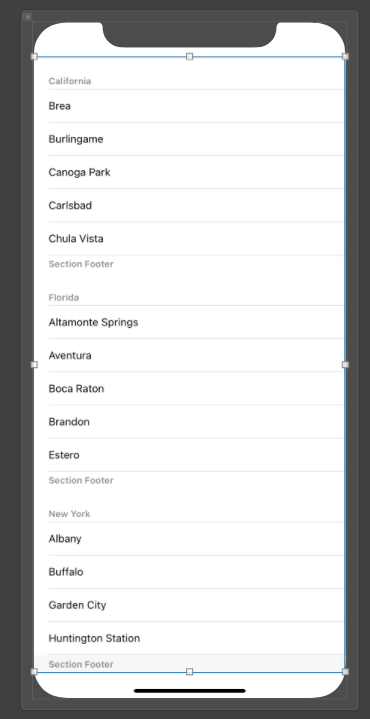

**ViewController**

```swift
//
//  ViewController.swift
//  FullPowerTableView
//
//  Created by jrasmusson on 2021-08-22.
//

import UIKit

class ViewController: UIViewController {
    
    @IBOutlet var tableView: UITableView!

    let games = [
        "Pacman",
        "Space Invaders",
        "Space Patrol",
    ]
        
    let cellId = "cellId"

    override func viewDidLoad() {
        super.viewDidLoad()
        setup()
    }
}

// MARK: - Setup
extension ViewController {
    func setup() {
        setupTableView()
    }
    
    private func setupTableView() {
        tableView.delegate = self
        tableView.dataSource = self

        tableView.register(UITableViewCell.self, forCellReuseIdentifier: cellId)
        tableView.tableFooterView = UIView() // hide empty rows
    }
}

// MARK: - UITableViewDelegate
extension ViewController: UITableViewDelegate {
    func tableView(_ tableView: UITableView, didSelectRowAt indexPath: IndexPath) {

    }
}

// MARK: - UITableViewDataSource
extension ViewController: UITableViewDataSource {
    func tableView(_ tableView: UITableView, cellForRowAt indexPath: IndexPath) -> UITableViewCell {
        let cell = tableView.dequeueReusableCell(withIdentifier: cellId, for: indexPath)

        cell.textLabel?.text = games[indexPath.row]
        cell.accessoryType = UITableViewCell.AccessoryType.disclosureIndicator

        return cell
    }

    func tableView(_ tableView: UITableView, numberOfRowsInSection section: Int) -> Int {
        return games.count
    }
}
```


## Add a header

Create a new header view and nib and assign the `File's Owner` like a plain old nib. 


Drag the `View` from the nib into the file and call it `contentView`.


Then if you wanted to do something fancy you could.

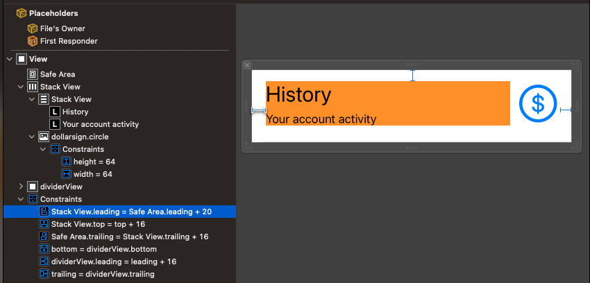

Pin your content view to the edges like this.

**HeaderView**

```swift
import Foundation
import UIKit

class HeaderView: UIView {
    
    @IBOutlet var contentView: UIView!
    
    override init(frame: CGRect) {
        super.init(frame: frame)
        commonInit()
    }

    required init?(coder aDecoder: NSCoder) {
        super.init(coder: aDecoder)
        commonInit()
    }

    // important! 
    override var intrinsicContentSize: CGSize {
        return CGSize(width: UIView.noIntrinsicMetric, height: 104)
    }

    private func commonInit() {
        let bundle = Bundle(for: HeaderView.self)
        bundle.loadNibNamed("HeaderView", owner: self, options: nil)
        addSubview(contentView)

        contentView.translatesAutoresizingMaskIntoConstraints = false
        contentView.topAnchor.constraint(equalTo: self.topAnchor).isActive = true
        contentView.rightAnchor.constraint(equalTo: self.rightAnchor).isActive = true
        contentView.bottomAnchor.constraint(equalTo: self.bottomAnchor).isActive = true
        contentView.leftAnchor.constraint(equalTo: self.leftAnchor).isActive = true
    }
}
```

Then add it to the view controller like so.

**ViewController**

```swift
// MARK: - Setup
extension ViewController {
    func setup() {
        setupTableView()
        setupTableViewHeader()
    }
    
    ...
        
    private func setupTableViewHeader() {
        let header = HeaderView(frame: .zero)

        // Set frame size before populate view to have initial size
        var size = header.systemLayoutSizeFitting(UIView.layoutFittingCompressedSize)
        size.width = UIScreen.main.bounds.width
        header.frame.size = size

        // Recalculate header size after populated with content
        size = header.systemLayoutSizeFitting(UIView.layoutFittingCompressedSize)
        size.width = UIScreen.main.bounds.width
        header.frame.size = size

        tableView.tableHeaderView = header
    }
}
```

Yes you need to calculate the header size x2. Strange but this is how it works.

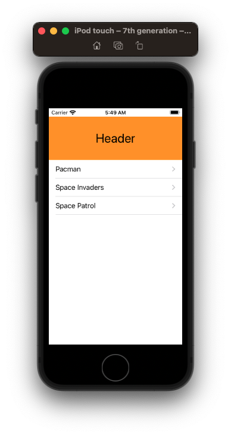

### Trouble shooting

#### Overlapping header

If your header overlaps your table like so

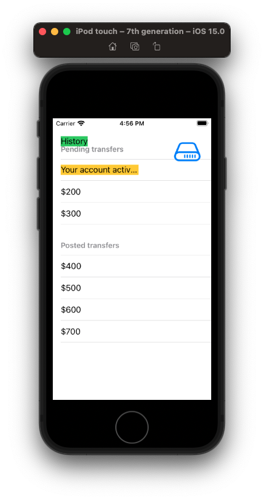

its because you forget to set an intrinsic content size in your `HeaderView`.

```swift
    override var intrinsicContentSize: CGSize {
        return CGSize(width: UIView.noIntrinsicMetric, height: 104)
    }
```

#### IB Outlets can't be created

Restart Xcode.

#### Assist editor not coming up

Restart Xcode.

## Add sections

To add sections to our table view, we are going to need some kind of data model. 

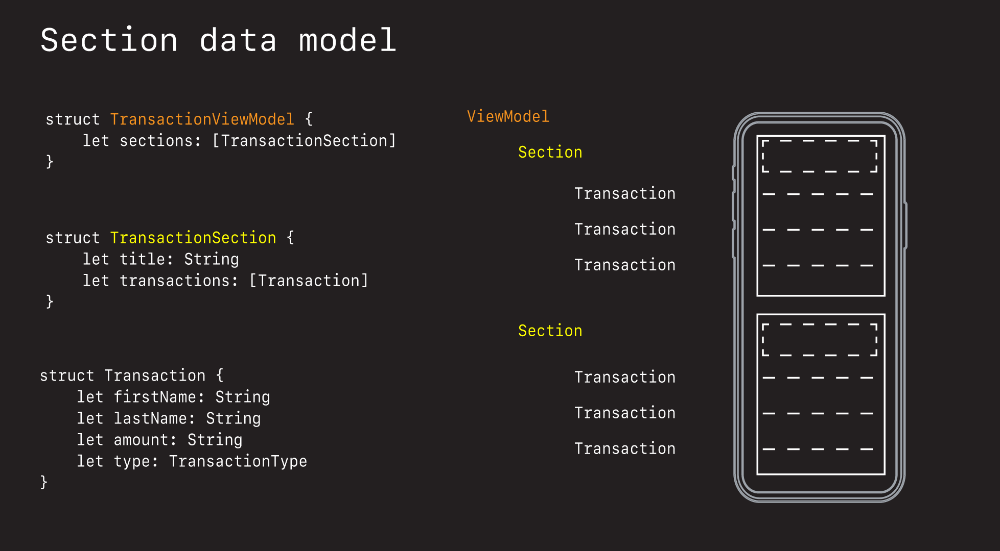

```swift
enum TransactionType: String {
    case pending = "Pending"
    case posted = "Posted"
}

struct Transaction {
    let firstName: String
    let lastName: String
    let amount: String
    let type: TransactionType
}

struct TransactionSection {
    let title: String
    let transactions: [Transaction]
}

struct TransactionViewModel {
    let sections: [TransactionSection]
}
```

Then to sync with with our table, we need to update our data source methods like this.

**ViewController**

```swift
class ViewController: UIViewController {
            
    var viewModel: TransactionViewModel?

    override func viewDidLoad() {
    	 ...
        fetchData()
    }
}

// MARK: - Networking
extension ViewController {
    private func fetchData() {
        let tx1 = Transaction(firstName: "Kevin", lastName: "Flynn", amount: "$100", type: .pending)
        let tx2 = Transaction(firstName: "Allan", lastName: "Bradley", amount: "$200", type: .pending)
        let tx3 = Transaction(firstName: "Ed", lastName: "Dillinger", amount: "$300", type: .pending)

        let tx4 = Transaction(firstName: "Sam", lastName: "Flynn", amount: "$400", type: .posted)
        let tx5 = Transaction(firstName: "Quorra", lastName: "Iso", amount: "$500", type: .posted)
        let tx6 = Transaction(firstName: "Castor", lastName: "Barkeep", amount: "$600", type: .posted)
        let tx7 = Transaction(firstName: "CLU", lastName: "MCU", amount: "$700", type: .posted)
        
        let section1 = TransactionSection(title: "Pending transfers", transactions: [tx1, tx2, tx3])
        let section2 = TransactionSection(title: "Posted transfers", transactions: [tx4, tx5, tx6, tx7])

        viewModel = TransactionViewModel(sections: [section1, section2])
    }
}

// MARK: - UITableViewDelegate
extension ViewController: UITableViewDelegate {
    func tableView(_ tableView: UITableView, didSelectRowAt indexPath: IndexPath) {
        
    }
}

// MARK: - UITableViewDataSource
extension ViewController: UITableViewDataSource {
    func tableView(_ tableView: UITableView, cellForRowAt indexPath: IndexPath) -> UITableViewCell {
        guard let vm = viewModel else { return UITableViewCell() }
        
        let cell = tableView.dequeueReusableCell(withIdentifier: cellId, for: indexPath)
        let section = indexPath.section
        
        let text = vm.sections[section].transactions[indexPath.row].amount
        cell.textLabel?.text = text
        
        return cell
    }
    
    func tableView(_ tableView: UITableView, numberOfRowsInSection section: Int) -> Int {
        guard let vm = viewModel else { return 0 }
        return vm.sections[section].transactions.count
    }
    
    func tableView(_ tableView: UITableView, titleForHeaderInSection section: Int) -> String? {
        guard let vm = viewModel else { return nil }
        return vm.sections[section].title
    }
    
    func tableView(_ tableView: UITableView, heightForHeaderInSection section: Int) -> CGFloat {
        return 40
    }
    
    func numberOfSections(in tableView: UITableView) -> Int {
        guard let sections = viewModel?.sections else { return 0 }
        return sections.count
    }
}
```

To make it so your sections headers don't stack as you scroll make the style grouped.


Should now have this.

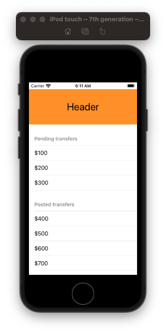

### Section header simple

You can either use the default section header that comes with the `UITableView`.

```swift
// MARK: - UITableViewDataSource
extension ViewController: UITableViewDataSource {
    ...
    func tableView(_ tableView: UITableView, titleForHeaderInSection section: Int) -> String? {
        guard let vm = viewModel else { return nil }
        return vm.sections[section].title
    }
}
```

### Section header complex


So here we can create a custom section header by creating a nib as a `UIView`.


**SectionHeaderView**

```swift
import Foundation
import UIKit

class SectionHeaderView: UIView {
    
    @IBOutlet var contentView: UIView!
    
    override init(frame: CGRect) {
        super.init(frame: frame)
        commonInit()
    }

    required init?(coder aDecoder: NSCoder) {
        super.init(coder: aDecoder)
        commonInit()
    }

    override var intrinsicContentSize: CGSize {
        return CGSize(width: UIView.noIntrinsicMetric, height: 104)
    }

    private func commonInit() {
        let bundle = Bundle(for: SectionHeaderView.self)
        bundle.loadNibNamed("SectionHeaderView", owner: self, options: nil)
        addSubview(contentView)

        contentView.translatesAutoresizingMaskIntoConstraints = false
        contentView.topAnchor.constraint(equalTo: self.topAnchor).isActive = true
        contentView.rightAnchor.constraint(equalTo: self.rightAnchor).isActive = true
        contentView.bottomAnchor.constraint(equalTo: self.bottomAnchor).isActive = true
        contentView.leftAnchor.constraint(equalTo: self.leftAnchor).isActive = true
    }
}
```

And then replace the default section title as follows.

**ViewController**

```swift
// MARK: - UITableViewDataSource
extension ViewController: UITableViewDataSource {

// Comment this out...    
//    func tableView(_ tableView: UITableView, titleForHeaderInSection section: Int) -> String? {
//        guard let vm = viewModel else { return nil }
//        return vm.sections[section].title
//    }

    func tableView(_ tableView: UITableView, viewForHeaderInSection section: Int) -> UIView? {
        let headerView = SectionHeaderView()
        return headerView
    }
        
    func tableView(_ tableView: UITableView, heightForHeaderInSection section: Int) -> CGFloat {
        return 70 // should match the height of our nib
    }
}
```

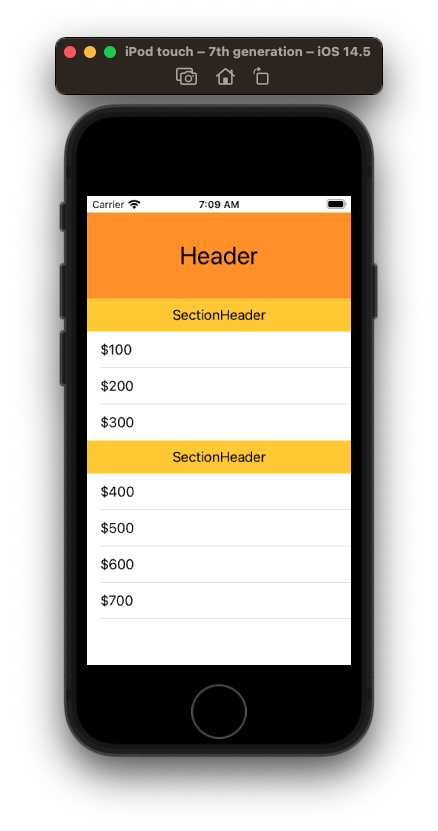


Note: The `heightForHeaderInSection` setting will override the height constraint in the nib. So if you set it to something really small.

```swift
// MARK: - UITableViewDataSource
extension ViewController: UITableViewDataSource {
    func tableView(_ tableView: UITableView, heightForHeaderInSection section: Int) -> CGFloat {
        return 20 // This overrides the nib
    }
    
    func numberOfSections(in tableView: UITableView) -> Int {
        guard let sections = viewModel?.sections else { return 0 }
        return sections.count
    }
}
```

It will override the nib.


### Floating section header

You'll notice when you scroll that the section header floats as you scroll up to it. If you don't want that, change the table `style` to `Grouped`.


This will get rid of the scrolling, but it will also make visible the section footer.


To hide the footers add these (we will replace them with real footers shortly).

```swift
// Hide footer
extension ViewController : UITableViewDataSource {

    func tableView(_ tableView: UITableView, viewForFooterInSection section: Int) -> UIView? {
        return UIView()
    }

    func tableView(_ tableView: UITableView, heightForFooterInSection section: Int) -> CGFloat {
        return CGFloat.leastNormalMagnitude
    }
    
}
```

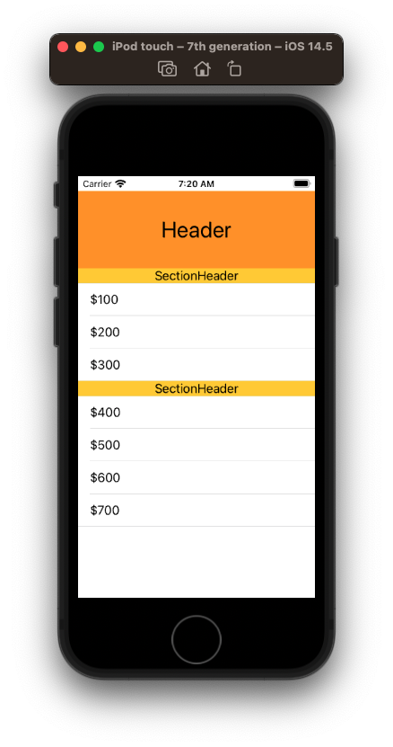


### More complex section headers

Using this technique you can create custom headers and custom section headers.


To get the layout above:

- embed both labels inside a `View`
- embed those within a `StackView` 
- set the heights of each view explicitly (i.e. 50 and 30)
- pin the stack view to the edges
- make the stackview with `fill` for alignment and distribution
- resize the nib frame to match the height (i.e. 80)

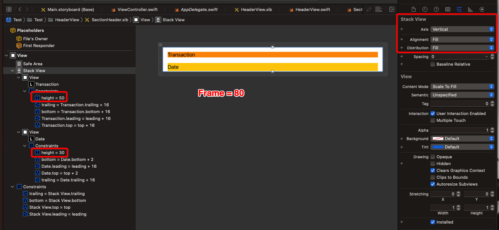


## Add a section footer

To add a footer, like we did before with header, create a plain old nib and set its `File's Owner` as well as create an outlet for its `contentView`.


**FooterView**

```swift
import Foundation
import UIKit

class SectionFooterView: UIView {
    
    @IBOutlet var contentView: UIView!
    
    override init(frame: CGRect) {
        super.init(frame: frame)
        commonInit()
    }
    
    required init?(coder aDecoder: NSCoder) {
        super.init(coder: aDecoder)
        commonInit()
    }
    
    override var intrinsicContentSize: CGSize {
        return CGSize(width: UIView.noIntrinsicMetric, height: 104)
    }
    
    private func commonInit() {
        let bundle = Bundle(for: SectionFooterView.self)
        bundle.loadNibNamed("SectionFooterView", owner: self, options: nil)
        addSubview(contentView)
        
        contentView.translatesAutoresizingMaskIntoConstraints = false
        contentView.topAnchor.constraint(equalTo: self.topAnchor).isActive = true
        contentView.rightAnchor.constraint(equalTo: self.rightAnchor).isActive = true
        contentView.bottomAnchor.constraint(equalTo: self.bottomAnchor).isActive = true
        contentView.leftAnchor.constraint(equalTo: self.leftAnchor).isActive = true
    }
}
```

Then return the footer view and set the height just like we did before with the header only in the footer delegate section.

**ViewController**

```swift
// MARK: - UITableViewDataSource
extension ViewController: UITableViewDataSource {
    ...    
    func tableView(_ tableView: UITableView, viewForFooterInSection section: Int) -> UIView? {
        let footerView = SectionFooterView()
        return footerView
    }

    func tableView(_ tableView: UITableView, heightForFooterInSection section: Int) -> CGFloat {
        return 40
    }
}
```

## Add a footer

Same as header. Only footer. Create nib, set `File's Owner` add outlet for `contentView`.


**FooterView**

```swift
import Foundation
import UIKit

class FooterView: UIView {
    
    @IBOutlet var contentView: UIView!
    
    override init(frame: CGRect) {
        super.init(frame: frame)
        commonInit()
    }
    
    required init?(coder aDecoder: NSCoder) {
        super.init(coder: aDecoder)
        commonInit()
    }
    
    // important!
    override var intrinsicContentSize: CGSize {
        return CGSize(width: UIView.noIntrinsicMetric, height: 104)
    }
    
    private func commonInit() {
        let bundle = Bundle(for: FooterView.self)
        bundle.loadNibNamed("FooterView", owner: self, options: nil)
        addSubview(contentView)
        
        contentView.translatesAutoresizingMaskIntoConstraints = false
        contentView.topAnchor.constraint(equalTo: self.topAnchor).isActive = true
        contentView.rightAnchor.constraint(equalTo: self.rightAnchor).isActive = true
        contentView.bottomAnchor.constraint(equalTo: self.bottomAnchor).isActive = true
        contentView.leftAnchor.constraint(equalTo: self.leftAnchor).isActive = true
    }
}
```

Then add to view controller.

**ViewController**

```swift
// MARK: - Setup
extension ViewController {
    func setup() {
        ....
        setupTableViewFooter()
    }
    
    private func setupTableViewFooter() {
        let footer = FooterView(frame: .zero)
        
        // Set frame size before populate view to have initial size
        var size = footer.systemLayoutSizeFitting(UIView.layoutFittingCompressedSize)
        size.width = UIScreen.main.bounds.width
        footer.frame.size = size
        
        // Recalculate header size after populated with content
        size = footer.systemLayoutSizeFitting(UIView.layoutFittingCompressedSize)
        size.width = UIScreen.main.bounds.width
        footer.frame.size = size
        
        tableView.tableFooterView = footer
    }
}
```

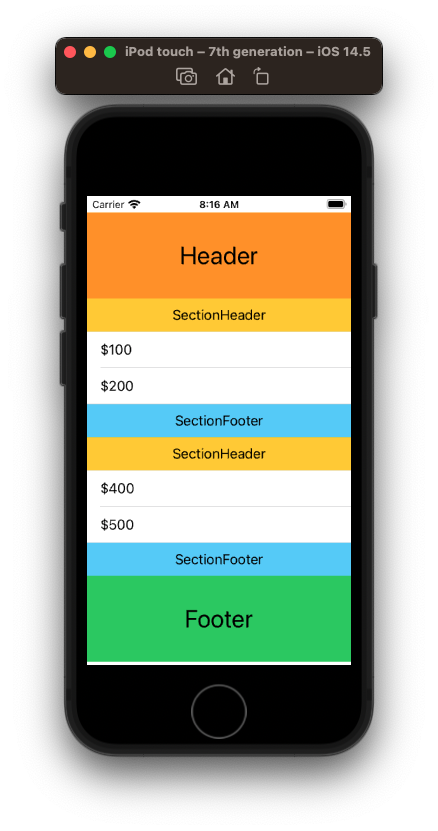


## Create Custom Cells

Bit different here. Create a nib. Set it is as a `Custom Class` (not the `File's Owner`).

**PendingCell**

```swift
import Foundation
import UIKit

class PendingCell: UITableViewCell {
    
    @IBOutlet var nameLabel: UILabel!
    @IBOutlet var amountLabel: UILabel!
    
    override func awakeFromNib() {
        super.awakeFromNib()
    }
}
```


This is where I introduce a class to help with the loading of nibs.

**ReuseableView**

```swift
import UIKit

protocol ReusableView: AnyObject {}
protocol NibLoadableView: AnyObject {}

extension ReusableView {
    static var reuseID: String { return "\(self)" }
}

extension NibLoadableView {
    static var nibName: String { return "\(self)" }
}

extension UITableViewCell: ReusableView, NibLoadableView {}
extension UICollectionViewCell: ReusableView, NibLoadableView {}
extension UITableViewHeaderFooterView: ReusableView, NibLoadableView {}

extension UITableView {
    func dequeueResuableCell<T: UITableViewCell>(for indexPath: IndexPath) -> T {
        guard let cell = dequeueReusableCell(withIdentifier: T.reuseID, for: indexPath) as? T else {
            fatalError("Could not dequeue cell with identifier: \(T.reuseID)")
        }
        return cell
    }

    func dequeueResuableHeaderFooter<T: UITableViewHeaderFooterView>() -> T {
        guard let headerFooter = dequeueReusableHeaderFooterView(withIdentifier: T.reuseID) as? T else {
            fatalError("Could not dequeue header footer view with identifier: \(T.reuseID)")
        }
        return headerFooter
    }

    func register<T: ReusableView & NibLoadableView>(_: T.Type) {
        let nib = UINib(nibName: T.nibName, bundle: nil)
        register(nib, forCellReuseIdentifier: T.reuseID)
    }

    func registerHeaderFooter<T: ReusableView & NibLoadableView>(_: T.Type) {
        let nib = UINib(nibName: T.nibName, bundle: nil)
        register(nib, forHeaderFooterViewReuseIdentifier: T.reuseID)
    }
}
```

This class uses the `UIView` and `nib` name to register itself as reusable views, and then sets up these convenience routines for dequeuing when used in a table. We will use this later.

We can use this now to conveniently register and our cell in our view controller as follows.

**ViewController**

```swift
    private func setupTableView() {
        ...
        tableView.register(PendingCell.self) // using ReusableView extensions
    }
    
    // MARK: - UITableViewDataSource
extension ViewController: UITableViewDataSource {
    func tableView(_ tableView: UITableView, cellForRowAt indexPath: IndexPath) -> UITableViewCell {
        guard let vm = viewModel else { return UITableViewCell() }
        
        let cell: PendingCell = tableView.dequeueResuableCell(for: indexPath)
        let section = indexPath.section
        
        let transaction = vm.sections[section].transactions[indexPath.row]
        let fullName = "\(transaction.firstName) \(transaction.lastName)"
        let amount = transaction.amount
        
        cell.nameLabel.text = fullName
        cell.amountLabel.text = amount
        
        return cell
    }
}
```


### Dynamic cell row

Sometimes you may want your cell rows to change. Like say on a `TransactionType`.

```swift
enum TransactionType: String {
    case pending = "Pending"
    case posted = "Posted"
}
```

You can create a new cell type just like we did before

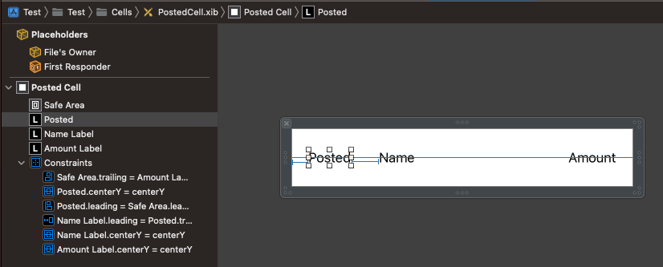

**PostedCell**

```swift
import Foundation
import UIKit

class PostedCell: UITableViewCell {
    
    @IBOutlet var nameLabel: UILabel!
    @IBOutlet var amountLabel: UILabel!
    
    override func awakeFromNib() {
        super.awakeFromNib()
    }
}
```

Register it.

**ViewController**

```swift
    private func setupTableView() {        
        ...
        tableView.register(PostedCell.self)
    }
```

You can then swap cells based on the transaction type.

**ViewController**

```swift
// MARK: - UITableViewDataSource
extension ViewController: UITableViewDataSource {
    func tableView(_ tableView: UITableView, cellForRowAt indexPath: IndexPath) -> UITableViewCell {
        guard let vm = viewModel else { return UITableViewCell() }

        let section = indexPath.section
        let transaction = vm.sections[section].transactions[indexPath.row]
        let fullName = "\(transaction.firstName) \(transaction.lastName)"
        let amount = transaction.amount

        switch transaction.type {
        case .pending:
            let cell: PendingCell = tableView.dequeueResuableCell(for: indexPath)
            cell.nameLabel.text = fullName
            cell.amountLabel.text = amount
            
            return cell
        case .posted:
            let cell: PostedCell = tableView.dequeueResuableCell(for: indexPath)
            cell.nameLabel.text = fullName
            cell.amountLabel.text = amount
            
            return cell
        }
    }
}
```

 

## Build anything

Using these techniques you can build just about anything. All in a nice scrollable view.


### Links that help

- [Table Header View Storyboard](https://programmingwithswift.com/how-to-add-header-footer-view-in-uitableview-in-storyboard/)